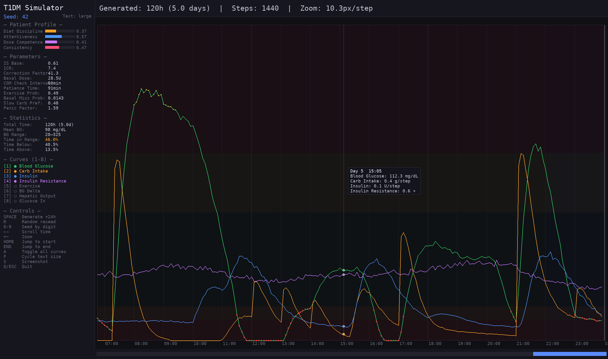
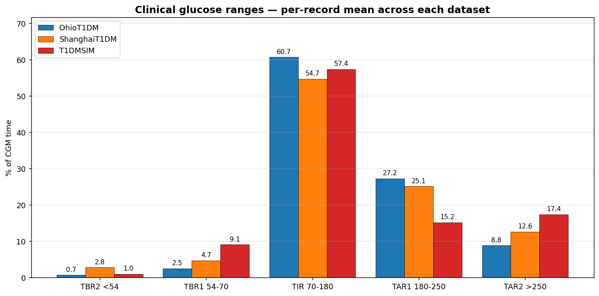
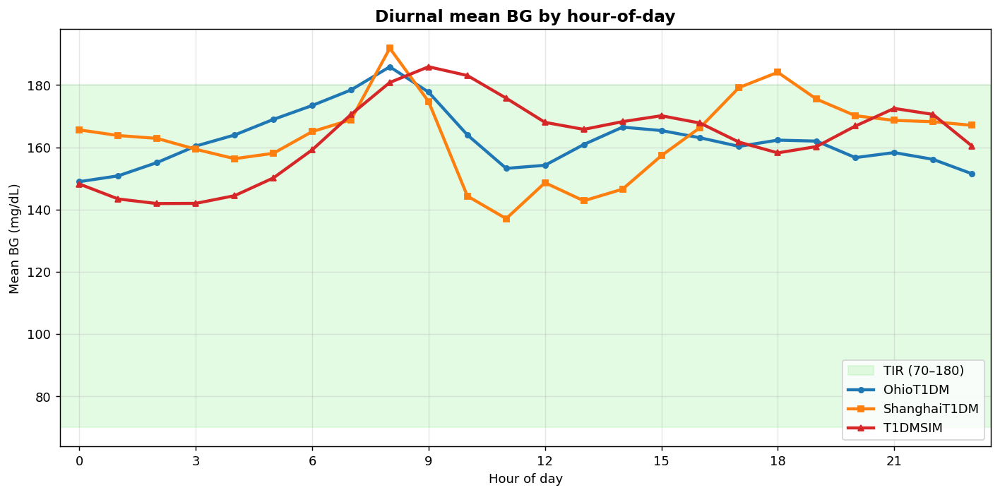
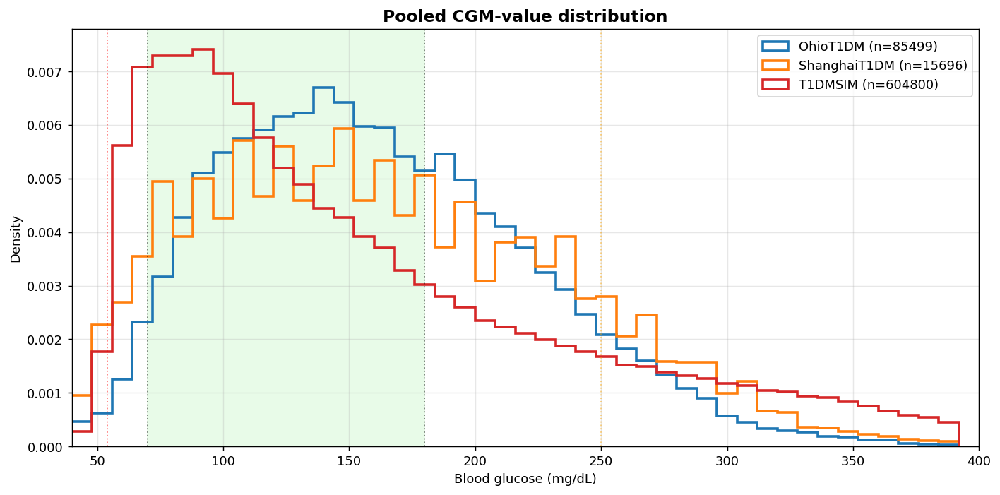
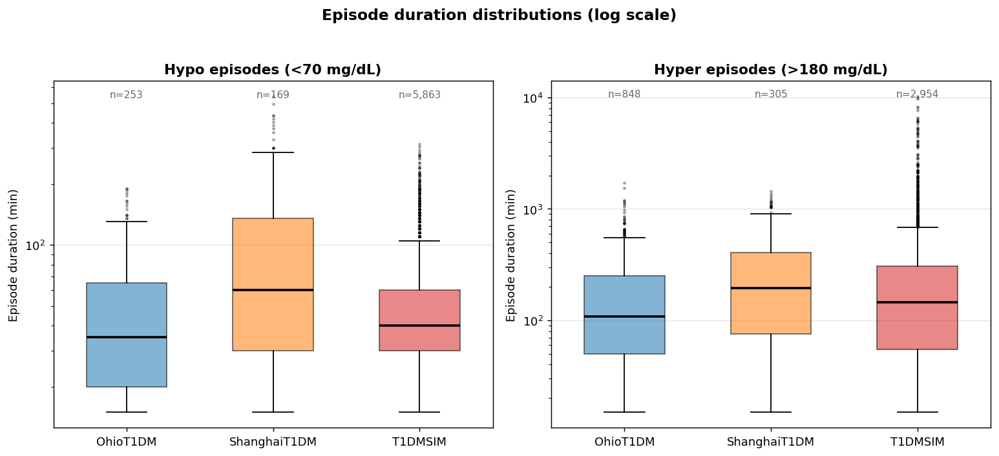
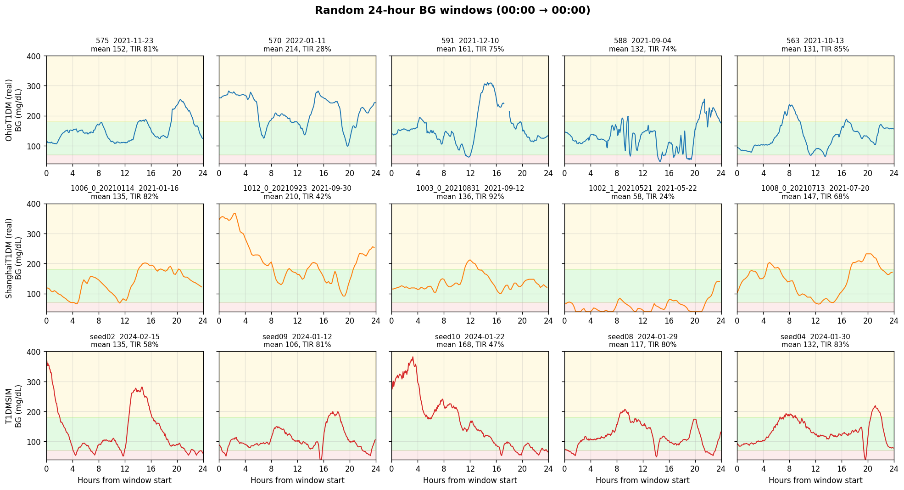
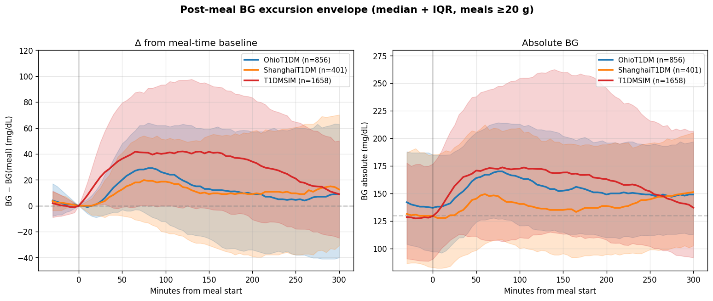
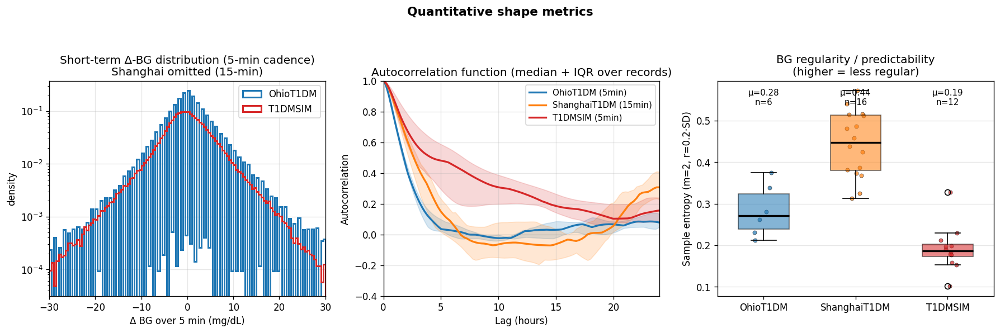
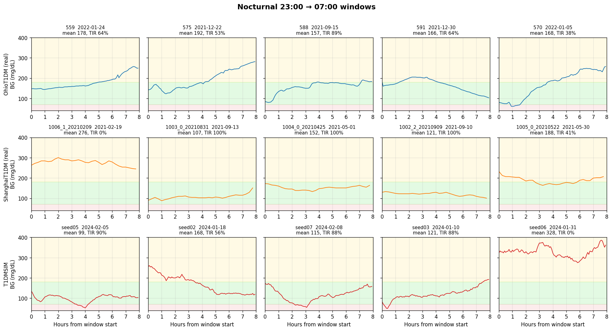

# T1DM Patient Behavior Simulator

A seed-driven simulator for generating synthetic Type 1 Diabetes blood glucose data. Unlike traditional glucose-insulin simulators (e.g., UVA/Padova), this simulator models patient *behavior* as the primary driver of blood sugar outcomes. The simulator generates factor curves -- carbohydrate intake, insulin action, insulin sensitivity, and exercise -- and computes blood sugar as the emergent result of their interactions.

Designed by a T1DM patient, informed by lived experience.

Screenshot:




## Motivation

Most T1DM simulators model physiology: glucose kinetics, insulin pharmacokinetics, compartmental models. They produce accurate BG traces but require dozens of physiological parameters that are hard to measure and vary between patients.

This simulator takes a different approach. It models the *person*, not the pancreas. The key insight is that most real-world blood sugar variance comes from behavioral decisions -- what the patient eats, when they bolus, how they correct, whether they exercise -- not from subtle physiological differences. By generating diverse behavioral patterns and computing BG as a consequence, the simulator produces training data that teaches a model to predict what patients *do*, with blood sugar as the outcome.

The ultimate goal is to train a transformer model on these synthetic factor curves, then fine-tune it on real patient data for personalized blood sugar prediction.


## Design Principles

The simulator is built on several core ideas:

1. Every factor is a curve, not a number. Eating 40g of bread and 40g of orange juice both contribute 40g of carbs, but the absorption curves have different shapes (the juice peaks faster and falls faster). The same applies to rapid-acting vs long-acting insulin.

2. Patient behavior is driven by a latent skill profile. Four correlated skill dimensions (dietary discipline, attentiveness, dosing competence, lifestyle consistency) determine everything about how a patient lives: what they eat, when they eat, how accurately they dose, how quickly they correct, whether they exercise.

3. The liver is an insulin-suppressed feeding session. Hepatic glucose output (HGO) is a steady stream of "food" entering the bloodstream, throttled down by a Hill function of EMA-smoothed plasma insulin. A finite hepatic glycogen reservoir gates the glycogenolysis fraction, and large meals schedule a delayed HGO rebound 3.5-5.5h later (the mechanism behind nocturnal hyperglycemia after a big dinner). Basal insulin exists to counteract baseline HGO; the ideal basal dose is anchored to `(HGO_base × 24h) / ICR`.

4. Exercise is negative food. Walking, for example, pulls glucose out of the bloodstream into muscle cells. Modeling this as a negative carb-equivalent curve is a pragmatic simplification that works well for aerobic exercise. Additionally, exercise increases insulin sensitivity for `EXERCISE_IS_DURATION_HOURS` (18h) afterward, modeled as a time-limited IS reduction.

5. Everything is seed-driven. A single integer seed determines the patient's personality, physiology, daily schedule, meal choices, insulin doses, exercise patterns, illness events, and random noise. Same seed, same simulation, always.


## Architecture

The simulator consists of two files:

`simulator.py` contains the core engine. All tunable parameters are defined as uppercase constants at the top of the file (approximately 200 parameters). The `T1DMSimulator` class exposes a `generate()` method that advances the simulation by one 5-minute time step and returns all factor values and the resulting BG. This is analogous to `rand()` in C: seed it once, then call repeatedly to produce a stream of data.

`visualizer.py` is an interactive Pygame-based renderer that displays the generated curves in real time. It shows the patient's skill profile, derived parameters, and live statistics (time in range, mean BG, etc.) in a sidebar, with the main chart area rendering whichever curves are toggled on. Mouse hover shows exact values at any time point.

**Performance:** Curve contributions are pre-accumulated into numpy arrays (`_carb_totals`, `_basal_totals`, `_bolus_totals`, `_exercise_totals`) so each time step reads values in O(1). Insulin-on-board (IOB) is computed as a single `np.sum` over the future insulin array. This makes `generate_hours()` fast enough for bulk training-data generation.


## Blood Sugar Computation

At each 5-minute time step, the BG delta is computed as:

```
glucose_in  = carbs + hepatic_output - exercise
glucose_out = insulin_units * ICR / insulin_sensitivity
delta_BG    = alpha * (glucose_in - glucose_out)
```

Where `alpha` is `BG_SCALE_FACTOR`, the master scaling constant that converts abstract units to mg/dL. Insulin sensitivity divides the insulin-clearance term: resistant patients (IS > 1) clear less glucose per unit insulin, sensitive patients (IS < 1) clear more. HGO suppression by insulin is handled separately (via a Hill function on smoothed plasma insulin), so IS modulates only peripheral insulin action.

After computing the delta, three physiological guardrails are applied:

- Renal clearance: above 180 mg/dL, the kidneys excrete glucose proportionally to the excess.
- Counter-regulatory response: below 70 mg/dL, glucagon and cortisol force the liver to dump extra sugar.
- Severe-hypo glucagon dump: below `SEVERE_HYPO_THRESHOLD`, an additional emergency release adds glucose proportionally to severity.

Soft delta-damping near the floor and ceiling shapes the tails; a hard clamp at 20-500 mg/dL acts as a backstop.

Alcohol additionally suppresses HGO (on top of insulin's own suppression) by 30–70% for 4–8 hours starting 1–2 hours after drinking. Stress events temporarily multiply `insulin_sensitivity` by 1.1–1.5.


## Patient Model

Each virtual patient is defined by four skill dimensions sampled from a multivariate normal with configurable correlation (default 0.7):

- Dietary discipline (s1): Controls carb amounts per meal, number of meals/snacks, fast-vs-slow carb mixture, and meal timing regularity. Low s1 patients eat more fast carbs and display more erratic eating patterns.

- Attentiveness (s2): Controls how often the patient checks their CGM, how quickly they respond to highs and lows, and whether they notice overnight alarms. Also drives trend-based anticipatory corrections.

- Dosing competence (s3): Controls accuracy of carb counting, correctness of bolus timing (pre-bolus vs post-bolus), IOB awareness (high-s3 patients account for active insulin before correcting), and appropriateness of correction doses. Also controls the probability of rage eating and rage bolusing.

- Lifestyle consistency (s4): Controls regularity of wake/sleep times, exercise frequency, meal schedule stability, alcohol consumption frequency, and overall routine predictability.

These skills are mapped through a sigmoid and clipped to a configurable range (default 0.55-0.95). From these four numbers, all behavioral parameters are derived: meal sizes, timing jitter, bolus accuracy, correction behavior, exercise habits, and more.


## Insulin Sensitivity Model

Insulin sensitivity follows a multi-peak diurnal pattern modeled as a sum of Gaussian bumps:

- Morning peak (dawn phenomenon): Resistance rises around 7 AM, causing the classic morning BG rise.
- Afternoon dip: Resistance decreases in the early afternoon, making BG easier to control.
- Evening rebound: Resistance rises again around 8 PM.
- Nighttime dip: Sensitivity increases around 2 AM, which can cause nocturnal lows.

The morning peak's timing shifts randomly day-to-day (configurable sigma). A daily drift and per-step noise add further variability. During illness, the IS factor ramps gradually toward a target (rather than jumping instantly) and ramps back down during recovery.

Additional IS modifiers apply on top of the diurnal pattern:

- **Post-exercise sensitivity boost**: After aerobic exercise, IS is reduced by `EXERCISE_IS_REDUCTION` (10%) for `EXERCISE_IS_DURATION_HOURS` (18h), modelling the well-known glucose-lowering effect of exercise that causes nocturnal hypos in active patients.
- **Stress resistance**: Stress events (2–6h duration, 1.1–1.5× IS multiplier) model the transient insulin resistance from cortisol and adrenaline.
- **Glucotoxicity**: A slow 6h EMA of true BG drives transient insulin resistance when chronically elevated, closing a positive feedback loop on hyperglycemia (high BG → more IR → harder to bring down).
- **Postprandial IS bonus**: While carbs are absorbing, IS is multiplied by `(1 − bonus)` where `bonus` saturates with active carb load. Models the incretin / GLP-1 effect — peripheral tissues are transiently more insulin-sensitive after eating.
- **Injection site quality (lipohypertrophy)**: Every insulin dose (basal, meal bolus, corrections) is multiplied by a per-dose `site_quality` factor sampled from `N(1.0, σ)` where σ scales with `1/s4`. Patients with poor lifestyle consistency rotate sites poorly and develop higher dose-to-dose variance.


## Behavioral Events

The simulator generates the following events:

- **Meals**: Number, timing, and carb amount are all skill-dependent. Each meal is decomposed into 2-5 overlapping gamma absorption components (a "mixed meal" model): the component count is `MIXED_MEAL_MIN_COMPONENTS + Poisson(λ)` capped at the max, and carb fractions are drawn from a Dirichlet distribution. Each component is classified as fast / medium / slow with weights driven by the patient's `slow_carb_preference`, and its `(k, θ)` is uniformly sampled from category-specific ranges. A protein/fat tail is always added, sized as a fraction of meal carbs (snacks ~3 g, typical meals ~9 g, large dinners ~14 g). Hypo-correction carbs use a separate fast pair that peaks faster than meal carbs (glucose tablets / juice).

- **Basal insulin**: Administered once daily. The ideal dose is anchored to `(HGO_base × 24h) / ICR`; unskilled patients deviate from this ideal more. A daily adjustment mechanism lets the patient nudge their dose based on the previous day's mean BG. Absorption is modeled using a trapezoidal `basal_curve` (ramp-up, plateau, ramp-down) with a total duration of `BASAL_DURATION_HOURS` (28h), which ensures continuous coverage throughout the day and overnight.

- **Bolus insulin**: Dosed per meal based on an estimated carb count (with skill-dependent counting error). Timing is skill-dependent: competent patients pre-bolus, incompetent ones bolus after eating. Snack boluses may be skipped. Bolus PK is dose-dependent: both duration of action and θ scale with `√dose` (centered on a 5U reference), so larger doses act longer and peak slightly later, matching observed subcutaneous insulin behavior. Use the `bolus_pk_for_dose(dose)` helper to retrieve `(k, θ, duration_minutes)`.

- **Corrections**: The patient checks their CGM at skill-dependent intervals. High-competence patients account for insulin-on-board (IOB) before correcting to avoid stacking. Attentive patients also react to BG *trends*: a rising trend above 140 mg/dL or a falling trend below 100 mg/dL triggers a preemptive correction before crossing the absolute threshold. At extreme values (above 300 or below 55), rage bolusing or rage eating may occur.

- **Exercise**: Occurs with skill-dependent probability. Modeled as a negative carb-equivalent gamma curve plus an 18h post-exercise IS sensitivity boost (`EXERCISE_IS_DURATION_HOURS`). Reduced probability on weekends.

- **Alcohol**: On weekends, holidays, and rare event days (higher probability), the patient may drink. This triggers HGO suppression (30–70%) for 4–8 hours starting 1–2 hours after drinking, causing the delayed nocturnal lows common in real T1DM patients.

- **Stress events**: Occasional transient IS increases (1.1–1.5×, 2–6h) model cortisol spikes from work, emotion, or poor sleep. Frequency decreases with lifestyle consistency.

- **Weekday/weekend/holiday patterns**: Wake time shifts later on weekends and holidays, meal timing is more variable, carb amounts are slightly larger, and alcohol probability increases. Public holidays (10–20 per year, configurable) are distributed across the year and never fall on weekends.

- **Rare events**: With low probability per day, the patient has a "chaotic day" where all skills are degraded and schedule is disrupted.

- **Illness**: With low daily probability, the patient gets sick. Illness gradually ramps up insulin resistance over several days and returns to normal during recovery.

- **Anomalous events**: With ~1% daily probability, one meal curve has its gamma shape parameters dramatically modified (k and theta multiplied by random factors), modelling bimodal absorption, injection site issues, or unexplained BG spikes.


## Installation and Usage

Requirements: Python 3.10+, numpy, pygame, pytest (for tests).

```bash
pip install numpy pygame pytest
```

Interactive visualizer:

```bash
python visualizer.py
python visualizer.py --seed 7 --bg 150 --hours 48
```

Programmatic usage:

```python
from simulator import T1DMSimulator

sim = T1DMSimulator(seed=42, initial_bg=120)

# Step-by-step generation
step = sim.generate()   # returns dict with all values for this 5-min step
step = sim.generate()   # next step

# Bulk generation
data = sim.generate_hours(72)  # returns dict of numpy arrays

# Patient info
print(sim.get_patient_summary())

# Reseed
sim.reseed(seed=99)

# Inject a curve externally (e.g., for testing or custom scenarios)
import numpy as np
from simulator import gamma_curve
curve = gamma_curve(60.0, k=2.0, theta=15.0, duration_minutes=120.0)
sim.inject_curve(curve, sim.state.current_idx, 'carb', 'Custom meal')
```


## Visualizer Controls

```
SPACE       Generate next 24 hours
R           Random reseed
0           Reseed to 0 (canonical patient)
1-8         Toggle curve visibility
A           Toggle all curves
F           Cycle text size (small / medium / large)
Left/Right  Scroll timeline
+/-         Zoom in/out
HOME/END    Jump to start/end
Mouse       Hover for values
S           Screenshot (PNG)
Q/ESC       Quit
```

Curves: (1) Blood Glucose, (2) Carb Intake, (3) Insulin, (4) Insulin Sensitivity, (5) Exercise, (6) BG Delta, (7) Hepatic Output, (8) Glucose In.


## Parameters

All parameters are uppercase constants at the top of `simulator.py`. They are grouped by category:

- Time resolution (`DT_MINUTES`, `STEPS_PER_DAY`)
- Skill distribution (`SKILL_CORRELATION`, `SKILL_VARIANCE`, `SKILL_MIN`, `SKILL_MAX`)
- Wake/sleep schedule
- Meal generation (counts, timing, carb amounts, fast/slow mixture, curve shapes)
- Insulin sensitivity (diurnal pattern, daily drift, noise, illness effects)
- Basal insulin (sigma around HGO/ICR ideal, gamma curve shape `BASAL_GAMMA_K/THETA` with per-dose noise, duration, miss probability, daily adjustment)
- Bolus insulin (curve shape, timing, carb counting error)
- Correction behavior (thresholds, patience, CGM check intervals, IOB awareness, trend thresholds)
- Exercise (probability, duration, carb equivalent, delayed IS effect)
- Hepatic glucose output
- BG computation (scale factor, clamps, guardrails)
- CGM noise
- Weekday/weekend modifiers and public holiday counts
- Alcohol (probability by day type, HGO reduction, onset delay, duration)
- Stress events (probability, IS factor range, duration range)
- Anomalous events (probability, curve shape multiplier ranges)
- Rare events and rage behavior


## Comparison Against Real-World Datasets

The simulator's output is compared against two non-redistributable real-world CGM datasets to verify both aggregate statistics and curve dynamics:

- **OhioT1DM** — 6 adult T1D patients in the US, ~50 days each (297 CGM-days), 5-min Dexcom CGM, pump + announced meals.
- **ShanghaiT1DM** — 16 records / 13 unique adult patients in China, ~10 days each (164 CGM-days), **15-min** CGM cadence, mix of CSII pump and MDI (including Novolin R regular human insulin), leaner cohort (mean BMI 21).
- **T1DMSIM** — 30 seeds × 70 days = 2100 CGM-days at 5-min cadence.

Both datasets are gitignored (non-redistributable). Figures below are regenerated by running:

```bash
python scripts/generate_comparison_figures.py
```

### Aggregate statistics

The simulator matches both real cohorts on mean BG and GMI within a fraction of a unit, while preserving wider inter-patient variability than either dataset — both real cohorts are small (n=6 and n=16) and don't capture the full distribution of real T1D populations.

| Metric          | OhioT1DM | ShanghaiT1DM | T1DMSIM |
|-----------------|---------:|-------------:|--------:|
| Patients / records | 6     | 16           | 30 seeds |
| Mean BG (mg/dL) | 162.3    | 163.6        | 163.2   |
| GMI             | 7.2      | 7.2          | 7.2     |
| CV (%)          | 36.3     | 38.6         | 48.5    |
| Δ5min std       | 5.81     | (15-min: 10.65) | 5.83 |

#### Clinical glucose ranges


TBR2 / TBR1 / TIR / TAR1 / TAR2 in percent of CGM time. Simulator TIR sits between OhioT1DM and ShanghaiT1DM; the higher TBR1 reflects the wider IS/weight axis spanned by the synthetic cohort.

#### Diurnal pattern


All three datasets show the morning peak at 08:00 (dawn phenomenon + breakfast). The simulator's peak amplitude is slightly muted compared to the real cohorts, but the peak hour, trough, and late-evening trajectory align.

#### Pooled BG distribution


The full pooled CGM-value distribution. Vertical lines mark the 54 / 70 / 180 / 250 mg/dL clinical thresholds. Simulator distribution sits between the two real cohorts across most of the range, with a slightly heavier left tail (TBR1) and a slightly heavier right tail (TAR2 outliers).

#### Episode durations


Pooled hypo and hyper episode duration boxplots on a log y-axis. ShanghaiT1DM's multi-hour hypo episodes (max ~540 min) confirm that the simulator's long-hypo tail is realistic. The simulator's hyper-tail extends further than in either real dataset — a small fraction of seeds (~2 of 30) settle into multi-day hyper-glycaemia in a way that real adult cohorts don't, a known limitation.

### Curve-shape comparison

Statistical aggregates can be matched by curves that visibly look synthetic, so the simulator is also evaluated on *shape*: do the BG traces look like the real ones?

#### 24-hour random windows


Random 24-hour CGM windows from each dataset, plotted on identical axes. The simulator and OhioT1DM show similar jaggedness; ShanghaiT1DM's chunkier appearance is the 15-min cadence. AR(1) sensor noise (ρ=0.92) produces the smoothly-drifting wobble of real Dexcom traces rather than white-noise spikes.

#### Post-meal excursion envelope


Median + IQR ribbon of every detected post-meal BG segment (meals ≥ 20 g), aligned to meal time. The simulator rises monotonically from t=0 matching the OhioT1DM shape, with peak around 125 min vs OhioT1DM ~75–100 min. The residual late-peak is the largest remaining curve-shape gap.

#### Quantitative shape metrics


Three diagnostics: Δ-BG distribution (simulator has slightly narrower tails than OhioT1DM), autocorrelation function over 24h (the simulator's BG remains autocorrelated longer than real CGM, partially driven by the simulator's coupled internal state), and sample entropy boxplots (the simulator is more regular / predictable than either real dataset).

#### Nocturnal windows (23:00 → 07:00)


Nocturnal-only windows. The simulator does not exhibit the recurrent 3–5x nocturnal hypo cycling that would occur without hypo-correction refractory periods + nocturnal basal scale-down. The dawn phenomenon (gradual morning rise from ~4 am) is visible just as it is in OhioT1DM.

### What's matched, what's not

| Aspect | Verdict |
|---|---|
| Mean BG, GMI | match both real cohorts within 1 mg/dL / 0.1 unit |
| Δ5min std | matches OhioT1DM (5.83 vs 5.81) |
| Diurnal peak hour (08:00) | matches both real datasets |
| TIR | within 3pp of OhioT1DM, 3pp of ShanghaiT1DM |
| Long hypo episodes | realistic shape (validated against ShanghaiT1DM) |
| Post-meal rise direction at t=0 | matches OhioT1DM |
| Sensor-noise character | smooth Perlin-like wobble matches real CGM |
| Recurrent nocturnal hypos | not present in simulator output |
| Post-meal peak timing | ~125 min in simulator vs ~100 min in OhioT1DM |
| Multi-hour ACF persistence | simulator slightly more autocorrelated than real |
| Sample entropy / regularity | simulator more regular than either real dataset |
| Hyper-tail outliers | rare simulator seeds (~2 of 30) settle into multi-day hyper |
| TBR1 (54–70) rate | wider than OhioT1DM by design (broader IS/weight axis) |

To reproduce the figures and the underlying numbers, run `scripts/generate_comparison_figures.py` with `OhioT1DM/` and `ShanghaiT1DM/` placed at the repo root (both datasets are gated by data-use agreements and not redistributable, so they are not included).

## Testing

```bash
python -m pytest tests/ -v
```

The test suite (45 tests) covers:
- `tests/test_curves.py` — curve generation correctness and unit consistency
- `tests/test_patient.py` — skill ranges, basal/HGO/ICR relationship, behavioral parameters
- `tests/test_simulator.py` — reproducibility, BG bounds, meal/insulin effects, weekday/weekend/holiday
- `tests/test_balance.py` — basal-HGO balance, meal-bolus balance, ICR-basal proportionality

## License

Copyright 2026 0xdeadf1sh

Permission is hereby granted, free of charge, to any person obtaining a copy of this software and associated documentation files (the “Software”), to deal in the Software without restriction, including without limitation the rights to use, copy, modify, merge, publish, distribute, sublicense, and/or sell copies of the Software, and to permit persons to whom the Software is furnished to do so, subject to the following conditions:

The above copyright notice and this permission notice shall be included in all copies or substantial portions of the Software.

THE SOFTWARE IS PROVIDED “AS IS”, WITHOUT WARRANTY OF ANY KIND, EXPRESS OR IMPLIED, INCLUDING BUT NOT LIMITED TO THE WARRANTIES OF MERCHANTABILITY, FITNESS FOR A PARTICULAR PURPOSE AND NONINFRINGEMENT. IN NO EVENT SHALL THE AUTHORS OR COPYRIGHT HOLDERS BE LIABLE FOR ANY CLAIM, DAMAGES OR OTHER LIABILITY, WHETHER IN AN ACTION OF CONTRACT, TORT OR OTHERWISE, ARISING FROM, OUT OF OR IN CONNECTION WITH THE SOFTWARE OR THE USE OR OTHER DEALINGS IN THE SOFTWARE.
