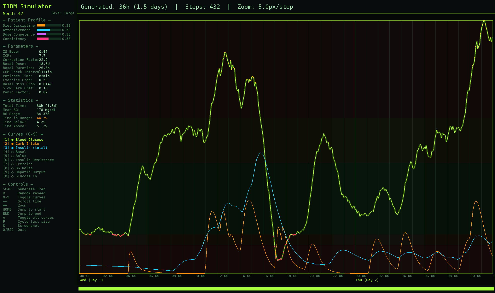
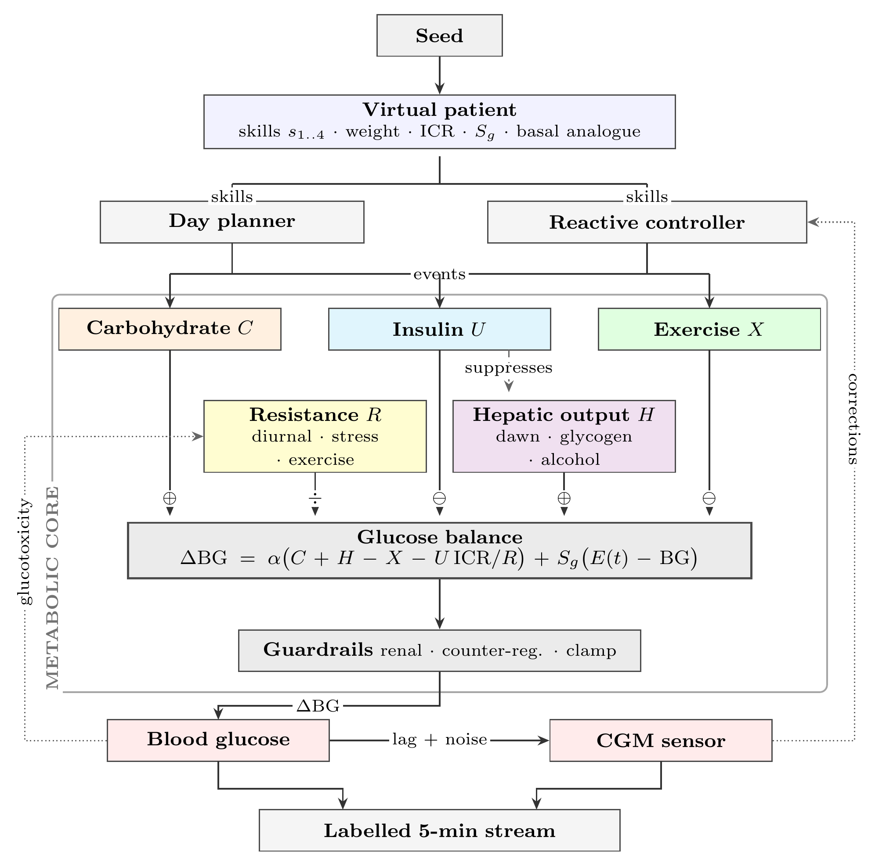

# T1DM Patient Behavior Simulator

A seed-driven simulator for generating synthetic Type 1 Diabetes blood glucose data. Unlike traditional glucose-insulin simulators (e.g., UVA/Padova), it models patient *behavior* as the primary driver of blood sugar outcomes: factor curves -- carbohydrate intake, insulin action, insulin sensitivity, and exercise -- are generated, and blood sugar emerges from their interactions.

Designed by a T1DM patient, informed by lived experience.

> [!CAUTION]
> **Research and educational use only.** This project is a synthetic-data generator and a behavioral model of Type 1 Diabetes — not a medical device, and not clinically validated. Its output is artificial data, not real patient measurements, and **must not** be used to make medical, diagnostic, or treatment decisions, to calculate or adjust insulin doses, or to guide diabetes management in any way. For medical advice, consult a qualified healthcare professional. The software is provided "as is", without warranty of any kind, and the authors accept no liability for any use.




## Table of contents

- [Motivation](#motivation)
- [Paper](#paper)
- [Pregenerated Datasets](#pregenerated-datasets)
- [Design Principles](#design-principles)
- [Architecture](#architecture)
- [Blood Sugar Computation](#blood-sugar-computation)
- [Patient Model](#patient-model)
- [Insulin Sensitivity Model](#insulin-sensitivity-model)
- [Behavioral Events](#behavioral-events)
- [Installation and Usage](#installation-and-usage)
- [Visualizer Controls](#visualizer-controls)
- [Comparison Against Real-World Datasets](#comparison-against-real-world-datasets)
- [Comparison Against the UVA/Padova Simulator](#comparison-against-the-uvapadova-simulator)
- [Testing](#testing)
- [References](#references)
- [Related Projects](#related-projects)
- [License](#license)


## Motivation

Most T1DM simulators model physiology: glucose kinetics, insulin pharmacokinetics, compartmental models. They produce accurate BG traces but need dozens of physiological parameters that are hard to measure and vary between patients.

This one models the *person*, not the pancreas. Most real-world blood sugar variance comes from behavioral decisions -- what the patient eats, when they bolus, how they correct, whether they exercise -- not from subtle physiological differences. Generating diverse behavioral patterns and computing BG as a consequence yields training data whose target is what patients *do*, with blood sugar as the outcome: a near-unlimited stream of synthetic factor curves for pretraining personalized blood sugar prediction models, with real patient data reserved for fine-tuning.


## Paper

[T1DMSIM: A Behavioral Simulator for Synthetic Type 1 Diabetes Glucose Data Generation](paper/main.pdf)


## Pregenerated Datasets

Two caches written by `cache_simulator.py` are published — a balanced pool and a hypoglycemia-oversampled one — each documented by the report it ships with.

- [cache_balanced.tar.gz](https://drive.google.com/file/d/1pZuf6Htui-CC3Abp2NAHVvogk99X1ZR3/view?usp=sharing) — [`cache_balanced/DATASET.md`](cache_balanced/DATASET.md)
- [cache_hypo.tar.gz](https://drive.google.com/file/d/1D1tg0GDtzLY_IzrtMkOj1foQhRj3cU9R/view?usp=sharing) — [`cache_hypo/DATASET.md`](cache_hypo/DATASET.md)


## Design Principles

1. **Every factor is a curve, not a number.** 40g of bread and 40g of orange juice both contribute 40g of carbs, but the juice's absorption peaks faster and falls faster. The same applies to rapid-acting vs long-acting insulin.

2. **Behavior is driven by a latent skill profile.** Four correlated skill dimensions decide what a patient eats, when, how accurately they dose, and how quickly they correct.

3. **The liver is an insulin-suppressed feeding session.** Hepatic glucose output (HGO) is a steady stream of "food" entering the bloodstream, throttled down by a Hill function of EMA-smoothed plasma insulin. A finite hepatic glycogen reservoir gates the glycogenolysis fraction, and large meals schedule a delayed HGO rebound 3.5-5.5h later — the mechanism behind nocturnal hyperglycemia after a big dinner. Basal insulin exists to counteract baseline HGO.

4. **Exercise is negative food.** Aerobic exercise pulls glucose out of the bloodstream into muscle cells, modeled as a negative carb-equivalent curve plus a lasting insulin-sensitivity boost.

5. **Everything is seed-driven.** A single integer fixes the patient's personality, physiology, daily schedule, meal choices, insulin doses, exercise patterns, illness events, and random noise. Same seed, same simulation, always.


## Architecture

<picture>
  <source media="(prefers-color-scheme: dark)" srcset="screenshots/architecture-dark.png">
  <source media="(prefers-color-scheme: light)" srcset="screenshots/architecture.png">
  
</picture>

A seed fixes the virtual patient. A day planner turns that patient's latent skills into events, each event becomes a factor curve, and the metabolic core combines the curves into a 5-minute blood sugar delta. Solid arrows carry glucose or insulin and are badged by their effect on BG (⊕ raises, ⊖ lowers, ÷ divides the insulin term); the dashed arrow is multiplicative modulation; the dotted arrows are the two feedback loops -- the patient doses against the sensor rather than the true BG, and sustained hyperglycemia raises insulin resistance.


## Blood Sugar Computation

At each 5-minute time step, the BG delta is computed as:

```
glucose_in  = carbs + hepatic_output - exercise
glucose_out = insulin_units * ICR / insulin_sensitivity
delta_BG    = alpha * (glucose_in - glucose_out) + S_g * (E(t) - BG)
```

`alpha` is `BG_SCALE_FACTOR`, the master constant converting abstract units to mg/dL. Insulin sensitivity divides the clearance term: resistant patients (IS > 1) clear less glucose per unit insulin, sensitive patients (IS < 1) clear more. HGO suppression by insulin is handled separately by the Hill function, so IS modulates only peripheral insulin action.

`S_g * (E(t) - BG)` is glucose effectiveness — the Bergman-minimal-model insulin-independent pull toward a stochastic equilibrium `E(t)`, without which within-band BG would drift as an undamped integrator of net flux.

Three physiological guardrails are then applied to the delta:

- Renal clearance: above 180 mg/dL, the kidneys excrete glucose proportionally to the excess.
- Counter-regulatory response: below 70 mg/dL, glucagon and cortisol force the liver to dump extra sugar.
- Severe-hypo glucagon dump: below `SEVERE_HYPO_THRESHOLD`, an additional emergency release adds glucose proportionally to severity.

Soft delta-damping near the floor and ceiling shapes the tails; a hard clamp at 10-400 mg/dL acts as a backstop. The floor is deliberately below the CGM reporting floor of 40 mg/dL: a sensor that stops reporting does not stop the patient falling, and clamping the dynamics at the reporting floor makes every descent taper out there. The full algebra for every curve, envelope, and guardrail is in [`docs/math.md`](docs/math.md).


## Patient Model

Each virtual patient is defined by four skill dimensions sampled from a multivariate normal with configurable correlation (default 0.7):

| Skill | Governs |
|---|---|
| Dietary discipline (s1) | Carb amount per meal, number of meals/snacks, fast-vs-slow carb mixture, meal-timing regularity. Low s1 patients eat more fast carbs, more erratically. |
| Attentiveness (s2) | CGM check frequency, response speed to highs and lows, whether overnight alarms are noticed, trend-based anticipatory corrections. |
| Dosing competence (s3) | Carb-counting accuracy, bolus timing (pre- vs post-meal), IOB awareness before correcting, correction-dose appropriateness, probability of rage bolusing. |
| Lifestyle consistency (s4) | Regularity of wake/sleep times, exercise frequency, meal-schedule stability, alcohol frequency, overall routine predictability. |

Skills are mapped through a sigmoid and clipped to a configurable range (default 0.15-0.98); every behavioral parameter — meal sizes, timing jitter, bolus accuracy, correction behavior, exercise habits — is derived from them.

| Trait | Sampled | Governs |
|---|---|---|
| `body_weight_kg` | Normal, clipped | HGO scale and the basal-dose anchor |
| `insulin_resistance_factor` | Lognormal, clipped | `is_base`, `icr`, `correction_factor`, and the equilibrium anchor |
| `glucose_effectiveness` | Lognormal around `GE_RATE` | Strength of the insulin-independent restoring pull |
| `ge_anchor` | Normal about `GE_EQ_ANCHOR_MEAN`, lifted by resistance | The patient's own mean glucose level |
| `ge_sigma_mult` | Lognormal, clipped | Within-patient glycemic variability |
| `meal_appetite` | Lognormal, clipped | Per-meal carb amount |
| `basal_type` | Uniform over `BASAL_VARIANTS` | Glargine (26h) or degludec (42h) basal PK |
| `cgm_lag_minutes` | Normal, clipped | Interstitial lag of this patient's sensor behind plasma glucose (0-20 min) |

These traits are sampled independently of skill and give the population its between-patient spread in mean glucose, variability, and sensor timing.


## Insulin Sensitivity Model

Insulin sensitivity follows a diurnal pattern modeled as a sum of Gaussian bumps: a morning resistance peak around 7 AM (the dawn phenomenon, source of the classic morning BG rise) and a nighttime sensitivity dip around 2 AM that can cause nocturnal lows. The morning peak's timing shifts day-to-day (configurable sigma); a daily drift and per-step noise add further variability. During illness the IS factor ramps gradually toward a target and back down during recovery.

Modifiers applied on top of the diurnal pattern:

- **Post-exercise sensitivity boost**: IS is reduced by `EXERCISE_IS_REDUCTION` (10%) for `EXERCISE_IS_DURATION_HOURS` (6h) after aerobic exercise — the effect behind nocturnal hypos in active patients.
- **Glucotoxicity**: a slow 3h EMA of true BG drives transient insulin resistance when chronically elevated, closing a positive feedback loop on hyperglycemia (high BG → more IR → harder to bring down).
- **Postprandial insulin resistance**: while carbs are absorbing, the insulin-resistance factor is multiplied by `(1 + penalty)`, where `penalty` saturates with active carb load. In T1DM the incretin / GLP-1 sensitivity boost non-diabetics get with a meal is blunted or absent, so the absorbing-carb state is if anything mildly insulin-*resistant*.
- **Injection site quality (lipohypertrophy)**: every dose (basal, meal bolus, corrections) is multiplied by a per-dose `site_quality` factor from `N(1.0, σ)` with σ scaling as `1/s4` — poor lifestyle consistency means poor site rotation and higher dose-to-dose variance.


## Behavioral Events

- **Meals**: number, timing, and carb amount are all skill-dependent, and each meal decomposes into 2-5 overlapping gamma absorption components classified fast / medium / slow by the patient's `slow_carb_preference`, plus a protein/fat tail.

- **Basal insulin**: one long-acting injection per day, anchored to `HGO_base × 24h × (body_weight_kg / BODY_WEIGHT_MEAN_KG) × is_base / ICR` and absorbed through a Bateman one-compartment PK curve `f(t) = exp(-ke·t) − exp(-ka·t)` whose duration is the patient's assigned analogue, glargine (26h) or degludec (42h).

- **Bolus insulin**: dosed per meal from a carb count carrying skill-dependent error, with competent patients pre-bolusing and duration of action scaling as `√dose` about a 5U reference, so larger doses act longer and peak slightly later. Almost every dose is preceded by a glance at the CGM: below the patient's own hypo threshold the bolus is skipped and the meal carbs go untreated, and within 30 mg/dL above it the dose is cut.

- **Corrections**: the CGM is checked at skill-dependent intervals, high-competence patients subtracting insulin-on-board before correcting and attentive ones acting on BG *trends* preemptively, while extremes above 300 mg/dL or below the 55 mg/dL severe-hypo threshold can trigger rage bolusing or reflexive rescue eating. What counts as low is one number per patient — a `hypo_threshold` spanning 70-90 mg/dL across the skill range, higher for the attentive and competent — and that single value fires the rescue, gates every bolus, and sets the bar for exercise. Before eating again the patient nets off the rescue carbohydrate still absorbing, in a competence-scaled fraction, so one low is treated once rather than every few minutes; a rage-eat roll, likelier the less competent the patient, drops that arithmetic and treats on the reading alone.

- **Exercise**: skill-dependent probability, reduced on weekends, modelled as a negative carb-equivalent gamma curve plus the post-exercise IS boost above. A planned session starts only if BG sits at least 20 mg/dL above the patient's hypo threshold — exercise is negative food, so setting out already low drives BG straight down — and a session that never starts leaves no sensitivity tail behind it.

- **Alcohol**: more likely on weekends, holidays, and rare event days, it suppresses HGO by 30–70% for 4–8 hours starting 1–2 hours after drinking — on top of insulin's own suppression — causing the delayed nocturnal lows common in real T1DM patients.

- **Stress events**: occasional transient insulin-resistance multipliers (1.2–1.5×, 2–6h) model cortisol spikes from work, emotion, or poor sleep, at a frequency that falls with lifestyle consistency.

- **Weekday/weekend/holiday patterns**: on weekends and holidays wake time shifts later, meal timing is more variable, carb amounts are slightly larger, and alcohol probability increases, with 10–20 configurable public holidays distributed across the year and never falling on a weekend.

- **Rare events**: with low probability per day, the patient has a "chaotic day" where all skills are degraded and the schedule disrupted.

- **Illness**: with low daily probability, the patient gets sick; insulin resistance ramps up over several days and returns to normal during recovery.

- **Anomalous events**: with ~1% daily probability, one meal curve has its gamma shape parameters dramatically modified (k and theta multiplied by random factors), modelling bimodal absorption, injection site issues, or unexplained BG spikes.


## Installation and Usage

Requirements: Python 3.10+, numpy, pygame, pytest (for tests).

```bash
pip install numpy pygame pytest
```

Interactive visualizer:

```bash
python visualizer.py
python visualizer.py --seed 7 --bg 150 --hours 48
```

Programmatic usage:

```python
from simulator import T1DMSimulator

sim = T1DMSimulator(seed=42, initial_bg=120)

# Step-by-step generation
step = sim.generate()   # returns dict with all values for this 5-min step
step = sim.generate()   # next step

# Bulk generation
data = sim.generate_hours(72)  # returns dict of numpy arrays

# Patient info
print(sim.get_patient_summary())

# Reseed
sim.reseed(seed=99)

# Inject a curve externally (e.g., for testing or custom scenarios)
import numpy as np
from simulator import gamma_curve
curve = gamma_curve(60.0, k=2.0, theta=15.0, duration_minutes=120.0)
sim.inject_curve(curve, sim.state.current_idx, 'carb', 'Custom meal')
```


## Visualizer Controls

```
SPACE       Generate next 24 hours
R           Random reseed
1-9, 0      Toggle curve visibility
A           Toggle all curves
F           Cycle text size (small / medium / large)
Left/Right  Scroll timeline
+/-         Zoom in/out
HOME/END    Jump to start/end
Mouse       Hover for values
S           Screenshot (PNG)
Q/ESC       Quit
```

Curves: (1) Blood Glucose, (2) Carb Intake, (3) Insulin (total), (4) Basal, (5) Bolus, (6) Insulin Resistance (multiplier; >1 = resistant), (7) Exercise, (8) BG Delta, (9) Hepatic Output, (0) Glucose In.


## Comparison Against Real-World Datasets

[`diff/README.md`](diff/README.md) scores the simulator against three real CGM corpora — OhioT1DM, ShanghaiT1DM, and AZT1D — across distributional, variability, temporal, and episode metrics.


## Comparison Against the UVA/Padova Simulator

- [`uva_padova/README.md`](uva_padova/README.md) — the exact meals, boluses, and basal a seed generates are replayed verbatim into a paired UVA/Padova virtual patient, isolating how the two physiologies answer the same behaviour.
- [`uva_padova/EXCURSIONS.md`](uva_padova/EXCURSIONS.md) — sharing only the meal schedule and letting each engine dose for its own physiology, post-meal excursions are compared in amplitude, time-to-peak, area, and amplitude-normalised shape.
- [`uva_padova/REALISM.md`](uva_padova/REALISM.md) — each simulator is treated as a synthetic-data source and measured for how far its output sits from the real cohorts, with the distance *between* those cohorts as the yardstick.


## Testing

```bash
python -m pytest tests/ -v
```


## References

The comparison report in [`diff/README.md`](diff/README.md) benchmarks the simulator against three publicly available T1D CGM datasets. Credit and citation requests for those datasets belong to their original authors.

- **OhioT1DM** — Marling, C., and Bunescu, R. *The OhioT1DM Dataset for Blood Glucose Level Prediction: Update 2020.* Proceedings of the 5th International Workshop on Knowledge Discovery in Healthcare Data (KDH @ ECAI 2020), CEUR Workshop Proceedings, vol. 2675, pp. 71–74. Distributed under a data-use agreement via Ohio University; please request access through the maintainers' instructions before redistributing.

- **ShanghaiT1DM** — Zhao, Q., Zhu, J., Shen, X., Lin, C., Zhang, Y., Liang, Y., Cao, B., Li, J., Liu, X., Rao, W., and Wang, C. *Chinese Diabetes Datasets for Data-Driven Machine Learning.* Scientific Data 10, 35 (2023). doi:10.1038/s41597-023-01940-7. The T1DM portion contains 12 patients / 16 records of paired CGM, insulin, and dietary data.

- **AZT1D** — Khamesian, S., Arefeen, A., Thompson, B. M., Grando, M. A., and Ghasemzadeh, H. *AZT1D: A Real-World Dataset for Type 1 Diabetes.* Dataset of 25 individuals with T1D on Automated Insulin Delivery (Tandem t:slim X2 Control-IQ) collected at Mayo Clinic Arizona over 6–8 weeks per patient, including CGM, basal/bolus insulin (with correction-specific amounts and bolus types), carbohydrate intake, and device-mode annotations (regular / sleep / exercise). See the accompanying manuscript (Mayo Clinic / Arizona State University, 2025) for full study design and IRB protocol (#23-003065).

The in-silico comparison in [`uva_padova/README.md`](uva_padova/README.md) benchmarks the simulator against the UVA/Padova model, run through the open-source `simglucose` engine.

- **UVA/Padova Type 1 Diabetes Simulator** — Dalla Man, C., Rizza, R. A., and Cobelli, C. *Meal Simulation Model of the Glucose–Insulin System.* IEEE Transactions on Biomedical Engineering 54(10), 1740–1749 (2007). doi:10.1109/TBME.2007.893506. Simulator update: Dalla Man, C., Micheletto, F., Lv, D., Breton, M., Kovatchev, B., and Cobelli, C. *The UVA/PADOVA Type 1 Diabetes Simulator: New Features.* Journal of Diabetes Science and Technology 8(1), 26–34 (2014). doi:10.1177/1932296813514502. The FDA-accepted 2008 version of this model is the in-silico reference used here.

- **simglucose** — Xie, J. *simglucose: A Type-1 Diabetes Simulator as a Reinforcement Learning Environment in OpenAI Gym* (2018). An open-source Python implementation of the FDA-accepted UVA/Padova (2008) model. GitHub: <https://github.com/jxx123/simglucose> — the engine driven by the comparison scripts in `uva_padova/`.


## Related Projects

- **[T1DMAI](https://github.com/0xdeadf1sh/T1DMAI)** — the transformer that consumes this simulator's output: training, evaluation, and the ExecuTorch exporter that produces the on-device artifact.
- **[T1DMDROID](https://github.com/0xdeadf1sh/T1DMDROID)** — the Android app that runs that exported model on-device against a live CGM feed.
- **[T1DMSERVER](https://github.com/0xdeadf1sh/T1DMSERVER)** — the optional self-hosted sync backend and terminal dashboard for that app.


## License

Copyright 2026 0xdeadf1sh

Permission is hereby granted, free of charge, to any person obtaining a copy of this software and associated documentation files (the “Software”), to deal in the Software without restriction, including without limitation the rights to use, copy, modify, merge, publish, distribute, sublicense, and/or sell copies of the Software, and to permit persons to whom the Software is furnished to do so, subject to the following conditions:

The above copyright notice and this permission notice shall be included in all copies or substantial portions of the Software.

THE SOFTWARE IS PROVIDED “AS IS”, WITHOUT WARRANTY OF ANY KIND, EXPRESS OR IMPLIED, INCLUDING BUT NOT LIMITED TO THE WARRANTIES OF MERCHANTABILITY, FITNESS FOR A PARTICULAR PURPOSE AND NONINFRINGEMENT. IN NO EVENT SHALL THE AUTHORS OR COPYRIGHT HOLDERS BE LIABLE FOR ANY CLAIM, DAMAGES OR OTHER LIABILITY, WHETHER IN AN ACTION OF CONTRACT, TORT OR OTHERWISE, ARISING FROM, OUT OF OR IN CONNECTION WITH THE SOFTWARE OR THE USE OR OTHER DEALINGS IN THE SOFTWARE.
