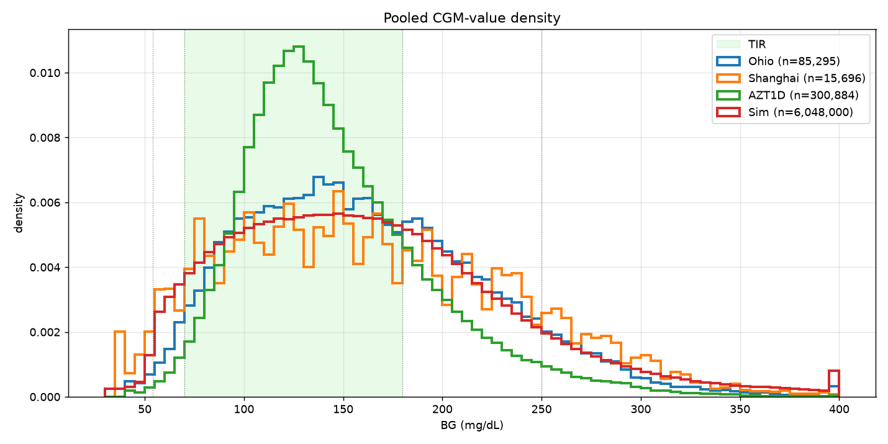
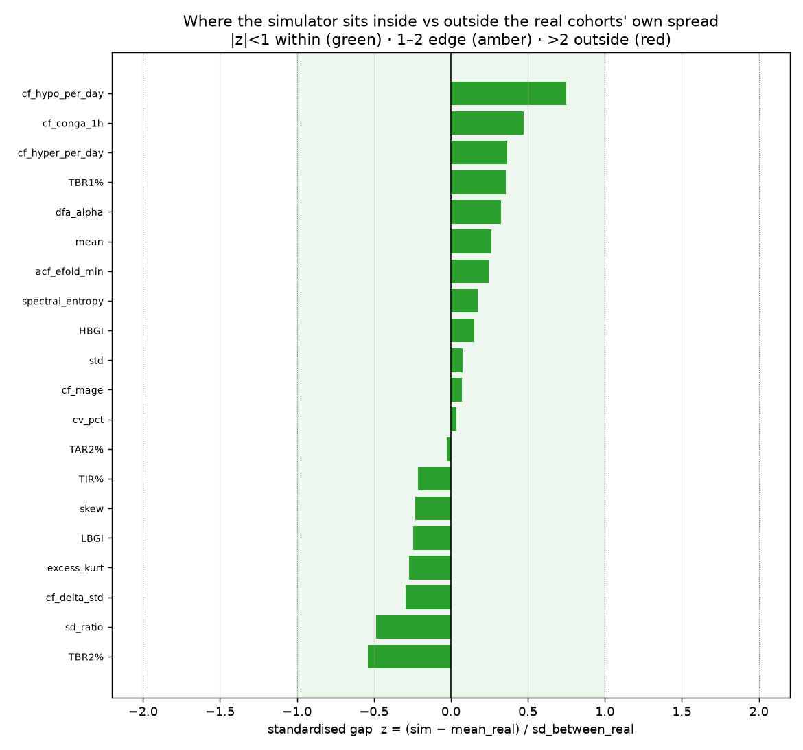

# T1DM Patient Behavior Simulator

A seed-driven simulator for generating synthetic Type 1 Diabetes blood glucose data. Unlike traditional glucose-insulin simulators (e.g., UVA/Padova), it models patient *behavior* as the primary driver of blood sugar outcomes: factor curves -- carbohydrate intake, insulin action, insulin sensitivity, and exercise -- are generated, and blood sugar emerges from their interactions.

Designed by a T1DM patient, informed by lived experience.

> [!CAUTION]
> **Research and educational use only.** This project is a synthetic-data generator and a behavioral model of Type 1 Diabetes — not a medical device, and not clinically validated. Its output is artificial data, not real patient measurements, and **must not** be used to make medical, diagnostic, or treatment decisions, to calculate or adjust insulin doses, or to guide diabetes management in any way. For medical advice, consult a qualified healthcare professional. The software is provided "as is", without warranty of any kind, and the authors accept no liability for any use.


## Table of contents

- [Motivation](#motivation)
- [Pregenerated Datasets](#pregenerated-datasets)
- [Design Principles](#design-principles)
- [Architecture](#architecture)
- [Blood Sugar Computation](#blood-sugar-computation)
- [Patient Model](#patient-model)
- [Insulin Sensitivity Model](#insulin-sensitivity-model)
- [Behavioral Events](#behavioral-events)
- [Installation and Usage](#installation-and-usage)
- [Visualizer Controls](#visualizer-controls)
- [Parameters](#parameters)
- [Comparison Against Real-World Datasets](#comparison-against-real-world-datasets)
- [Comparison Against the UVA/Padova Simulator](#comparison-against-the-uvapadova-simulator)
- [Testing](#testing)
- [References](#references)
- [License](#license)


## Motivation

Most T1DM simulators model physiology: glucose kinetics, insulin pharmacokinetics, compartmental models. They produce accurate BG traces but need dozens of physiological parameters that are hard to measure and vary between patients.

This one models the *person*, not the pancreas. Most real-world blood sugar variance comes from behavioral decisions -- what the patient eats, when they bolus, how they correct, whether they exercise -- not from subtle physiological differences. Generating diverse behavioral patterns and computing BG as a consequence yields training data whose target is what patients *do*, with blood sugar as the outcome: a near-unlimited stream of synthetic factor curves for pretraining personalized blood sugar prediction models, with real patient data reserved for fine-tuning.


## Pregenerated Datasets

`cache_simulator.py` drives the simulator across many seeds and writes each channel as a compressed [blosc2](https://www.blosc.org/) array. Alongside each cache it emits a `DATASET.md` report (path set by `--dataset-md`) covering patient and reading counts, CGM-hours, carbohydrate / insulin / meal totals, glycemic-band time fractions, the per-channel disk inventory, and the generation parameters; plus a `normalization_stats.json` — the 3-channel `{mean, std}` (blood glucose in Kovatchev risk space, carbohydrate / insulin in log1p space) the downstream forecasting model consumes to normalize its inputs.

```bash
# 50k patients across all cores
python cache_simulator.py --out-dir simulator_cache --pool-size 50000

# oversample hypoglycemia-rich trajectories (25% of rows) for class-balanced training
python cache_simulator.py --pool-size 50000 --hypo-oversample 0.25
```

Each trajectory is 55.5 h of post-warmup CGM at 5-minute cadence (666 steps; the first 48 h of warmup are discarded before caching). Windows whose CGM touches the clamp rails (a reading ≥ 399 or ≤ 41 mg/dL) are discarded, and `--hypo-oversample` biases a configurable fraction of rows toward hypoglycemia via seed rejection sampling. The tool needs `blosc2` beyond the core dependencies (`pip install blosc2`).

Each report also carries a **distribution-vs-baseline** table: the cache's pooled `bg_observed` measured against the unbiased-simulator baseline in [`diff/README.md`](diff/README.md) (`datasets.Sim` in `diff/stats.json`) — the shift in moments, percentiles, glycemic-band time fractions, and LBGI/HBGI, which under `--hypo-oversample` quantifies how far the biased corpus departs from the simulator's natural distribution.

The two published caches carry their reports in-tree — [`cache_balanced/DATASET.md`](cache_balanced/DATASET.md) and [`cache_hypo/DATASET.md`](cache_hypo/DATASET.md). The arrays themselves are downloadable:

- [cache_balanced.tar.gz](https://drive.google.com/file/d/1pZuf6Htui-CC3Abp2NAHVvogk99X1ZR3/view?usp=sharing)
- [cache_hypo.tar.gz](https://drive.google.com/file/d/1D1tg0GDtzLY_IzrtMkOj1foQhRj3cU9R/view?usp=sharing)


## Design Principles

1. **Every factor is a curve, not a number.** 40g of bread and 40g of orange juice both contribute 40g of carbs, but the juice's absorption peaks faster and falls faster. The same applies to rapid-acting vs long-acting insulin.

2. **Behavior is driven by a latent skill profile.** Four correlated skill dimensions decide what a patient eats, when, how accurately they dose, and how quickly they correct.

3. **The liver is an insulin-suppressed feeding session.** Hepatic glucose output (HGO) is a steady stream of "food" entering the bloodstream, throttled down by a Hill function of EMA-smoothed plasma insulin. A finite hepatic glycogen reservoir gates the glycogenolysis fraction, and large meals schedule a delayed HGO rebound 3.5-5.5h later — the mechanism behind nocturnal hyperglycemia after a big dinner. Basal insulin exists to counteract baseline HGO.

4. **Exercise is negative food.** Aerobic exercise pulls glucose out of the bloodstream into muscle cells, modeled as a negative carb-equivalent curve plus a lasting insulin-sensitivity boost.

5. **Everything is seed-driven.** A single integer fixes the patient's personality, physiology, daily schedule, meal choices, insulin doses, exercise patterns, illness events, and random noise. Same seed, same simulation, always.


## Architecture

<picture>
  <source media="(prefers-color-scheme: dark)" srcset="screenshots/architecture-dark.png">
  <source media="(prefers-color-scheme: light)" srcset="screenshots/architecture.png">
  
</picture>

A seed fixes the virtual patient. A day planner turns that patient's latent skills into events, each event becomes a factor curve, and the metabolic core combines the curves into a 5-minute blood sugar delta. Solid arrows carry glucose or insulin and are badged by their effect on BG (⊕ raises, ⊖ lowers, ÷ divides the insulin term); the dashed arrow is multiplicative modulation; the dotted arrows are the two feedback loops -- the patient doses against the sensor rather than the true BG, and sustained hyperglycemia raises insulin resistance.

`simulator.py` holds the engine and its ~270 uppercase parameter constants. `T1DMSimulator.generate()` advances one 5-minute step and returns every factor value plus the resulting BG — `rand()` in C: seed once, then call repeatedly. `visualizer.py` renders those curves interactively, with the skill profile, derived parameters, and live statistics in a sidebar and exact values on mouse hover.

**Performance:** curve contributions are pre-accumulated into numpy arrays (`_carb_totals`, `_basal_totals`, `_bolus_totals`, `_exercise_totals`) so each step reads values in O(1), and insulin-on-board is a single `np.sum` over the future insulin array — enough to make `generate_hours()` viable for bulk generation.


## Blood Sugar Computation

At each 5-minute time step, the BG delta is computed as:

```
glucose_in  = carbs + hepatic_output - exercise
glucose_out = insulin_units * ICR / insulin_sensitivity
delta_BG    = alpha * (glucose_in - glucose_out)
```

`alpha` is `BG_SCALE_FACTOR`, the master constant converting abstract units to mg/dL. Insulin sensitivity divides the clearance term: resistant patients (IS > 1) clear less glucose per unit insulin, sensitive patients (IS < 1) clear more. HGO suppression by insulin is handled separately by the Hill function, so IS modulates only peripheral insulin action.

Three physiological guardrails are then applied to the delta:

- Renal clearance: above 180 mg/dL, the kidneys excrete glucose proportionally to the excess.
- Counter-regulatory response: below 70 mg/dL, glucagon and cortisol force the liver to dump extra sugar.
- Severe-hypo glucagon dump: below `SEVERE_HYPO_THRESHOLD`, an additional emergency release adds glucose proportionally to severity.

Soft delta-damping near the floor and ceiling shapes the tails; a hard clamp at 40-400 mg/dL acts as a backstop. The full algebra for every curve, envelope, and guardrail is in [`docs/math.md`](docs/math.md).


## Patient Model

Each virtual patient is defined by four skill dimensions sampled from a multivariate normal with configurable correlation (default 0.7):

| Skill | Governs |
|---|---|
| Dietary discipline (s1) | Carb amount per meal, number of meals/snacks, fast-vs-slow carb mixture, meal-timing regularity. Low s1 patients eat more fast carbs, more erratically. |
| Attentiveness (s2) | CGM check frequency, response speed to highs and lows, whether overnight alarms are noticed, trend-based anticipatory corrections. |
| Dosing competence (s3) | Carb-counting accuracy, bolus timing (pre- vs post-meal), IOB awareness before correcting, correction-dose appropriateness, probability of rage bolusing. |
| Lifestyle consistency (s4) | Regularity of wake/sleep times, exercise frequency, meal-schedule stability, alcohol frequency, overall routine predictability. |

Skills are mapped through a sigmoid and clipped to a configurable range (default 0.15-0.98); every behavioral parameter — meal sizes, timing jitter, bolus accuracy, correction behavior, exercise habits — is derived from them.

Orthogonal to skill, each patient carries independently sampled physiological traits: body weight, an insulin-resistance level (setting baseline insulin needs and carb ratio, and shifting average glucose upward for more-resistant patients), and a glucose-variability scale. These give the population between-patient spread in both mean glucose and glycemic variability comparable to the real CGM cohorts.


## Insulin Sensitivity Model

Insulin sensitivity follows a multi-peak diurnal pattern modeled as a sum of Gaussian bumps: a morning resistance peak around 7 AM (the dawn phenomenon, source of the classic morning BG rise), a latent evening rebound near 8 PM currently disabled (`IS_EVENING_AMPLITUDE = 0.0`), and a nighttime sensitivity dip around 2 AM that can cause nocturnal lows. The morning peak's timing shifts day-to-day (configurable sigma); a daily drift and per-step noise add further variability. During illness the IS factor ramps gradually toward a target and back down during recovery.

Modifiers applied on top of the diurnal pattern:

- **Post-exercise sensitivity boost**: IS is reduced by `EXERCISE_IS_REDUCTION` (10%) for `EXERCISE_IS_DURATION_HOURS` (6h) after aerobic exercise — the effect behind nocturnal hypos in active patients.
- **Glucotoxicity**: a slow 3h EMA of true BG drives transient insulin resistance when chronically elevated, closing a positive feedback loop on hyperglycemia (high BG → more IR → harder to bring down).
- **Postprandial insulin resistance**: while carbs are absorbing, the insulin-resistance factor is multiplied by `(1 + penalty)`, where `penalty` saturates with active carb load. In T1DM the incretin / GLP-1 sensitivity boost non-diabetics get with a meal is blunted or absent, so the absorbing-carb state is if anything mildly insulin-*resistant*.
- **Injection site quality (lipohypertrophy)**: every dose (basal, meal bolus, corrections) is multiplied by a per-dose `site_quality` factor from `N(1.0, σ)` with σ scaling as `1/s4` — poor lifestyle consistency means poor site rotation and higher dose-to-dose variance.


## Behavioral Events

- **Meals**: number, timing, and carb amount are all skill-dependent. Each meal decomposes into 2-5 overlapping gamma absorption components (a "mixed meal" model): the count is `MIXED_MEAL_MIN_COMPONENTS + Poisson(λ)` capped at the max, carb fractions come from a Dirichlet distribution, and each component is classified fast / medium / slow with weights driven by the patient's `slow_carb_preference`, its `(k, θ)` sampled uniformly from category-specific ranges. A protein/fat tail is always added at `PROTEIN_FAT_FRACTION_OF_CARBS × meal_carbs`, floored at `PROTEIN_FAT_MIN_GRAMS` (6 g) — ~6 g for snacks, ~10–15 g for typical meals, ~18 g for large dinners. Hypo-correction carbs use a separate, faster pair (glucose tablets / juice).

- **Basal insulin**: one long-acting injection per day (`BASAL_DOSE_INTERVAL_HOURS`, 24h) delivering a 24h-equivalent dose anchored to `HGO_base × 24h × (body_weight_kg / BODY_WEIGHT_MEAN_KG) × is_base / ICR` — the weight factor mirrors the per-step HGO scaling and the `is_base` factor keeps the HGO-balances-basal invariant across body sizes and baseline insulin needs. Unskilled patients deviate from the ideal more, and a daily adjustment nudges the dose from the previous day's mean BG. Each patient is assigned one of two analogues (`BASAL_VARIANTS`): glargine (26h duration of action) or degludec (42h). Absorption is a Bateman one-compartment PK curve `f(t) = exp(-ke·t) − exp(-ka·t)` (broad peak at ~6.3h, half-life ~9.9h) with a smootherstep tail clip. Each dose's curve is generated with duration `basal_duration_hours × (1 + BASAL_PK_OVERLAP_FRACTION)` — overlap is 1.00 so the PK lasts 2× the cadence, meaning 2–3 doses always contribute simultaneously and a single missed dose is bridged by the previous dose's still-active tail.

- **Bolus insulin**: dosed per meal from an estimated carb count (with skill-dependent counting error). Competent patients pre-bolus, incompetent ones bolus after eating, and snack boluses may be skipped. PK is dose-dependent — duration of action and θ both scale with `√dose` about a 5U reference, so larger doses act longer and peak slightly later; `bolus_pk_for_dose(dose)` returns `(k, θ, duration_minutes)`.

- **Corrections**: the CGM is checked at skill-dependent intervals, and high-competence patients subtract insulin-on-board (IOB) before correcting to avoid stacking. Attentive patients also act on BG *trends*: rising above `TREND_HIGH_BG_MIN` (145 mg/dL) or falling below `TREND_LOW_BG_MAX` (110 mg/dL) triggers a preemptive correction before the absolute threshold is crossed. Above 300 mg/dL, or below the 55 mg/dL severe-hypo threshold, rage bolusing or reflexive rescue eating may occur.

- **Exercise**: skill-dependent probability, reduced on weekends. A negative carb-equivalent gamma curve plus the post-exercise IS boost above.

- **Alcohol**: more likely on weekends, holidays, and rare event days. Suppresses HGO by 30–70% for 4–8 hours starting 1–2 hours after drinking, on top of insulin's own suppression, causing the delayed nocturnal lows common in real T1DM patients.

- **Stress events**: occasional transient insulin-resistance multipliers (1.2–1.5×, 2–6h) model cortisol spikes from work, emotion, or poor sleep. Frequency decreases with lifestyle consistency.

- **Weekday/weekend/holiday patterns**: on weekends and holidays wake time shifts later, meal timing is more variable, carb amounts are slightly larger, and alcohol probability increases. Public holidays (10–20 per year, configurable) are distributed across the year and never fall on weekends.

- **Rare events**: with low probability per day, the patient has a "chaotic day" where all skills are degraded and the schedule disrupted.

- **Illness**: with low daily probability, the patient gets sick; insulin resistance ramps up over several days and returns to normal during recovery.

- **Anomalous events**: with ~1% daily probability, one meal curve has its gamma shape parameters dramatically modified (k and theta multiplied by random factors), modelling bimodal absorption, injection site issues, or unexplained BG spikes.


## Installation and Usage

Requirements: Python 3.10+, numpy, pygame, pytest (for tests).

```bash
pip install numpy pygame pytest
```

Interactive visualizer:

```bash
python visualizer.py
python visualizer.py --seed 7 --bg 150 --hours 48
```

Programmatic usage:

```python
from simulator import T1DMSimulator

sim = T1DMSimulator(seed=42, initial_bg=120)

# Step-by-step generation
step = sim.generate()   # returns dict with all values for this 5-min step
step = sim.generate()   # next step

# Bulk generation
data = sim.generate_hours(72)  # returns dict of numpy arrays

# Patient info
print(sim.get_patient_summary())

# Reseed
sim.reseed(seed=99)

# Inject a curve externally (e.g., for testing or custom scenarios)
import numpy as np
from simulator import gamma_curve
curve = gamma_curve(60.0, k=2.0, theta=15.0, duration_minutes=120.0)
sim.inject_curve(curve, sim.state.current_idx, 'carb', 'Custom meal')
```


## Visualizer Controls

```
SPACE       Generate next 24 hours
R           Random reseed
1-9, 0      Toggle curve visibility
A           Toggle all curves
F           Cycle text size (small / medium / large)
Left/Right  Scroll timeline
+/-         Zoom in/out
HOME/END    Jump to start/end
Mouse       Hover for values
S           Screenshot (PNG)
Q/ESC       Quit
```

Curves: (1) Blood Glucose, (2) Carb Intake, (3) Insulin (total), (4) Basal, (5) Bolus, (6) Insulin Resistance (multiplier; >1 = resistant), (7) Exercise, (8) BG Delta, (9) Hepatic Output, (0) Glucose In.


## Parameters

All parameters are uppercase constants at the top of `simulator.py`, grouped by category:

- Time resolution (`DT_MINUTES`, `STEPS_PER_DAY`)
- Skill distribution (`SKILL_CORRELATION`, `SKILL_VARIANCE`, `SKILL_MIN`, `SKILL_MAX`)
- Wake/sleep schedule
- Meal generation (counts, timing, carb amounts, fast/slow mixture, curve shapes)
- Insulin sensitivity (diurnal pattern, daily drift, noise, illness effects)
- Basal insulin (sigma around the HGO/ICR/weight ideal, `BASAL_KA_PER_HOUR` / `BASAL_KE_PER_HOUR` and the smootherstep tail clip, per-analogue duration from `BASAL_VARIANTS`, `BASAL_DOSE_INTERVAL_HOURS`, `BASAL_SITE_QUALITY_DAMPING`, miss probability, daily adjustment)
- Bolus insulin (curve shape, timing, carb counting error)
- Correction behavior (thresholds, patience, CGM check intervals, IOB awareness, trend thresholds)
- Exercise (probability, duration, carb equivalent, delayed IS effect)
- Hepatic glucose output
- BG computation (scale factor, clamps, guardrails)
- CGM noise
- Weekday/weekend modifiers and public holiday counts
- Alcohol, stress events, anomalous events, rare events and rage behavior


## Comparison Against Real-World Datasets

The simulator output is compared against three non-redistributable real CGM corpora:

| Corpus | Cohort | Signals |
|---|---|---|
| **OhioT1DM** | 6 US adults | 5-min Medtronic Enlite CGM |
| **ShanghaiT1DM** | 12 patients / 16 records | 15-min cadence, mixed CSII + MDI |
| **AZT1D** | 25 US adults on Tandem t:slim X2 Control-IQ AID | 5-min Dexcom G6 plus full pump event log: basal rate, bolus type, correction-vs-meal split, carb size, device mode |



The battery covers distributional moments, KS / Wasserstein / JS distances, LBGI / HBGI, MAGE / CONGA / MODD / SampEn, autocorrelation across nine lags, diurnal envelopes, weekday × hour heatmaps, episode counts and durations, hypo recovery time, per-record TIR / TBR scatter, and (AZT1D only) a head-to-head insulin / carb behaviour panel. An extended-statistics section adds further two-sample distances, cadence-fair metrics on a common 15-minute grid, temporal-structure measures (Poincaré SD1/SD2, spectral entropy, DFA/Hurst, ACF e-folding, a glycemic-band Markov transition matrix), cross-seed bootstrap confidence intervals, and a standardised gap score:



Tables, figures, and methodology live in [`diff/README.md`](diff/README.md). All three datasets are gitignored and live under `datasets/` (subject to data-use agreements). Reproduce with:

```bash
python diff/build_report.py                          # default corpus
python diff/build_report.py --n-seeds 300 --days 70  # larger synthetic corpus
```


## Comparison Against the UVA/Padova Simulator

A second comparison targets the reference *in-silico* model rather than real CGM: the FDA-accepted **UVA/Padova 2008** simulator, via the open-source [`simglucose`](https://github.com/jxx123/simglucose) ODE core, driven through a thin adapter in [`uva_padova/padova_engine.py`](uva_padova/padova_engine.py). Three lenses, each its own self-contained report:

- **Identical-input replay** — [`uva_padova/README.md`](uva_padova/README.md). The exact meals, boluses, and basal a seed generates are replayed verbatim into a paired UVA/Padova virtual patient, isolating how the two physiologies answer the same behaviour. Also carries a single-threaded **generation-speed** benchmark: this simulator reads pre-accumulated curves in O(1) per 5-min step, while UVA/Padova integrates a thirteen-state stiff ODE every minute.
- **Meal excursions** — [`uva_padova/EXCURSIONS.md`](uva_padova/EXCURSIONS.md). Sharing only the meal schedule and letting each engine dose for its own physiology, post-meal excursions are compared in amplitude, time-to-peak, area, and amplitude-normalised shape.
- **Distance to real** — [`uva_padova/REALISM.md`](uva_padova/REALISM.md). Each simulator treated as a synthetic-data source, measuring how far its output sits from the real cohorts above across the same metric battery, with the distance *between* the real cohorts as the yardstick for "indistinguishable from real".

The reference engine is installed without its reinforcement-learning extras (its pinned `gym` is unneeded and does not build on current Python). Reproduce with:

```bash
pip install --no-deps simglucose>=0.2.11
python uva_padova/compare_uva_padova.py     # identical-input replay + speed
python uva_padova/compare_excursions.py     # meal-excursion deviations
python uva_padova/compare_realism.py        # distance-to-real-CGM
```


## Testing

```bash
python -m pytest tests/ -v
```

The suite (78 tests) covers:

- `tests/test_curves.py` — curve generation correctness and unit consistency
- `tests/test_patient.py` — skill ranges, basal/HGO/ICR relationship, behavioral parameters
- `tests/test_simulator.py` — reproducibility, BG bounds, meal/insulin effects, weekday/weekend/holiday, severe-hypo rescue grams, skill-scaled correction, `inject_curve` totals contract, follow-up snack effect
- `tests/test_balance.py` — basal-HGO balance, meal-bolus balance, ICR-basal proportionality
- `tests/test_hypo_oversample.py` — the distribution-vs-baseline comparison in each cache's `DATASET.md` (pooled moments/percentiles/LBGI-HBGI vs `diff/stats.json`), and that `--hypo-oversample` shifts the pool toward hypoglycemia in the expected direction, reproducibly
- `tests/test_norm_stats.py` — the emitted `normalization_stats.json` schema (3 model channels, finite positive `{mean, std}`) and that its streaming power-sum stats match a direct recompute from the stored `.b2nd` arrays


## References

The comparison report in [`diff/README.md`](diff/README.md) benchmarks the simulator against three publicly available T1D CGM datasets. Credit and citation requests for those datasets belong to their original authors.

- **OhioT1DM** — Marling, C., and Bunescu, R. *The OhioT1DM Dataset for Blood Glucose Level Prediction: Update 2020.* Proceedings of the 5th International Workshop on Knowledge Discovery in Healthcare Data (KDH @ ECAI 2020), CEUR Workshop Proceedings, vol. 2675, pp. 71–74. Distributed under a data-use agreement via Ohio University; please request access through the maintainers' instructions before redistributing.

- **ShanghaiT1DM** — Zhao, Q., Zhu, J., Shen, X., Lin, C., Zhang, Y., Liang, Y., Cao, B., Li, J., Liu, X., Rao, W., and Wang, C. *Chinese Diabetes Datasets for Data-Driven Machine Learning.* Scientific Data 10, 35 (2023). doi:10.1038/s41597-023-01940-7. The T1DM portion contains 12 patients / 16 records of paired CGM, insulin, and dietary data.

- **AZT1D** — Khamesian, S., Arefeen, A., Thompson, B. M., Grando, M. A., and Ghasemzadeh, H. *AZT1D: A Real-World Dataset for Type 1 Diabetes.* Dataset of 25 individuals with T1D on Automated Insulin Delivery (Tandem t:slim X2 Control-IQ) collected at Mayo Clinic Arizona over 6–8 weeks per patient, including CGM, basal/bolus insulin (with correction-specific amounts and bolus types), carbohydrate intake, and device-mode annotations (regular / sleep / exercise). See the accompanying manuscript (Mayo Clinic / Arizona State University, 2025) for full study design and IRB protocol (#23-003065).

The in-silico comparison in [`uva_padova/README.md`](uva_padova/README.md) benchmarks the simulator against the UVA/Padova model, run through the open-source `simglucose` engine.

- **UVA/Padova Type 1 Diabetes Simulator** — Dalla Man, C., Rizza, R. A., and Cobelli, C. *Meal Simulation Model of the Glucose–Insulin System.* IEEE Transactions on Biomedical Engineering 54(10), 1740–1749 (2007). doi:10.1109/TBME.2007.893506. Simulator update: Dalla Man, C., Micheletto, F., Lv, D., Breton, M., Kovatchev, B., and Cobelli, C. *The UVA/PADOVA Type 1 Diabetes Simulator: New Features.* Journal of Diabetes Science and Technology 8(1), 26–34 (2014). doi:10.1177/1932296813514502. The FDA-accepted 2008 version of this model is the in-silico reference used here.

- **simglucose** — Xie, J. *simglucose: A Type-1 Diabetes Simulator as a Reinforcement Learning Environment in OpenAI Gym* (2018). An open-source Python implementation of the FDA-accepted UVA/Padova (2008) model. GitHub: <https://github.com/jxx123/simglucose> — the engine driven by the comparison scripts in `uva_padova/`.


## License

Copyright 2026 0xdeadf1sh

Permission is hereby granted, free of charge, to any person obtaining a copy of this software and associated documentation files (the “Software”), to deal in the Software without restriction, including without limitation the rights to use, copy, modify, merge, publish, distribute, sublicense, and/or sell copies of the Software, and to permit persons to whom the Software is furnished to do so, subject to the following conditions:

The above copyright notice and this permission notice shall be included in all copies or substantial portions of the Software.

THE SOFTWARE IS PROVIDED “AS IS”, WITHOUT WARRANTY OF ANY KIND, EXPRESS OR IMPLIED, INCLUDING BUT NOT LIMITED TO THE WARRANTIES OF MERCHANTABILITY, FITNESS FOR A PARTICULAR PURPOSE AND NONINFRINGEMENT. IN NO EVENT SHALL THE AUTHORS OR COPYRIGHT HOLDERS BE LIABLE FOR ANY CLAIM, DAMAGES OR OTHER LIABILITY, WHETHER IN AN ACTION OF CONTRACT, TORT OR OTHERWISE, ARISING FROM, OUT OF OR IN CONNECTION WITH THE SOFTWARE OR THE USE OR OTHER DEALINGS IN THE SOFTWARE.
