# T1DMSIM vs OhioT1DM, ShanghaiT1DM, AZT1D — Statistical Comparison Report

`simulator.py` is the seed-driven T1D behaviour simulator described in the
[project README](../README.md). It produces synthetic blood-glucose traces
together with the underlying carb / insulin / exercise / sensitivity factor
curves that generated them. This document compares those synthetic traces
against three real-world CGM corpora — OhioT1DM, ShanghaiT1DM, and AZT1D
(see [References](../README.md#references) in the project README) — across
distributional moments, KS / Wasserstein / JS distances, Kovatchev risk
indices, MAGE / CONGA / MODD / sample entropy, autocorrelation across nine
lags, rate-of-change distributions, hour-of-day envelopes, weekday × hour
heatmaps, per-record TIR / TBR scatter, expanded excursion-level metrics,
and — using AZT1D's richer pump log — a head-to-head comparison of basal-rate
distribution, bolus-event counts, per-meal carb size, and device-mode time
share.

**Cohort sizing.** The simulator is exercised here at 300 seeds × 70
days to give it a sample count comparable to the largest real corpus.
**This is not a fixed corpus** — `T1DMSimulator.generate_hours()` is a
deterministic generator (same seed → same trace), and an arbitrary number of
new patient seeds can be sampled, each producing an arbitrarily long trace.
Every per-record number below ("samples", "CGM-days", "n events", etc.) is a
property of *this particular run*, not an upper bound on what the simulator
can produce.

This file is regenerated end-to-end by `diff/build_report.py`. Raw stats are
persisted to `diff/stats.json`; figures live in `diff/figures/`.

## Table of contents

- [0. Machine-learning summary](#0-machine-learning-summary)
- [1. Corpora at a glance](#1-corpora-at-a-glance)
- [2. Methodology](#2-methodology)
- [3. Headline numbers](#3-headline-numbers)
- [4. Clinical glycemic indices](#4-clinical-glycemic-indices)
- [5. Variability and complexity](#5-variability-and-complexity)
- [6. Temporal dynamics](#6-temporal-dynamics)
- [7. Excursion-level dynamics](#7-excursion-level-dynamics)
- [8. Per-record heterogeneity](#8-per-record-per-patient-heterogeneity)
- [9. AZT1D insulin / carb panel](#9-azt1d-insulin--carb-behaviour-panel)
- [10. Side-by-side summary](#10-side-by-side-summary)
- [11. Limitations of this comparison](#11-limitations-of-this-comparison)
- [12. Reproduction](#12-reproduction)

---

## 0. Machine-learning summary

Stats and visuals tailored to designing an ML pipeline against this data.
The simulator emits a continuous, fully-labelled multivariate stream
(BG, carb intake, basal/bolus insulin, exercise, sensitivity, hepatic output
…) suitable for sequence modelling with regression or class-imbalanced
classification heads. **Volume is not a constraint:** each seed produces
an arbitrarily long trace, and there is no upper bound on how many seeds you
can sample — the figures below describe one particular generation run, not a
fixed corpus size.

### 0.1 Data volume per cohort

| Cohort | Records | Samples | Hours | CGM-days | Cadence |
|---|---:|---:|---:|---:|---:|
| OhioT1DM     |   6 | 85,295 |   7,108 |     296 | 5 min |
| ShanghaiT1DM |  16 | 15,696 |   3,924 |     164 | 15 min |
| AZT1D        |  25 | 300,884 |  25,074 |   1,045 | 5 min |
| **T1DMSIM** *(this run)* | **300** | **6,048,000** | **504,000** | **21,000** | **5 min** |

The T1DMSIM row above reflects the 300-seed × 70-day run used
to compute every other number in this report. A fresh `build_report.py` call
with `--n-seeds N --days D` (or the equivalent edit in `main()`) scales the
synthetic corpus linearly with no quality penalty — useful when an ML model
needs orders of magnitude more samples than the real corpora can supply.
Relative to that one run, T1DMSIM provides **70.9× the sample count of OhioT1DM**,
**385.3× ShanghaiT1DM**, and
**20.1× AZT1D**.

### 0.2 Normalization statistics

Per-cohort statistics on the pooled BG vector. Use these for input/output
standardization. For neural-net-friendly z-scoring on the simulator output:
`bg_z = (bg - 160.3) / 61.2`. For robust scaling
that is resistant to extreme-hyper outliers: `bg_robust = (bg - 153.4) / 84.6`
(median / IQR).

| Stat (mg/dL) | Ohio | Shanghai | AZT1D | **Sim** |
|---|---:|---:|---:|---:|
| mean    | 162.1  | 164.7  | 146.4  | **160.3**  |
| median  | 155.0  | 156.6  | 138.0  | **153.4**  |
| std     | 60.9   | 72.3   | 47.6   | **61.2**   |
| IQR     | 87.0   | 106.2   | 57.0   | **84.6**   |
| p1      | 57.0    | 41.3    | 65.0    | **56.7**    |
| p99     | 326.0   | 349.2   | 293.0   | **330.8**   |
| min     | 40.0   | 39.6   | 40.0   | **40.0**   |
| max     | 400.0   | 475.2   | 400.0   | **400.0**   |

### 0.3 Sample-level class balance

For classification heads predicting BG-band membership. Percentages are
per-record means across each cohort.

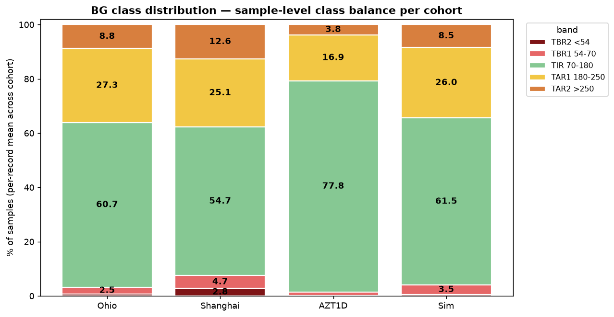

| Band | Threshold | Ohio % | Shang % | AZT1D % | **Sim %** |
|---|---|---:|---:|---:|---:|
| TBR2 | <54     |  0.72 |  2.79 |  0.26 | **0.53** |
| TBR1 | 54-70   |  2.51 |  4.72 |  1.21 | **3.50** |
| TIR  | 70-180  |  60.7  |  54.7  |  77.8  | **61.5**  |
| TAR1 | 180-250 |  27.3 |  25.1 |  16.9 | **26.0** |
| TAR2 | >250    |   8.8 |  12.6 |   3.8 | **8.5** |

T1DMSIM is intentionally tuned for *elevated mild-hypo (TBR1) and severe-hyper
(TAR2) density* relative to OhioT1DM — the shape of those events (durations,
depths, recovery profiles) still matches real cohorts (see §7), but the rate is
higher to give a classifier more positive examples of each rare-event class
per epoch.

### 0.4 Episode-level event counts

For rare-event detection training (e.g. "will hypo in next N minutes" binary
heads). Each row is a contiguous excursion ≥ 15 min.

| Event class | Ohio | Shanghai | AZT1D | **Sim** |
|---|---:|---:|---:|---:|
| Hypo (<70) episodes        | 252   | 169   | 570   | **20,962** |
| Severe-hypo (<54) episodes | 58    | 78    | 117    | **5,752** |
| Hyper (>180) episodes      | 847  | 305  | 2,752  | **55,456** |
| Severe-hyper (>250) episodes | 340  | 192  | 626  | **23,303** |

### 0.5 Effective context window

Pooled Pearson autocorrelation decays as the lag grows. The lag at which the
ACF drops below a chosen threshold is a useful order-of-magnitude estimate of
how long an autoregressive model needs to look back.

| ACF threshold | Ohio | Shanghai | AZT1D | **Sim** |
|---|---:|---:|---:|---:|
| 0.5 (50% retained) | 1.9 h | 2.6 h | 1.3 h | **2.0 h** |
| 0.2 (20% retained) | 3.6 h | 4.8 h | 2.4 h | **3.9 h** |

A 4-8h context window covers the meaningful autoregressive signal; longer
contexts add little beyond the half-day BG ACF tail visible in §6.1.

### 0.6 Cross-record heterogeneity

For train/val/test split design. Between-patient variance dominating
within-patient variance means *patient-stratified* splits are required —
otherwise a model trained on one patient set will fail to generalize to
unseen patients. The simulator's between/within ratio is intentionally close
to the real cohorts' so the same split strategy carries over.

| Cohort | Between-patient mean-BG std | Within-patient BG std | Ratio |
|---|---:|---:|---:|
| Ohio     | 16.2 | 58.6 | 0.28 |
| Shanghai | 31.0 | 62.2 | 0.50 |
| AZT1D    | 16.0 | 44.1 | 0.36 |
| **Sim**  | **16.1** | **58.6** | **0.27** |

### 0.7 Diurnal shape (clean line overlay)

The diurnal envelope figure in §6.3 includes ±1σ bands that visually overlap
across cohorts. This clean line overlay isolates the shape comparison.

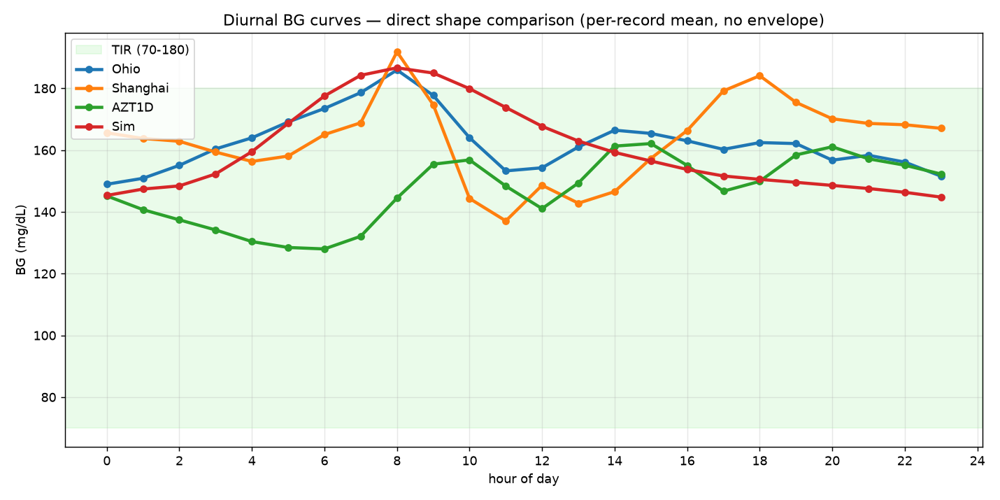

### 0.8 Sim-vs-real domain gap

For models trained on the simulator and evaluated on real CGM, the
Wasserstein-1 distance between the sim and real pooled distributions is a
direct measure of the domain gap that needs to close at inference time.

| Pair | KS | Wasserstein-1 (mg/dL) | JS divergence |
|---|---:|---:|---:|
| **Sim vs Ohio**     | 0.020 | 2.2 | 0.002 |
| **Sim vs Shanghai** | 0.074 | 10.5 | 0.017 |
| **Sim vs AZT1D**    | 0.147 | 17.1 | 0.024 |
| Ohio vs Shanghai (real-vs-real baseline) | 0.064 | 10.1 | 0.018 |
| Ohio vs AZT1D    (real-vs-real baseline) | 0.157 | 18.1 | 0.025 |
| Shanghai vs AZT1D (real-vs-real baseline) | 0.190 | 26.9 | 0.060 |

Compared like-for-like against the real-vs-real spread: the Sim-vs-real
Wasserstein-1 distances are 2.2 (min) / 9.9 (mean) mg/dL,
versus a real-vs-real baseline of 10.1 (min) /
18.4 (mean) mg/dL. The simulator's pooled BG distribution
therefore sits inside the band the
three real cohorts span among themselves (min-vs-min and mean-vs-mean).
Note the smallest gap is Sim-vs-Ohio (2.2 mg/dL), which falls *below* the 10.1 mg/dL real-vs-real floor — the simulator is tuned against OhioT1DM specifically, so a sub-floor distance reflects that tuning, not general realism beyond that cohort.


---

## 1. Corpora at a glance

| Dataset | Records | Cadence | Total CGM-days | Cohort | Notes |
|---|---:|---:|---:|---|---|
| OhioT1DM | 6 records (file pairs) | 5 min Dexcom | 296.2 | US adults, pump + announced meals | training + testing periods concatenated per patient |
| ShanghaiT1DM | 16 records | **15 min** | 163.5 | CN adults, mixed CSII + MDI (incl. regular Novolin R), BMI ≈ 21 | shorter individual records (~10 d) |
| AZT1D | 25 subjects | 5 min Dexcom G6 | 1044.7 | US adults, Mayo Clinic AZ, all on Tandem t:slim X2 Control-IQ (AID) | rich pump event log: bolus type, basal rate, carbs, device mode |
| T1DMSIM *(this run)* | 300 seeds × 70 days | 5 min | 21000.0 | synthetic, seeds 0–299, 24 h warm-up discarded | `initial_bg = 120 mg/dL`, `bg_observed` (sensor-noised); generator is unbounded |

All three real datasets are gitignored. The simulator is exercised as in
`scripts/compare_all_datasets.py`: 24 h warm-up to clear the `initial_bg = 120`
transient, then the next 70 days are captured.

---

## 2. Methodology

- **Resampling.** Ohio CGM is irregular Dexcom samples; it is resampled onto a
  5 min grid by nearest-sample snapping (each grid cell takes the nearer real
  sample, not a linear interpolation) with gaps > 30 min NaN-bridged. Shanghai is
  similarly resampled to a 15 min grid with > 60 min gaps as NaN. AZT1D is
  natively 5-min and uses the same 30-min gap rule as Ohio. The simulator is
  already on a 5 min grid. All statistics ignore NaN.
- **Cadence-aware comparison.** Rate-of-change Δ-BG, ACF, CONGA, MAGE, and MODD
  are computed at each cohort's **native** cadence (5 min for Ohio/AZT1D/Sim,
  15 min for Shanghai). CONGA and MODD are anchored to a fixed real-time lag and
  are cadence-robust; Δ-BG std and MAGE are cadence-sensitive, so Shanghai's
  values there are not directly comparable to the 5-min cohorts (flagged inline).
  Sample entropy is put on a common 15-min effective interval for **every**
  cohort (§5), so its cross-cohort comparison is cadence-fair. A dedicated
  cadence-fair block (§6.4) recomputes the cadence-sensitive metrics for all
  cohorts on one 15-min grid.
- **Distribution distances.** KS statistic, KS p-value, Wasserstein-1 distance,
  and Jensen–Shannon divergence (5 mg/dL bins over the full 0–600 mg/dL support,
  so no cohort's out-of-range tail is dropped) computed on the
  pooled per-cohort CGM-value vector.
- **Risk indices.** LBGI / HBGI per Kovatchev (1997), J-index = 10⁻³·(μ+σ)²,
  M-value with reference 120 mg/dL.
- **MAGE.** Mean amplitude of peak-trough swings exceeding 1·σ_BG.
- **CONGA-h.** Standard deviation of `bg[t+h] − bg[t]`.
- **MODD.** Mean of `|bg[t+24h] − bg[t]|`.
- **Sample entropy.** SampEn(m=2, r=0.2·σ), measured at a fixed 15-min effective
  interval for every cohort (5-min cohorts are strided to 15 min; Shanghai is
  native 15 min) so the value is stable in record length and comparable across
  cadences. Template matches are accumulated within contiguous gap-free segments
  only, so a sensor dropout never joins samples across a bridged gap.
- **Episodes.** Contiguous runs across a threshold lasting ≥ 15 min, NaN
  gaps treated as in-range so a sensor dropout does not split an episode.
- **AZT1D event log.** The pump CSV columns are parsed straight from `Subject
  N.csv`: Basal (U/hr), TotalBolusInsulinDelivered, CorrectionDelivered,
  FoodDelivered, CarbSize, BolusType, DeviceMode. Bolus events are flagged
  by a non-null BolusType. Meal vs correction-only is decided per event by
  `FoodDelivered > 0`. Device-mode time share counts every 5-min row.

---

## 3. Headline numbers

### 3.1 Pooled central moments

| Metric (mg/dL) | OhioT1DM | ShanghaiT1DM | AZT1D | T1DMSIM | Sim − Ohio | Sim − Shang | Sim − AZT1D |
|---|---:|---:|---:|---:|---:|---:|---:|
| n (samples) | 85,295 | 15,696 | 300,884 | 6,048,000 | — | — | — |
| **mean** | 162.1 | 164.7 | 146.4 | 160.3 | -1.7 | -4.4 | +13.9 |
| **median** | 155.0 | 156.6 | 138.0 | 153.4 | -1.6 | -3.2 | +15.4 |
| std | 60.9 | 72.3 | 47.6 | 61.2 | +0.4 | -11.1 | +13.6 |
| IQR | 87.0 | 106.2 | 57.0 | 84.6 | -2.4 | -21.6 | +27.6 |
| CV (%) | 37.6 | 43.9 | 32.5 | 38.2 | +0.6 pp | -5.7 pp | +5.7 pp |
| skewness | 0.58 | 0.51 | 1.03 | 0.64 | +0.06 | +0.13 | -0.39 |
| excess kurtosis | 0.15 | -0.14 | 1.56 | 0.28 | +0.12 | +0.42 | -1.28 |
| min | 40.0 | 39.6 | 40.0 | 40.0 | — | — | — |
| max | 400.0 | 475.2 | 400.0 | 400.0 | — | — | — |

### 3.2 Percentiles of the pooled distribution

| Percentile | OhioT1DM | ShanghaiT1DM | AZT1D | T1DMSIM | Sim − Ohio | Sim − Shang | Sim − AZT1D |
|---|---:|---:|---:|---:|---:|---:|---:|
| p1 | 57.0 | 41.3 | 65.0 | 56.7 | -0.3 | +15.4 | -8.3 |
| p5 | 76.0 | 61.2 | 84.0 | 73.1 | -2.9 | +11.9 | -10.9 |
| p10 | 88.0 | 75.6 | 95.0 | 86.3 | -1.7 | +10.7 | -8.7 |
| p25 | 115.0 | 108.0 | 114.0 | 114.1 | -0.9 | +6.1 | +0.1 |
| p50 | 155.0 | 156.6 | 138.0 | 153.4 | -1.6 | -3.2 | +15.4 |
| p75 | 202.0 | 214.2 | 171.0 | 198.6 | -3.4 | -15.6 | +27.6 |
| p90 | 245.0 | 264.6 | 210.0 | 242.7 | -2.3 | -21.9 | +32.7 |
| p95 | 271.0 | 291.6 | 238.0 | 271.6 | +0.6 | -20.0 | +33.6 |
| p99 | 326.0 | 349.2 | 293.0 | 330.8 | +4.8 | -18.4 | +37.8 |

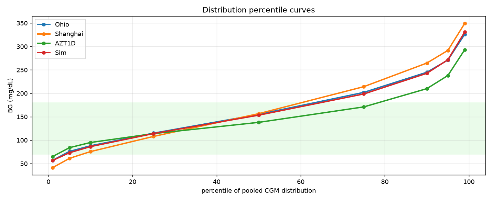


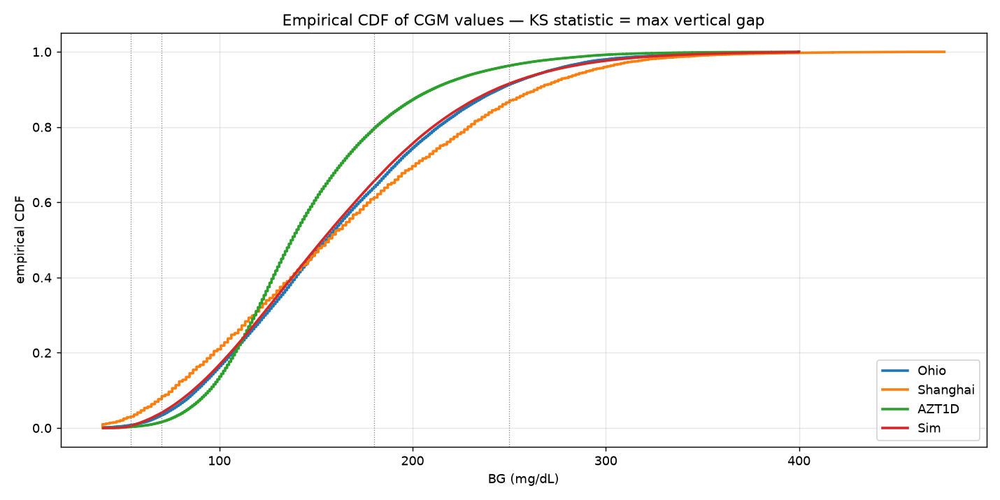

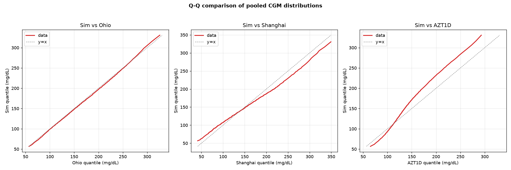

### 3.3 Distribution-distance statistics

| Pair | KS statistic | KS p-value | Wasserstein-1 (mg/dL) | JS divergence (5 mg/dL bins) |
|---|---:|---:|---:|---:|
| Ohio vs Shanghai | 0.064 | 2.0 × 10⁻⁴⁷ | 10.1 | 0.018 |
| Ohio vs AZT1D | 0.157 | < 10⁻³⁰⁰ | 18.1 | 0.025 |
| Shanghai vs AZT1D | 0.190 | < 10⁻³⁰⁰ | 26.9 | 0.060 |
| Sim vs Ohio | 0.020 | 2.2 × 10⁻³⁰ | 2.2 | 0.002 |
| Sim vs Shanghai | 0.074 | 8.2 × 10⁻⁷⁶ | 10.5 | 0.017 |
| Sim vs AZT1D | 0.147 | < 10⁻³⁰⁰ | 17.1 | 0.024 |

KS p-values fall to numerical zero in the right tail at these sample sizes
(Ohio 85k, AZT1D 301k, Sim 6.05M);
the magnitudes of the KS statistic and the Wasserstein-1 distance are the
meaningful quantities, not p.

---

## 4. Clinical glycemic indices

Per-record means ± std across each cohort.

| Index | OhioT1DM | ShanghaiT1DM | AZT1D | T1DMSIM |
|---|---|---|---|---|
| GMI / eA1c proxy | 7.19 ± 0.39 | 7.22 ± 0.74 | 6.83 ± 0.38 | 7.15 ± 0.38 |
| **LBGI** (low-BG risk) | 0.86 ± 0.49 | 1.82 ± 1.76 | 0.50 ± 0.39 | **0.91 ± 0.66** |
| **HBGI** (high-BG risk) | 7.60 ± 2.53 | 8.58 ± 4.28 | 4.65 ± 2.36 | **7.33 ± 2.31** |
| J-index | 49.2 ± 9.2 | 52.6 ± 17.1 | 37.1 ± 9.7 | 48.4 ± 9.5 |
| M-value (ref 120) | 11.1 ± 3.8 | 15.8 ± 6.2 | 5.8 ± 3.4 | 10.8 ± 3.6 |

Pooled (not per-record) risk indices, for reference:

| | Ohio | Shanghai | AZT1D | Sim |
|---|---:|---:|---:|---:|
| LBGI (pooled) | 0.86 | 1.87 | 0.51 | 0.91 |
| HBGI (pooled) | 7.54 | 8.87 | 4.56 | 7.33 |
| J-index (pooled) | 49.7 | 56.2 | 37.6 | 49.1 |
| M-value (pooled) | 11.0 | 16.5 | 5.7 | 10.8 |

### 4.1 Time-in-range, per-record cohort summary

| Range | OhioT1DM | ShanghaiT1DM | AZT1D | T1DMSIM |
|---|---|---|---|---|
| TBR2 (<54)        | 0.72 ± 0.66 | 2.79 ± 3.77 | 0.26 ± 0.32 | 0.53 ± 0.68 |
| TBR1 (54–70)      | 2.51 ± 1.57 | 4.72 ± 3.97 | 1.21 ± 1.26 | 3.50 ± 2.98 |
| **TIR (70–180)**  | **60.7 ± 10.2** | **54.7 ± 14.5** | **77.8 ± 10.7** | **61.5 ± 8.1** |
| TAR1 (180–250)    | 27.3 ± 6.1 | 25.1 ± 11.7 | 16.9 ± 7.4 | 26.0 ± 5.8 |
| TAR2 (>250)       | 8.83 ± 6.09 | 12.64 ± 8.91 | 3.77 ± 4.32 | 8.46 ± 4.90 |

The §0.3 class-balance stacked bar (`figures/class_balance.png`) plots the
same numbers visually for all four cohorts.

---

## 5. Variability and complexity

Per-record mean ± std.

| Metric (native cadence) | OhioT1DM | ShanghaiT1DM | AZT1D | T1DMSIM |
|---|---|---|---|---|
| CV (%)              | 36.3 ± 4.5   | 38.6 ± 6.8   | 29.7 ± 4.2   | **36.6 ± 4.0**   |
| MAGE (mg/dL)        | 102.6 ± 14.9     | 123.4 ± 30.0¹     | 78.2 ± 16.1     | 97.9 ± 15.5     |
| CONGA-1h (mg/dL)    | 39.5 ± 5.6 | 34.2 ± 7.2 | 37.5 ± 5.5 | 38.3 ± 6.2 |
| CONGA-4h (mg/dL)    | 76.2 ± 11.5 | 75.1 ± 17.7 | 62.5 ± 12.9 | 74.9 ± 10.3 |
| MODD (mg/dL)        | 61.1 ± 8.9     | 53.3 ± 12.8     | 42.1 ± 8.5     | **62.1 ± 8.7**     |
| Sample entropy      | 0.56 ± 0.09 | 0.44 ± 0.08 | 0.75 ± 0.11 | 0.64 ± 0.04 |

¹ Shanghai's MAGE is computed on its native 15-min samples; coarser sampling
  drops small intermediate turning points and lengthens the surviving swings,
  inflating MAGE ~6–10% relative to a 5-min measurement of the same process, so
  Shanghai's value is not directly comparable to the 5-min cohorts. Sample
  entropy carries no such caveat: it is put on a common 15-min effective
  interval for every cohort, so Shanghai's lower value is a genuine complexity
  difference, not a cadence artefact. §6.4 recomputes MAGE (and the other
  cadence-sensitive metrics) for all cohorts on one 15-min grid.

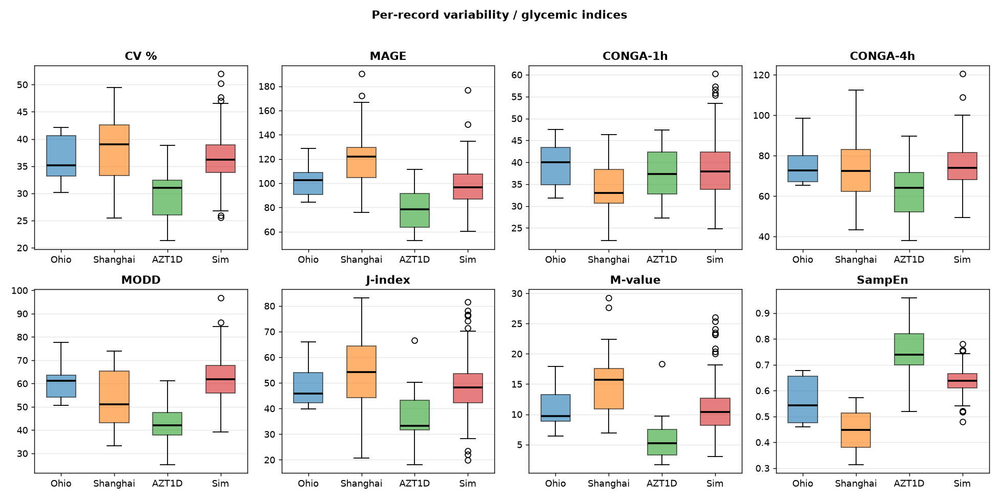

---

## 6. Temporal dynamics

### 6.1 Autocorrelation

Pooled (mean across records) Pearson autocorrelation at the indicated lag.

| Lag         | OhioT1DM | ShanghaiT1DM | AZT1D | T1DMSIM |
|---|---|---|---|---|
| 5 min   | 0.995 | (n/a)  | 0.990 | 0.996 |
| 15 min  | 0.968 | 0.984  | 0.943 | 0.977 |
| 30 min  | 0.909 | 0.946  | 0.846 | 0.927 |
| 1 h     | 0.764 | 0.840  | 0.617 | 0.783 |
| 2 h     | 0.483 | 0.606  | 0.248 | 0.486 |
| 4 h     | 0.137 | 0.254  | -0.015 | 0.179 |
| **8 h**     | **-0.004** | **-0.028** | **-0.021** | **0.032** |
| **12 h**    | **-0.010** | **-0.050** | **-0.020** | **-0.014** |
| 24 h    | 0.116 | 0.378  | 0.203 | **0.102** |

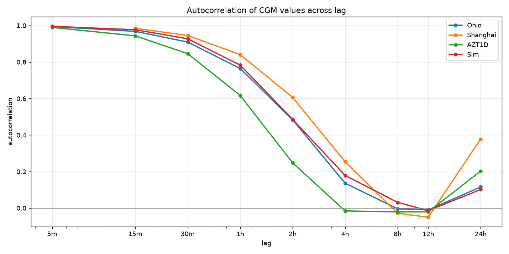

### 6.2 Rate-of-change (Δ-BG)

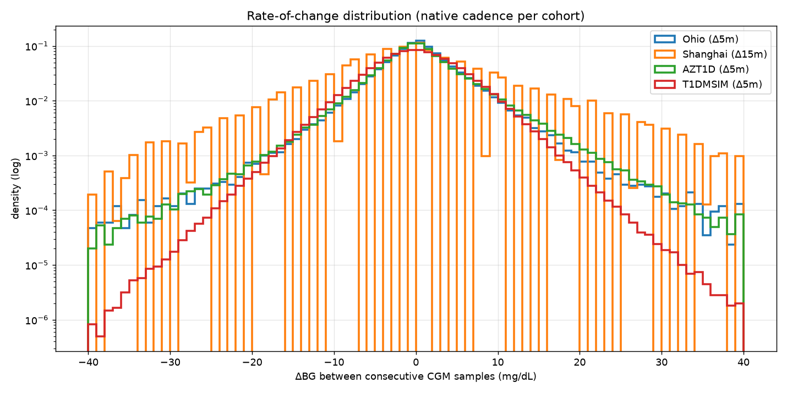

Per-record Δ-BG standard deviation (mean across records, native cadence):
Ohio 5.89 mg/dL · Shanghai 10.65 mg/dL ·
AZT1D 6.02 mg/dL · Sim 5.42 mg/dL.
Shanghai's value is at 15-min cadence and is not directly comparable to the
5-min values from Ohio, AZT1D, and the simulator.

### 6.3 Diurnal pattern (hour-of-day across records)

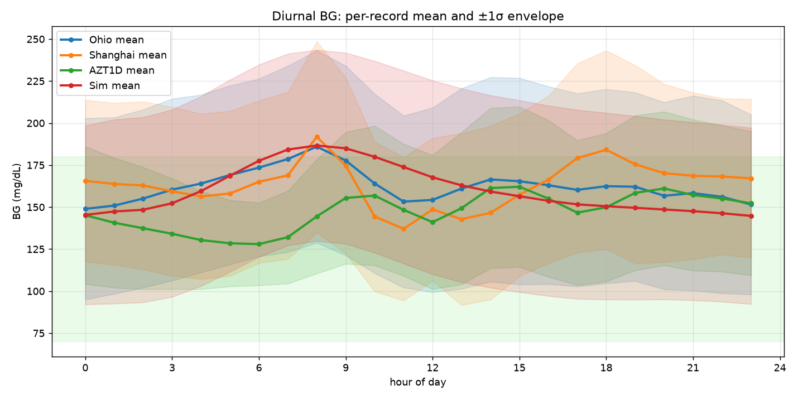

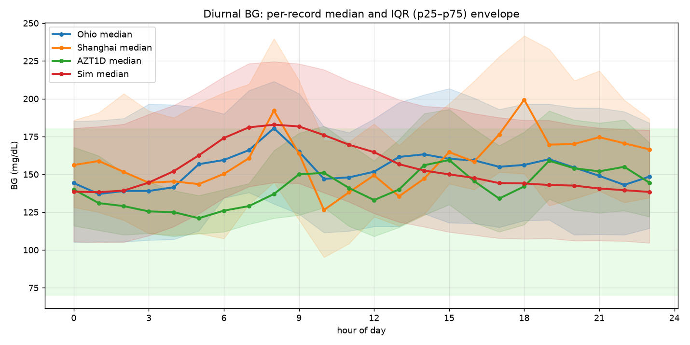

Hour-by-hour mean BG (mg/dL):

|   | 0 | 1 | 2 | 3 | 4 | 5 | 6 | 7 | 8 | 9 | 10 | 11 | 12 | 13 | 14 | 15 | 16 | 17 | 18 | 19 | 20 | 21 | 22 | 23 |
|---|---|---|---|---|---|---|---|---|---|---|---|---|---|---|---|---|---|---|---|---|---|---|---|---|
| Ohio | 149 | 151 | 155 | 160 | 164 | 169 | 173 | 179 | 186 | 178 | 164 | 153 | 154 | 161 | 166 | 165 | 163 | 160 | 162 | 162 | 157 | 158 | 156 | 152 |
| Shanghai | 166 | 164 | 163 | 159 | 156 | 158 | 165 | 169 | 192 | 175 | 144 | 137 | 149 | 143 | 147 | 157 | 166 | 179 | 184 | 175 | 170 | 169 | 168 | 167 |
| AZT1D | 145 | 141 | 137 | 134 | 130 | 128 | 128 | 132 | 144 | 155 | 157 | 148 | 141 | 149 | 161 | 162 | 155 | 147 | 150 | 158 | 161 | 157 | 155 | 152 |
| Sim | 145 | 147 | 148 | 152 | 160 | 169 | 178 | 184 | 187 | 185 | 180 | 174 | 168 | 163 | 159 | 156 | 154 | 152 | 151 | 150 | 149 | 148 | 146 | 145 |

Hour-by-hour median BG (mg/dL):

|   | 0 | 1 | 2 | 3 | 4 | 5 | 6 | 7 | 8 | 9 | 10 | 11 | 12 | 13 | 14 | 15 | 16 | 17 | 18 | 19 | 20 | 21 | 22 | 23 |
|---|---|---|---|---|---|---|---|---|---|---|---|---|---|---|---|---|---|---|---|---|---|---|---|---|
| Ohio | 144 | 137 | 139 | 139 | 142 | 157 | 160 | 166 | 180 | 165 | 147 | 148 | 152 | 162 | 163 | 160 | 159 | 155 | 156 | 160 | 154 | 149 | 143 | 148 |
| Shanghai | 156 | 159 | 152 | 144 | 145 | 144 | 150 | 161 | 192 | 164 | 126 | 138 | 149 | 135 | 147 | 165 | 158 | 176 | 199 | 170 | 170 | 175 | 171 | 166 |
| AZT1D | 140 | 131 | 129 | 126 | 125 | 121 | 126 | 129 | 137 | 150 | 151 | 141 | 133 | 140 | 156 | 160 | 146 | 134 | 142 | 159 | 154 | 152 | 155 | 144 |
| Sim | 139 | 138 | 139 | 145 | 152 | 163 | 174 | 181 | 183 | 182 | 176 | 170 | 165 | 157 | 152 | 150 | 148 | 144 | 144 | 143 | 143 | 141 | 140 | 138 |

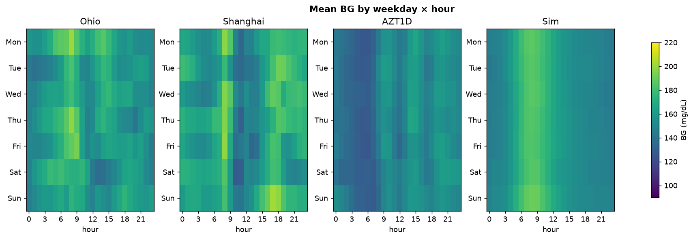

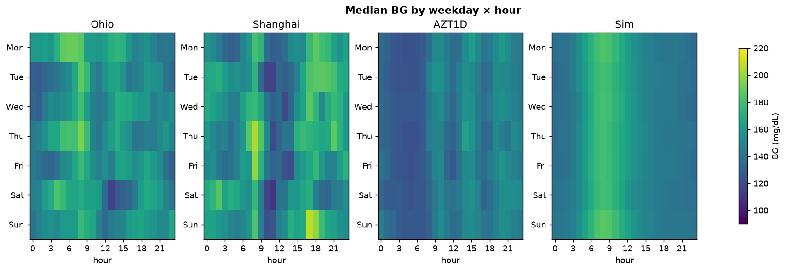

---

## 7. Excursion-level dynamics

### 7.1 Episode counts and durations

Per-record means ± std.

| Metric | OhioT1DM | ShanghaiT1DM | AZT1D | T1DMSIM |
|---|---|---|---|---|
| Hypo (<70) episodes / day      | 0.86 ± 0.43 | 1.02 ± 0.74 | 0.53 ± 0.45 | **1.00 ± 0.73** |
| Severe-hypo (<54) eps / day   | 0.20 ± 0.21 | 0.51 ± 0.47 | 0.11 ± 0.12 | 0.27 ± 0.35 |
| Hyper (>180) episodes / day   | 2.86 ± 0.27 | 1.87 ± 0.71 | 2.65 ± 0.89 | 2.64 ± 0.42 |
| Severe-hyper (>250) eps / day | 1.17 ± 0.43 | 1.12 ± 0.68 | 0.62 ± 0.59 | 1.11 ± 0.49 |
| Hypo median duration (min)    | 34.6 | 69.4 | 26.6 | 50.1 |
| Hypo p90 duration (min)       | 89.6 | 179.2 | 49.3 | **83.5** |
| Hyper median duration (min)   | 127.9 | 213.3 | 75.5 | 125.7 |
| Hyper p90 duration (min)      | 421.8 | 622.6 | 226.9 | **421.1** |

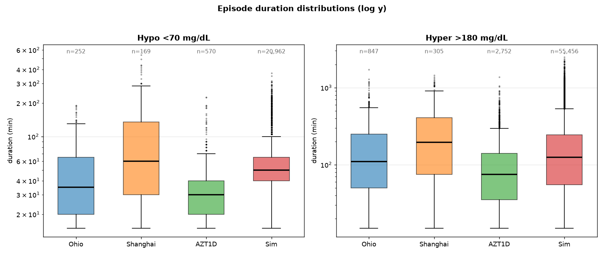

### 7.2 Hypo recovery time

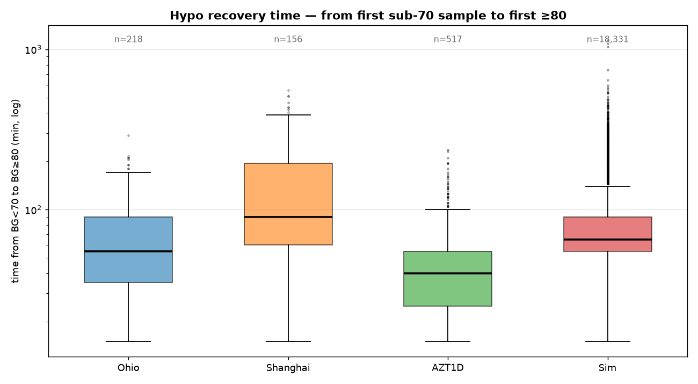

Time from the first sub-70 sample to the next ≥ 80 sample:

| Cohort | n events | median (min) | p75 (min) | p90 (min) | p99 (min) | max (min) |
|---|---:|---:|---:|---:|---:|---:|
| Ohio     |   218 | 55 | 90 | 145 | 210 | 290 |
| Shanghai |   156 | 90 | 195 | 300 | 510 | 555 |
| AZT1D    |   517 | 40 | 55 | 90 | 193 | 235 |
| Sim      | 18,331 | 65 | 90 | 140 | 275 | 1135 |

### 7.3 Unexplained excursions

A fraction of CGM excursions (≥ 40 mg/dL monotone swings, MAGE-style
turning-point detection) carry no proximate logged cause: a rise with no meal
(≥ 10 g) logged within [−60, +15] min of onset, or a fall
with no bolus (≥ 0.5 U) or exercise logged within
[−90, +15] min. This counts both unlogged events and genuinely
endogenous movements (dawn phenomenon, post-hypo rebound, stress, illness,
sensor artefact). ShanghaiT1DM is omitted — its dietary column is almost
entirely "data not available". The simulator is held to the identical test,
its meal / bolus / exercise events taken as the rising edges of the
corresponding factor channels.

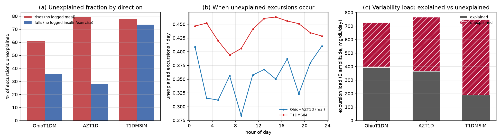

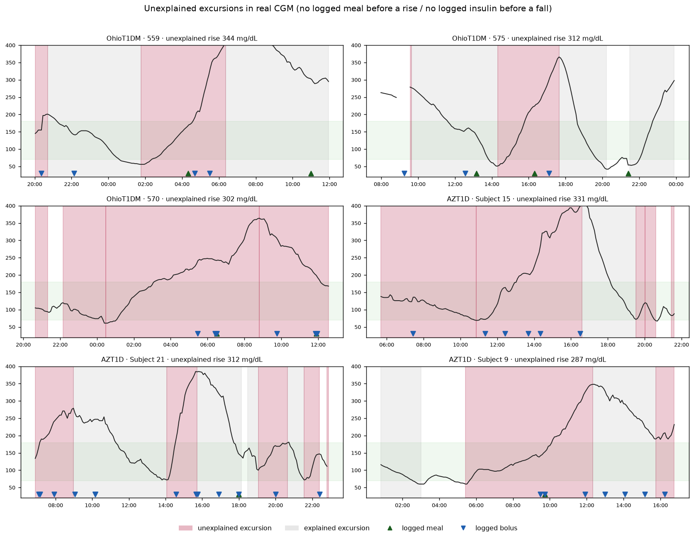

| Quantity | OhioT1DM | AZT1D | T1DMSIM |
|---|---:|---:|---:|
| Excursions detected | 2266 | 8770 | 145900 |
| &nbsp;&nbsp;rises unexplained (%) | 60.7 | 79.2 | 77.7 |
| &nbsp;&nbsp;falls unexplained (%) | 35.4 | 28.0 | 73.4 |
| &nbsp;&nbsp;all unexplained (%) | 48.9 | 54.4 | 75.6 |
| Explained load (mg/dL/day) | 393 | 364 | 188 |
| Unexplained load (mg/dL/day) | 334 | 400 | 562 |
| Median amplitude, explained (mg/dL) | 96 | 86 | 99 |
| Median amplitude, unexplained (mg/dL) | 83 | 78 | 94 |
| Δ-BG SD, full trace (mg/dL) | 5.89 | 6.02 | 5.42 |
| Δ-BG SD, unexplained censored (mg/dL) | 5.85 | 5.64 | 5.34 |

Across the two real cohorts with complete logs, roughly 52% of
excursions carry no proximate logged cause (OhioT1DM 48.9%,
AZT1D 54.4%); rises are more often unexplained than falls,
and the asymmetry is starkest in the closed-loop AID cohort (AZT1D
79% of rises vs 28% of falls),
where the pump logs insulin automatically while meals stay user-announced. The
simulator's unexplained fraction is 75.6%. Splitting the
per-day excursion load into explained and unexplained components, the
simulator's unexplained load (562 mg/dL/day) sits near the
real cohorts (367); its per-excursion amplitude runs larger in
both buckets (explained 99 vs 96/86,
unexplained 94 vs 83/78), and the
step-to-step Δ-BG SD is essentially unchanged when unexplained-excursion
segments are censored.

---

## 8. Per-record (per-patient) heterogeneity

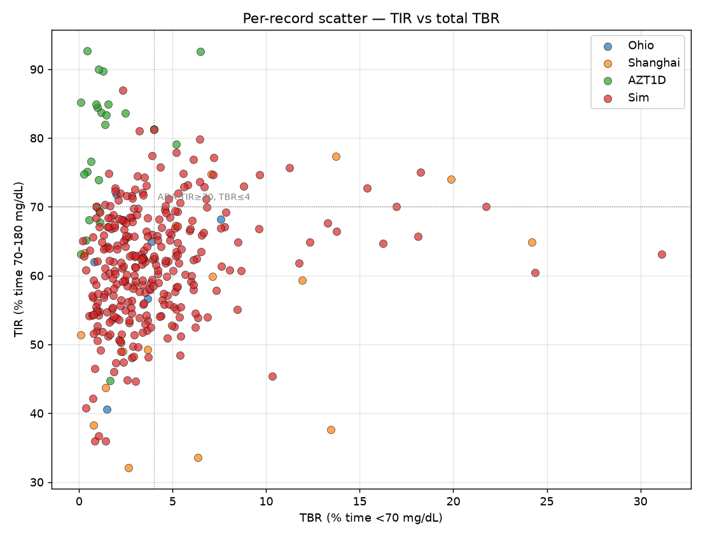

| Cohort | TIR IQR (pp) | TIR min–max (pp) | Mean-BG std across records |
|---|---:|---|---:|
| Ohio     | 9.4 | 40.6 – 71.8 | 16.2 |
| Shanghai | 23.1 | 32.1 – 77.3 | 31.0 |
| AZT1D    | 14.9 | 44.7 – 92.7 | 16.0 |
| Sim      | 11.4 | 36.0 – 87.0 | 16.1 |

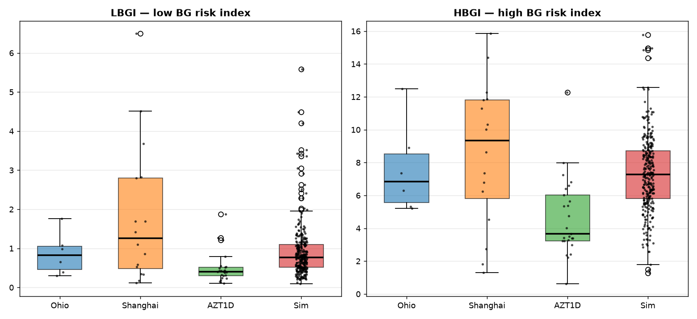

---

## 9. AZT1D insulin / carb behaviour panel

OhioT1DM and ShanghaiT1DM only expose CGM-level traces. AZT1D additionally
publishes the full pump event log — basal rate, bolus type (standard /
correction / automatic), units delivered for food and for correction, carb
size, and a device-mode flag (regular / sleep / exercise). The simulator
generates the same channels by construction (`basal_insulin`, `bolus_insulin`,
`total_carb`), so this section compares the comparable quantities head-to-head
and reports the AZT1D-only quantities alongside.

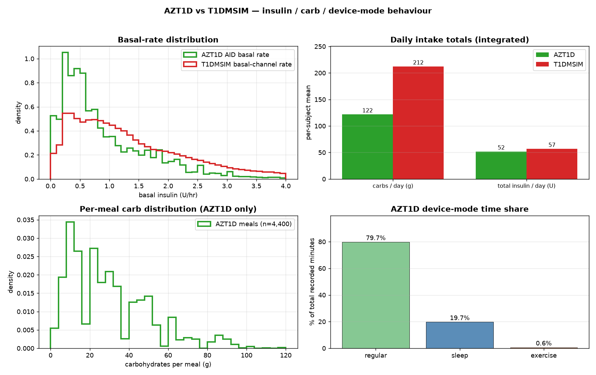

**Comparable quantities** (integrated daily totals + basal-rate distribution):

| Quantity | AZT1D | T1DMSIM | Δ (Sim − AZT1D) |
|---|---:|---:|---:|
| Mean basal rate (U/hr)            | 0.92 | 1.51 | +0.58 |
| Median basal rate (U/hr)          | 0.67 | 1.18 | +0.51 |
| Basal P10–P90 spread (U/hr)       | 0.20 – 2.03 | 0.30 – 3.16 | — |
| Carbs / day (g, per-subject mean) | 121.8 | 212.1 | +90.3 |
| Total insulin / day (U)           | 51.9 | 56.8 | +4.9 |

AZT1D's pooled basal-rate distribution was clipped at
10 U/hr before pooling
(3.2% of the basal column was discarded as
clearly non-physiological — values up to 4000+ U/hr in a few subjects,
likely PDF-to-CSV extraction artefacts). The Tandem AID adjusts basal every
5 min, so AZT1D's basal column is a long sequence of distinct rates; the
simulator's `basal_insulin` channel is the per-step PK-curve sample from
user-injected long-acting basal and integrates to the same daily total
**by construction** (matched to the patient's HGO via the
`basal = HGO_base × 24h × (BW/BW₀) × is_base / ICR` invariant), so this
panel is the sanity check that the daily-balance derivation lands in the
right ballpark for real T1D patients.

**AZT1D-only quantities** (user-initiated bolus events; AID auto-boluses are
filtered out — the simulator models MDI without a closed-loop controller and
has no auto-bolus channel to compare to):

| Quantity | AZT1D (per-subject mean) |
|---|---:|
| User-initiated boluses / day        | 7.22 |
| Meal boluses / day                  | 4.21 |
| Correction-only boluses / day       | 1.30 |
| Mean carbs / meal (g)               | 29.1 |
| Correction-unit share of total bolus | 13.8% |

Per-bolus and per-meal event counts are deliberately not computed for the
simulator: its `bolus_insulin` / `total_carb` channels expose per-step active
PK / absorption levels rather than discrete injection events, and any
threshold-based clustering merges events whose curves overlap. Comparison at
the **daily-total** level (above) is well-posed; comparison at the
per-event level is not.

- **Bolus type counts** (across the whole AZT1D pool, including AID-driven
  events):
  - Automatic Bolus/Correction: 3,478
  - Standard: 3,301
  - Standard/Correction: 2,746
  - BLE Standard Bolus/Correction: 787
  - BLE Standard Bolus: 749
  - Quick: 14
  - Extended 50.00%/0.00: 4
  - Extended 50.00%/12.00: 3
  - Extended/Correction 65.00%/3.18: 3
  - Extended 50.00%/20.00: 2
- **Device-mode time share:** regular 79.7%, sleep 19.7%, exercise 0.6%

---

## 10. Side-by-side summary

Raw deltas only — no qualitative verdicts. See sections 3–9 for context.

| Quantity | T1DMSIM | OhioT1DM | ShanghaiT1DM | AZT1D | Sim − Ohio | Sim − Shang | Sim − AZT1D |
|---|---:|---:|---:|---:|---:|---:|---:|
| Pooled mean BG (mg/dL) | 160.3 | 162.1 | 164.7 | 146.4 | -1.7 | -4.4 | +13.9 |
| Pooled median BG (mg/dL) | 153.4 | 155.0 | 156.6 | 138.0 | -1.6 | -3.2 | +15.4 |
| Pooled std (mg/dL) | 61.2 | 60.9 | 72.3 | 47.6 | +0.4 | -11.1 | +13.6 |
| Pooled CV (%) | 38.2 | 37.6 | 43.9 | 32.5 | +0.6 | -5.7 | +5.7 |
| Pooled skewness | 0.64 | 0.58 | 0.51 | 1.03 | +0.06 | +0.13 | -0.39 |
| Pooled excess kurtosis | 0.28 | 0.15 | -0.14 | 1.56 | +0.12 | +0.42 | -1.28 |
| Pooled p99 (mg/dL) | 330.8 | 326.0 | 349.2 | 293.0 | +4.8 | -18.4 | +37.8 |
| GMI (per-record mean) | 7.15 | 7.19 | 7.22 | 6.83 | -0.05 | -0.08 | +0.32 |
| LBGI (per-record mean) | 0.91 | 0.86 | 1.82 | 0.50 | +0.04 | -0.92 | +0.40 |
| HBGI (per-record mean) | 7.33 | 7.60 | 8.58 | 4.65 | -0.27 | -1.25 | +2.68 |
| TIR % (per-record mean) | 61.5 | 60.7 | 54.7 | 77.8 | +0.8 | +6.8 | -16.3 |
| TBR1 % (per-record mean) | 3.50 | 2.51 | 4.72 | 1.21 | +0.99 | -1.22 | +2.30 |
| TBR2 % (per-record mean) | 0.53 | 0.72 | 2.79 | 0.26 | -0.18 | -2.25 | +0.28 |
| TAR1 % (per-record mean) | 26.0 | 27.3 | 25.1 | 16.9 | -1.3 | +0.9 | +9.1 |
| TAR2 % (per-record mean) | 8.5 | 8.8 | 12.6 | 3.8 | -0.4 | -4.2 | +4.7 |
| MAGE (mg/dL) | 97.9 | 102.6 | 123.4 | 78.2 | -4.7 | -25.5 | +19.7 |
| CONGA-1h (mg/dL) | 38.3 | 39.5 | 34.2 | 37.5 | -1.2 | +4.2 | +0.9 |
| CONGA-4h (mg/dL) | 74.9 | 76.2 | 75.1 | 62.5 | -1.3 | -0.2 | +12.4 |
| MODD (mg/dL) | 62.1 | 61.1 | 53.3 | 42.1 | +1.0 | +8.8 | +20.0 |
| Hypo episodes / day | 1.00 | 0.86 | 1.02 | 0.53 | +0.14 | -0.03 | +0.47 |
| Severe-hypo eps / day | 0.27 | 0.20 | 0.51 | 0.11 | +0.08 | -0.23 | +0.16 |
| Hyper episodes / day | 2.64 | 2.86 | 1.87 | 2.65 | -0.22 | +0.77 | -0.01 |
| Severe-hyper eps / day | 1.11 | 1.17 | 1.12 | 0.62 | -0.06 | -0.01 | +0.49 |
| Hypo p90 duration (min) | 83.5 | 89.6 | 179.2 | 49.3 | -6.1 | -95.7 | +34.2 |
| Hyper p90 duration (min) | 421.1 | 421.8 | 622.6 | 226.9 | -0.7 | -201.5 | +194.1 |
| Hypo recovery median (min) | 65.0 | 55.0 | 90.0 | 40.0 | +10.0 | -25.0 | +25.0 |

Pooled distribution distances do not fit the sim-minus-cohort layout above
(they are pairwise, not per-cohort), so they are tabulated separately with the
real-vs-real baselines as the yardstick — a Sim-vs-real distance is only
"close" relative to how far the real cohorts sit from each other:

| Pooled distance | Sim vs Ohio | Sim vs Shanghai | Sim vs AZT1D | Ohio–Shang | Ohio–AZT1D | Shang–AZT1D |
|---|---:|---:|---:|---:|---:|---:|
| Wasserstein-1 (mg/dL) | 2.2 | 10.5 | 17.1 | 10.1 | 18.1 | 26.9 |
| KS statistic | 0.020 | 0.074 | 0.147 | 0.064 | 0.157 | 0.190 |

---

## 11. Limitations of this comparison

- **Cohort size.** OhioT1DM (n = 6), ShanghaiT1DM (n = 16), and
  AZT1D (n = 25) are small enough that cohort means have non-trivial
  sampling error; each "real" distribution should be taken as a band, not a
  point. The simulator was exercised with 300 seeds for this report, but the
  generator is unbounded — production training pipelines can sample as many
  more seeds as they need.
- **Cadence asymmetry.** Shanghai's 15-min cadence deflates Δ-BG std and
  inflates MAGE (~6–10%) relative to 5-min cohorts; cross-cadence ACF below
  30 min is not directly comparable. Sample entropy is put on a common 15-min
  effective interval for every cohort, so it is cadence-fair. §6.4 recomputes
  the cadence-sensitive metrics for all cohorts on one 15-min grid.
- **No glucose-controller benchmark.** The simulator output is compared to
  three real human cohorts but not to UVA/Padova `simglucose` here.
- **AID asymmetry.** AZT1D subjects are all on closed-loop AID (Tandem
  Control-IQ); OhioT1DM is a mix of pump + announced meals; ShanghaiT1DM
  mixes CSII and MDI; the simulator models MDI long-acting basal + per-meal
  bolus. Differences in basal-rate variability and time-in-range partly
  reflect these different therapy regimens, not just simulator vs reality.
- **Sample entropy window.** Sample entropy is strided to a fixed 15-min
  effective interval and capped to the first 4,000 valid samples per record
  (deterministic — no random subsampling), so it is a stable estimate over a
  bounded window rather than the exact value over the full trace.

---

## 12. Extended statistics

Four metric families added on top of §§3–11 to give the comparison more
resolution and to make the sim-vs-real position objective. All are computed by
`diff/extended_stats.py` and ignore NaN / never join samples across a gap.

### 12.1 Cadence-fair variability (common 15-min grid)

The §5 variability metrics are computed at each cohort's native cadence, so
Shanghai's 15-min values are not directly comparable to the 5-min cohorts.
Here every cohort — including the 5-min ones and the simulator — is decimated
to one common 15-min grid before the cadence-sensitive metrics are recomputed,
so all four columns are finally apples-to-apples.

| Metric (15-min grid) | OhioT1DM | ShanghaiT1DM | AZT1D | T1DMSIM |
|---|---:|---:|---:|---:|
| MAGE (mg/dL) | 109.5 | 123.4 | 87.3 | **108.0** |
| Δ-BG SD, 15-min (mg/dL) | 14.55 | 10.65 | 14.26 | **12.51** |
| CONGA-1h (mg/dL) | 39.55 | 34.17 | 37.45 | **38.34** |
| ACF @ 30 min | 0.909 | 0.946 | 0.846 | **0.927** |
| ACF @ 60 min | 0.764 | 0.840 | 0.617 | **0.783** |
| ACF @ 120 min | 0.483 | 0.606 | 0.248 | **0.486** |
| Hypo eps / day | 0.96 | 1.02 | 0.64 | **1.03** |
| Hyper eps / day | 2.81 | 1.87 | 2.74 | **2.66** |

### 12.2 Additional two-sample distances (pooled BG)

KS and Wasserstein-1 (§3.3) are complemented by tests with different tail
weighting, so no single distance drives the verdict. Sim-vs-real is read
against the real-vs-real baselines on the right.

| Distance | Sim vs Ohio | Sim vs Shang | Sim vs AZT1D | Ohio–Shang | Ohio–AZT1D | Shang–AZT1D |
|---|---:|---:|---:|---:|---:|---:|
| Energy distance | 0.213 | 0.962 | 1.802 | 0.910 | 1.971 | 2.594 |
| Cramér–von Mises | 3.5 | 12.5 | 58.5 | 11.6 | 75.9 | 107.7 |
| Anderson–Darling | 23.3 | 123.4 | 437.1 | 133.3 | 525.0 | 875.1 |
| Total variation | 0.035 | 0.127 | 0.186 | 0.127 | 0.191 | 0.279 |
| Hellinger | 0.046 | 0.137 | 0.157 | 0.140 | 0.160 | 0.251 |
| Histogram overlap | 0.965 | 0.873 | 0.814 | 0.873 | 0.809 | 0.721 |

CvM/AD statistics scale with sample size, so every pair is evaluated at one
common 15,696-sample-per-arm subsample (the smallest pooled cohort) to be
cross-comparable; energy distance and the histogram rows (total variation,
Hellinger, overlap) are sample-size-stable and use the full pooled vectors.

### 12.3 Temporal structure (common 15-min grid)

| Metric | OhioT1DM | ShanghaiT1DM | AZT1D | T1DMSIM |
|---|---:|---:|---:|---:|
| Poincaré SD1 (mg/dL) | 10.29 | 7.53 | 10.08 | **8.85** |
| Poincaré SD2 (mg/dL) | 82.2 | 87.7 | 61.5 | **82.3** |
| Poincaré SD1/SD2 | 0.126 | 0.088 | 0.169 | **0.108** |
| Spectral entropy (0–1) | 0.530 | 0.496 | 0.622 | **0.561** |
| Spectral centroid (cyc/h) | 0.110 | 0.085 | 0.150 | **0.101** |
| DFA α (Hurst) | 1.432 | 1.537 | 1.325 | **1.466** |
| ACF e-folding (1/e) | 2.7 h | 3.4 h | 1.7 h | **2.8 h** |

SD1 is short-term (step-to-step) variability, SD2 long-term; DFA α ≈ 0.5 white,
1.0 pink/1-f, 1.5 Brownian. Glycemic-band transition structure (15-min grid):

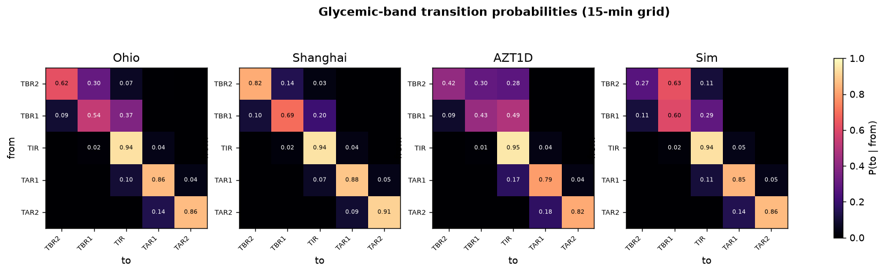

Mean dwell time per band (minutes before leaving), and the Frobenius distance of
each cohort's transition matrix from the simulator's:

| Band | OhioT1DM | ShanghaiT1DM | AZT1D | T1DMSIM |
|---|---:|---:|---:|---:|
| TBR2 | 40 | 85 | 26 | 20 |
| TBR1 | 32 | 49 | 26 | 38 |
| TIR | 246 | 269 | 331 | 240 |
| TAR1 | 106 | 124 | 73 | 98 |
| TAR2 | 109 | 165 | 85 | 105 |

Transition-matrix distance from Sim: Ohio 0.494 · Shanghai 0.757 ·
AZT1D 0.488 (Frobenius; lower = more similar dynamics).

### 12.4 Cross-seed bootstrap 95% CIs

Each pooled statistic with a 95% CI from resampling whole records/seeds with
replacement — the CI reflects between-record (between-seed) uncertainty. The
simulator's many seeds give a tight interval; the handful of real patients an
honestly wide one.

| Statistic | OhioT1DM | ShanghaiT1DM | AZT1D | T1DMSIM |
|---|---|---|---|---|
| Pooled mean (mg/dL) | 162.1 [151.0, 177.6] | 164.7 [149.7, 180.8] | 146.4 [140.1, 153.3] | **160.3 [158.5, 162.1]** |
| Pooled std (mg/dL) | 60.9 [52.9, 66.0] | 72.3 [66.0, 77.2] | 47.6 [43.3, 52.1] | **61.2 [60.4, 62.1]** |
| TIR % (70–180) | 60.9 [51.1, 68.3] | 53.6 [46.0, 60.8] | 78.2 [73.6, 82.2] | **61.5 [60.7, 62.4]** |
| LBGI | 0.86 [0.49, 1.29] | 1.87 [0.98, 2.74] | 0.51 [0.37, 0.67] | **0.91 [0.84, 0.98]** |

### 12.5 Standardised strength / weakness gap score

For each metric, z = (sim − mean of the three real cohorts) / SD across those
three cohorts. |z| < 1 means the simulator sits inside the band the real
cohorts span among themselves; |z| ≥ 2 means it sits outside all three.
"within envelope" is the assumption-free check (is sim within [min, max] of the
real cohorts). Sorted by |z| (largest divergence first). Of 20
metrics: 20 within (|z|<1), 0 at the edge (1–2), 0 outside (|z|≥2).


| Metric | Sim | Ohio | Shanghai | AZT1D | z | within envelope |
|---|---:|---:|---:|---:|---:|:--:|
| cf_hypo_per_day | 1.03 | 0.96 | 1.02 | 0.64 | +0.75 | **no** |
| TBR2% | 0.53 | 0.71 | 2.83 | 0.27 | -0.54 | yes |
| sd_ratio | 0.11 | 0.13 | 0.09 | 0.17 | -0.49 | yes |
| cf_conga_1h | 38.34 | 39.55 | 34.17 | 37.45 | +0.47 | yes |
| cf_hyper_per_day | 2.66 | 2.81 | 1.87 | 2.74 | +0.37 | yes |
| TBR1% | 3.50 | 2.49 | 4.82 | 1.25 | +0.36 | yes |
| dfa_alpha | 1.47 | 1.43 | 1.54 | 1.33 | +0.33 | yes |
| cf_delta_std | 12.51 | 14.55 | 10.65 | 14.26 | -0.30 | yes |
| excess_kurt | 0.28 | 0.15 | -0.14 | 1.56 | -0.27 | yes |
| mean | 160.33 | 162.07 | 164.75 | 146.42 | +0.26 | yes |
| LBGI | 0.91 | 0.86 | 1.87 | 0.51 | -0.25 | yes |
| acf_efold_min | 166.20 | 159.98 | 201.21 | 100.47 | +0.24 | yes |
| skew | 0.64 | 0.58 | 0.51 | 1.03 | -0.23 | yes |
| TIR% | 61.53 | 60.93 | 53.62 | 78.25 | -0.22 | yes |
| spectral_entropy | 0.56 | 0.53 | 0.50 | 0.62 | +0.17 | yes |
| HBGI | 7.33 | 7.54 | 8.87 | 4.56 | +0.15 | yes |
| std | 61.22 | 60.86 | 72.31 | 47.60 | +0.08 | yes |
| cf_mage | 107.98 | 109.49 | 123.38 | 87.27 | +0.07 | yes |
| cv_pct | 38.18 | 37.55 | 43.89 | 32.51 | +0.03 | yes |
| TAR2% | 8.46 | 8.63 | 13.48 | 3.65 | -0.03 | yes |

The SD across only three real cohorts is coarse, so z is an order-of-magnitude
locator, not a test statistic; the "within envelope" column and the §3.3 / §12.2
distances against the real-vs-real baselines are the robust reads.


---

## 13. Reproduction

```bash
# regenerates diff/stats.json + diff/README.md + diff/figures/*.png
python diff/build_report.py                       # default 100 seeds x 70 d
python diff/build_report.py --n-seeds 300 --days 70   # larger synthetic corpus
```

`scripts/compare_all_datasets.py` is reused for the dataset loaders and grid
regularisation. The three real datasets must live under `datasets/`
(`datasets/ohiot1dm/`, `datasets/ShanghaiT1DM/Shanghai_T1DM/`, and
`datasets/AZT1D/CGM Records/Subject N/`) — all gitignored, all subject to
their respective data-use agreements.

Numbers in this file come from one run of `build_report.py`
(300 seeds, 70 days each, 24 h warm-up discarded). Re-running reproduces
them exactly because the simulator is seed-deterministic and the real-data
side is fixed. Generating an arbitrarily larger synthetic corpus is just a
matter of passing `--n-seeds` / `--days` to `build_report.py`.
