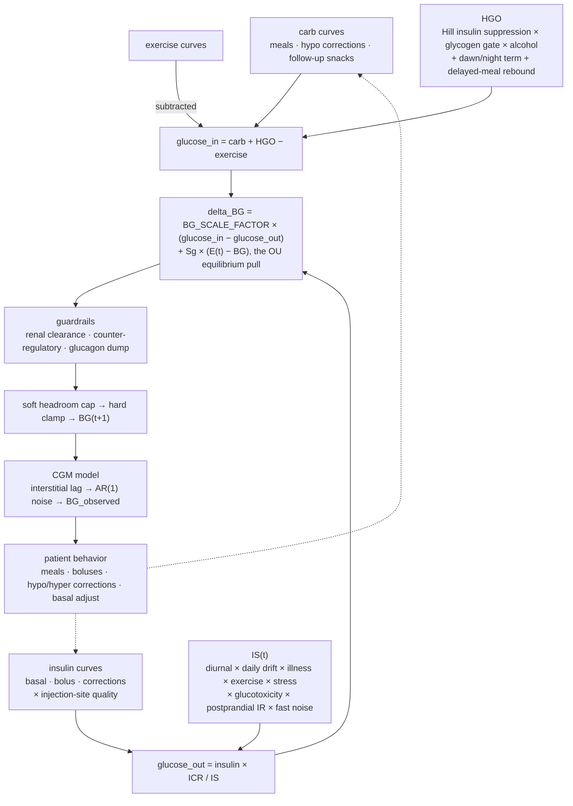

# Mathematical Formulation

Reference for the T1DM simulator's model: curve generation, the BG delta pipeline, and the behavioral layers that perturb it.

## Per-Step Pipeline

## Patient Skill Profile

Sample from a 4D multivariate normal — `Sigma` has `SKILL_VARIANCE` on the diagonal and `SKILL_CORRELATION * SKILL_VARIANCE` off-diagonal — then squash and clamp:

    s_raw = (s1, s2, s3, s4) ~ N(0, Sigma)
    s_i   = sigmoid(s_raw_i) = 1 / (1 + exp(-s_raw_i))
    s_i   = clip(s_i, SKILL_MIN, SKILL_MAX)

## Carbohydrate Absorption Curves

Each meal becomes 2-5 overlapping gamma-distributed absorption curves:

    C_i(t) = A_i * t^(k_i - 1) * exp(-t / theta_i)     A_i s.t. sum(C_i) = component_carb_grams

Component sampling, per-component noise, and the protein/fat tail added to every meal regardless of composition:

    n_components  = min(MIXED_MEAL_MIN_COMPONENTS + Poisson(MIXED_MEAL_EXTRA_COMPONENTS_LAMBDA),
                        MIXED_MEAL_MAX_COMPONENTS)
    carb_fraction ~ Dirichlet(MIXED_MEAL_DIRICHLET_ALPHA)
    type_i        ~ {fast, medium, slow}, weighted by slow_carb_preference
    k_i, theta_i  ~ U(category range)                  e.g. MIXED_MEAL_FAST_K_RANGE
    k_actual      = k * (1 + N(0, CARB_CURVE_K_NOISE))
    theta_actual  = theta * (1 + N(0, CARB_CURVE_THETA_NOISE))
    tail_grams    = clip(PROTEIN_FAT_FRACTION_OF_CARBS * carb_amount,
                         PROTEIN_FAT_MIN_GRAMS, PROTEIN_FAT_MAX_GRAMS)

With `PROTEIN_FAT_MIN_GRAMS = 6 g`, snacks get ~6 g of tail and large dinners ~18 g. Hypo correction carbs use a separate fast pair (`HYPO_CARB_K`, `HYPO_CARB_THETA`) peaking faster than meal carbs (glucose tablets / juice).

## Insulin Action Curves

Bolus (rapid-acting): gamma curve whose duration and theta scale with dose about a 5U reference, so larger doses act longer and peak later, matching subcutaneous insulin PK. Helper: `bolus_pk_for_dose(dose) -> (k, theta, duration_minutes)`; the legacy `BOLUS_DURATION_HOURS` constant is kept for tests but not used by new code.

    sqrt_excess = sqrt(dose) - sqrt(5)
    duration_h  = clip(BOLUS_DIA_BASE_HOURS + BOLUS_DIA_DOSE_SCALE * sqrt_excess,
                       BOLUS_DIA_MIN_HOURS, BOLUS_DIA_MAX_HOURS)
    theta       = BOLUS_GAMMA_THETA * (1 + BOLUS_THETA_DOSE_SLOPE * sqrt_excess)
    k           = BOLUS_GAMMA_K

Basal (long-acting): Bateman one-compartment PK from `basal_curve()` — subcutaneous depot absorption (rate `ka`) followed by first-order elimination (rate `ke`):

    f(t)   = exp(-BASAL_KE_PER_HOUR · t) − exp(-BASAL_KA_PER_HOUR · t)
    tmax   = ln(ka / ke) / (ka − ke) ≈ 6.3 h      with ka = 0.30/h, ke = 0.07/h
    t_half ≈ 9.9 h                                (elimination)

A broad-peaked long-acting profile sitting between the glargine and degludec time-action curves, with no flat plateau and no slope discontinuity. A smootherstep window over the last `BASAL_TAIL_CLIP_HOURS` tapers the late residual to zero so consecutive daily doses join without a tail-step. Normalized so the area equals the dose.

### Injection site quality (lipohypertrophy)

Every dose (basal, meal bolus, hyper correction, trend correction) is multiplied by a per-dose factor. Low `lifestyle_consistency` (s4) means poor site rotation and higher dose-to-dose variance; the PK shape (k, theta, duration) is set by the *intended* dose, only the absorbed amount varies:

    site_quality   ~ N(1.0, SITE_QUALITY_SIGMA_BASE * (1.5 - s4) ** 1.8)
    site_quality   = clip(site_quality, SITE_QUALITY_MIN, SITE_QUALITY_MAX)
    delivered_dose = intended_dose * site_quality

## Insulin Sensitivity

Diurnal pattern (`phase_shift` and `daily_drift` smooth-step-blend across midnight from yesterday to today over `IS_DRIFT_TRANSITION_HOURS`):

    morning = IS_MORNING_AMPLITUDE * exp(-0.5 * ((hour - IS_MORNING_PEAK_HOUR - phase_shift) / 2.0)^2)
    night   = -IS_NIGHT_DIP_AMPLITUDE * exp(-0.5 * ((night_hour - IS_NIGHT_DIP_HOUR) / 2.0)^2)
    diurnal = 1.0 + morning + night

    IS(t)   = IS_base * diurnal * (1 + daily_drift) * illness_factor
              * exercise_envelope * stress_envelope
              * glucotox_factor * postprandial_ir
              * (1 + fast_noise)

| Term | Sampling | Cadence |
| --- | --- | --- |
| `daily_drift` | `N(0, IS_DAILY_DRIFT_SIGMA * (1.5 - s4))` — consistent-lifestyle patients swing less day-to-day | once per day, blended across midnight |
| `phase_shift` | `N(0, IS_DAWN_PHASE_DAILY_SIGMA)` | once per day, blended across midnight |
| `fast_noise` | `N(0, IS_FAST_NOISE_SIGMA)` | every step |
| `illness_factor` | ramps toward `illness_is_target` at `ILLNESS_IS_RAMP_RATE` per day; rests at 1.0 when healthy | always applied |
| `exercise_envelope`, `stress_envelope` | trapezoidal `envelope_intensity()` blending the raw factor against 1.0 | per event |

### Glucotoxicity

A slow EMA of true BG (3h half-life) drives transient insulin resistance when chronically elevated, closing a positive feedback loop (high BG → more IR → harder to bring down):

    glucotox_bg_ema += α * (BG - glucotox_bg_ema)   where α = 1 - 0.5^(dt / half_life)
    if glucotox_bg_ema > GLUCOTOX_BG_THRESHOLD:
        intensity = min(1, (ema - threshold) / (max_bg - threshold))
        glucotox_factor = 1 + GLUCOTOX_MAX_IS_INCREASE * intensity
    else:
        glucotox_factor = 1.0

### Postprandial insulin resistance

In T1DM the incretin / GLP-1 axis is blunted and there is no endogenous insulin response, so the meal-time sensitivity boost non-diabetics get is absent; the absorbing-carb state is if anything mildly insulin-*resistant*. IR is therefore raised while carbs absorb, saturating in active carb load:

    penalty = POSTPRANDIAL_IR_PENALTY_FACTOR * active_carb / (POSTPRANDIAL_IR_PENALTY_HALF + active_carb)
    postprandial_ir = 1 + penalty

## BG Delta Computation

    glucose_in  = total_carb + HGO - exercise
    glucose_out = total_insulin * ICR / IS(t)
    delta_BG    = BG_SCALE_FACTOR * (glucose_in - glucose_out)
    delta_BG   += Sg * (E(t) - BG)     # glucose-effectiveness restoring pull (see below)

`IS(t)` divides the insulin side only: insulin-resistant patients (IS > 1) clear less glucose per unit insulin. HGO suppression by insulin is handled separately by the Hill function (see Hepatic Glucose Output). Physiological guardrails, then the clamp:

    if BG > RENAL_THRESHOLD:
        delta_BG -= (BG - RENAL_THRESHOLD) * RENAL_CLEARANCE_RATE

    if BG < COUNTER_REGULATORY_THRESHOLD:
        delta_BG += COUNTER_REGULATORY_RATE * (COUNTER_REGULATORY_THRESHOLD - BG) / COUNTER_REGULATORY_THRESHOLD

    if BG < SEVERE_HYPO_THRESHOLD:
        severity = (SEVERE_HYPO_THRESHOLD - BG) / SEVERE_HYPO_THRESHOLD
        delta_BG += SEVERE_HYPO_GLUCAGON_RATE * severity

    BG(t+1) = clamp(BG(t) + delta_BG, BG_CLAMP_MIN, BG_CLAMP_MAX)

`BG_CLAMP_MIN` is 10 mg/dL. It is not a device floor — a real CGM stops reporting near 40 but the patient keeps falling, and clamping the dynamics at the reporting floor made a descent taper out there. 10 mg/dL is below survivable, so it never binds physiologically; it exists to keep the Kovatchev log transform defined. The counter-regulatory and glucagon-dump terms plus the soft-bound headroom cap normally arrest a fall well above it.

### Glucose effectiveness (Bergman Sg) equilibrium

`Sg = glucose_effectiveness` is the per-patient Bergman minimal-model glucose effectiveness (a per-step reversion fraction), sampled lognormally around `GE_RATE` and clipped to `[GE_RATE_MIN, GE_RATE_MAX]` (~2–3× inter-individual spread; the floor prevents a pure integrator). The pull supplies the within-band mean reversion the renal / counter-regulatory guardrails do not: inside 70–180 net flux is otherwise integrated with an over-long autocorrelation.

`E(t)` is an Ornstein–Uhlenbeck process. With `rho = exp(-DT_MINUTES / (GE_EQ_TAU_HOURS * 60))`:

    mu = ge_anchor + ge_dawn_amplitude * ge_diurnal_profile(hour)
    E  = mu + rho * (E_prev - mu) + sqrt(1 - rho^2) * GE_EQ_SIGMA * ge_sigma_mult * N(0, 1)
    E  = max(E, GE_EQ_FLOOR)

The `sqrt(1 - rho^2)` factor makes the stationary std equal `GE_EQ_SIGMA * ge_sigma_mult`. `E`'s own timescale, not the strength of the Sg pull, is what keeps the 8h ACF near zero: `E` wanders enough to supply the distributional spread but decorrelates within hours, decoupling spread from the autocorrelation. Sg itself is deliberately weak, because a strong spring high-passes any input slower than its own time constant — insulin included. `GE_EQ_FLOOR = 64` sits above `SEVERE_HYPO_THRESHOLD = 55`, so the pull is always upward in a severe low (it aids, never opposes, the rescue). `ge_diurnal_profile(hour)` is a mean-zero wrapped-Gaussian dawn-phenomenon rhythm peaking at `GE_DAWN_PEAK_HOUR = 8` with width `GE_DAWN_WIDTH_HOURS = 5.5`, mean-subtracted over the 24h day so it adds rhythm without shifting the pooled mean; its per-patient amplitude `ge_dawn_amplitude` scales with the same dawn trait as the HGO surge.

Per-patient heterogeneity, sampled once in `generate_patient`:

    ir            = clip(exp(N(0, IR_LOGNORMAL_SIGMA)), IR_FACTOR_MIN, IR_FACTOR_MAX)
    ge_anchor     = clip(N(GE_EQ_ANCHOR_MEAN + GE_ANCHOR_IR_COUPLING * (ir - 1), GE_EQ_ANCHOR_SIGMA), 110, 210)
    ge_sigma_mult = clip(exp(N(0, GE_SIGMA_REL_SIGMA)), GE_SIGMA_MULT_CLIP)

| Constant | Value | Role |
| --- | --- | --- |
| `IR_LOGNORMAL_SIGMA` | 0.26 | lognormal sigma of `ir` |
| `IR_FACTOR_MIN` / `IR_FACTOR_MAX` | 0.4 / 2.0 | clip on `ir` |
| `GE_EQ_ANCHOR_MEAN` | 138 | population-mean anchor (mg/dL) |
| `GE_ANCHOR_IR_COUPLING` | 30 | mg/dL per unit `ir - 1` |
| `GE_EQ_ANCHOR_SIGMA` | 15 | between-patient anchor spread |
| `GE_SIGMA_REL_SIGMA` | 0.16 | lognormal sigma of `ge_sigma_mult` |
| `GE_SIGMA_MULT_CLIP` | (0.68, 1.38) | clip on `ge_sigma_mult` |

The anchor's between-patient spread carries the per-patient mean-glucose heterogeneity, the IR coupling raising it for resistant patients on the high side that `GE_EQ_FLOOR` does not compress. `ge_sigma_mult` makes patients differ in *within*-patient variability rather than sharing one global `GE_EQ_SIGMA`. The same `ir` also seeds `is_base`, `icr`, and `correction_factor`.

## CGM Observation Model

The sensor reports a delayed-and-smoothed interstitial value with time-correlated multiplicative noise — never the instantaneous true BG. A first-order interstitial lag (Rebrin/Steil) is applied first, then AR(1) sensor noise multiplicatively. The timescale is **per patient**, `cgm_lag_minutes ~ clip(N(CGM_LAG_MEAN_MINUTES, CGM_LAG_SIGMA_MINUTES), *CGM_LAG_CLIP)` — 8 ± 4 min clipped to [0, 20]. The mean sits below the raw physiological 5–15 min because CGM firmware compensates much of the apparent lag, and the spread covers sensor generations from fully compensated to not at all, so a model trained here is lag-robust rather than tuned to one device:

    alpha_lag   = 1 - exp(-DT_MINUTES / cgm_lag_minutes)
    IG         += alpha_lag * (BG_true - IG)
    ar_cgm      = NOISE_AR1_RHO_SENSOR * ar_cgm + NOISE_AR1_INNOV_SENSOR * N(0, CGM_NOISE_FRACTION)
    BG_observed = IG * (1 + ar_cgm)

Multiplying the reading makes the noise std scale with BG, matching real CGM MARD characteristics. `NOISE_AR1_RHO_SENSOR = 0.92` (~42 min half-life, with `NOISE_AR1_INNOV_SENSOR = sqrt(1 - 0.92^2)`) gives smoothly-drifting offsets over 30-60 min windows rather than white-noise spikes. Every consumer of `BG_observed` — corrections, hypo detection, the exported CGM channel — sees this value, not the current step's true BG.

## Hepatic Glucose Output

Insulin-suppressed via a Hill function on EMA-smoothed insulin (proxies plasma insulin lag behind subcutaneous absorption, ~12 min half-life at `HGO_INSULIN_SMOOTHING_ALPHA = 0.25`):

    smoothed_ins  = α * insulin_per_step + (1-α) * smoothed_ins_prev
    suppression   = 1 / (1 + smoothed_ins / HGO_INSULIN_HALF_MAX)
    HGO_rate      = HGO_SUPPRESSED_FLOOR + (HGO_UNSUPPRESSED - HGO_SUPPRESSED_FLOOR) * suppression
    HGO_baseline  = max(0, HGO_rate * (1 + N(0, HGO_NOISE_SIGMA)) * (body_weight_kg / BODY_WEIGHT_MEAN_KG) * (DT_MINUTES / 60)
                            + (dawn_g_per_hr - night_dip_g_per_hr) * (DT_MINUTES / 60)) * glycogen_gate * alcohol_factor
    meal_rebound  = sum over active meal_hgo_effects of (magnitude * envelope_intensity) * (DT_MINUTES / 60)
    HGO(t)        = HGO_baseline + meal_rebound

- `HGO_INSULIN_HALF_MAX` is tuned so a typical basal level (~0.086 U/step) yields 8.25 g/hr = `HGO_BASE_GRAMS_PER_HOUR`, the balanced reference rate. This preserves basal sizing — `ideal_basal = HGO_BASE_GRAMS_PER_HOUR * 24 * (body_weight_kg / BODY_WEIGHT_MEAN_KG) * is_base / ICR` gives near-zero net delta. The weight factor mirrors the per-step HGO scaling; `is_base` keeps the invariant across baseline insulin needs.
- At zero insulin, HGO climbs toward `HGO_UNSUPPRESSED_GRAMS_PER_HOUR` (DKA-like).
- `(dawn_g_per_hr - night_dip_g_per_hr)` is a cortisol-driven dawn surge (Gaussian peaking at `DAWN_HGO_PEAK_HOUR`) minus a deep-sleep trough (Gaussian at `NIGHT_HGO_DIP_HOUR`), added in g/hr rather than as a multiplier so the Hill suppression does not cancel it — this produces the dawn phenomenon.
- `alcohol_factor` (trapezoidal envelope around 1.0) suppresses HGO on top of insulin's suppression; `glycogen_gate` ramps HGO down when the reservoir is depleted.
- `meal_rebound` is additive, not multiplicative. Helper: `compute_hgo_rate(insulin_per_step) -> g/hr`.

### Delayed-meal HGO rebound

Each meal above `DELAYED_HGO_MEAL_THRESHOLD_GRAMS` schedules a positive HGO bump 3.5-5.5h later lasting 2.7-7.0h, shaped by the trapezoidal `envelope_intensity()` with `DELAYED_HGO_RAMP_HOURS` ramps. Models the delayed gluconeogenesis from amino acids and cortisol response that drive nocturnal hyperglycemia after a large dinner:

    excess     = carb_amount - DELAYED_HGO_MEAL_THRESHOLD_GRAMS
    magnitude  = min(DELAYED_HGO_MAX_BUMP, DELAYED_HGO_PER_GRAM * excess)   (g/hr)
    delay      ~ U(DELAYED_HGO_DELAY_HOURS_MIN, DELAYED_HGO_DELAY_HOURS_MAX)
    duration   ~ U(DELAYED_HGO_DURATION_HOURS_MIN, DELAYED_HGO_DURATION_HOURS_MAX)

### Glycogen reservoir

Hepatic glycogen is a finite store gating the glycogenolysis-sourced fraction of HGO, drained and refilled each step. The refill is a "background" channel — not subtracted from BG-bound carbs, since ICR is empirically tuned to net BG response; the only coupling back to BG dynamics is `glycogen_gate` reducing future HGO:

    if glycogen < GLYCOGEN_CAPACITY * GLYCOGEN_LOW_THRESHOLD_FRACTION:
        availability  = glycogen / (GLYCOGEN_CAPACITY * GLYCOGEN_LOW_THRESHOLD_FRACTION)
        glycogen_gate = (1 - GLYCOGEN_DRAIN_FRACTION) + GLYCOGEN_DRAIN_FRACTION * availability
    else:
        glycogen_gate = 1.0

    glycogen -= HGO(t) * GLYCOGEN_DRAIN_FRACTION        (drain from glycogenolysis)
    glycogen += total_carb * GLYCOGEN_REFILL_FRACTION   (refill from absorbed carbs)
    glycogen  = clip(glycogen, 0, GLYCOGEN_CAPACITY)

## Correction Behavior

Hypo correction (BG_observed < eff_low_thresh):

    skill_avg         = (attentiveness + dosing_competence) / 2
    hypo_threshold    = HYPO_THRESHOLD_MEDIAN + HYPO_THRESHOLD_SKILL_SPAN * (skill_avg - 0.5)
    severity          = max(0, hypo_threshold - BG_observed)
    skill_multiplier  = 1 + 1.5 * skill_avg
    correction_grams  = HYPO_CORRECTION_BASE_GRAMS * skill_multiplier
                        + panic_factor * severity / 20

Trigger and severity are measured against the per-patient `hypo_threshold` (sampled once in `generate_patient`, median 80 mg/dL, range ≈ 74–88): attentive/competent patients act on the drop earlier. The same value blocks every bolus beneath it — a patient who considers themselves low does not dose insulin, whatever the meal plan said — so one number defines "low" for both halves of the response. The skill multiplier is critical — without it, high-skill patients linger at TBR ~30% because the bare base grams cannot overcome a strong basal pipeline.

Severe hypo (BG_observed < `SEVERE_HYPO_THRESHOLD`, default 55):

    deficit = SEVERE_HYPO_THRESHOLD - BG_observed
    correction_grams = max(correction_grams, 14 + 0.35 * deficit)

This deterministic rescue is what keeps severe episodes under 1h. Severe hypo also bypasses the CGM check interval, but a `SEVERE_HYPO_REFRACTORY_MIN` (10 min) gate still applies between back-to-back doses so stacked carbs don't sawtooth into post-correction hypers. After any hypo correction, basal is scaled by `POST_HYPO_BASAL_SUSPEND_FACTOR` for `POST_HYPO_BASAL_SUSPEND_DURATION_HOURS` (pump-suspend / temp-basal analogue), and skill-gated patients (`skill_avg > HYPO_FOLLOWUP_SKILL_THRESHOLD`) eat a slow-carb follow-up snack of `HYPO_FOLLOWUP_FRACTION × correction_grams`.

Hyper correction (BG_observed > eff_high_thresh):

    eff_high_thresh   = BG_HIGH_THRESHOLD - 25 * skill_avg
    iob_consideration = IOB * correction_factor * (0.7 + 0.3 * dosing_competence)
    adjusted_excess   = max(0, (BG_observed - BG_TARGET) - iob_consideration)
    correction_dose   = max(0.5, adjusted_excess / correction_factor * (1 + noise))
    urgency           = min(3, 1 + max(0, (BG_observed - BG_HIGH_THRESHOLD) / 50))
    patience          = patience_time / urgency

Subtracting the insulin-on-board term before sizing stops patients from stacking corrections. Urgency saturates at 3 (reached at BG = 275), shortening the patience window for sustained highs.

Above `RAGE_BOLUS_BG_THRESHOLD` rage bolusing may occur, with probability proportional to `(1.2 - dosing_competence)`.

## Basal Adjustment

Daily adjustment based on a 3-day rolling mean BG (`recent_mean`):

    if recent_mean > 150:
        overshoot     = min((recent_mean - 150) / 80, 1)
        skill_factor  = 0.4 + 0.6 * competence
        trigger_mean  = max(recent_mean, one_day_mean)
        extreme_boost = 1 + 0.5 * min(1, (trigger_mean - 200) / 50)   if trigger_mean > 200, else 1
        adjustment    = 1 + overshoot * (BASAL_CORRECTION_MAX_ADJUSTMENT * skill_factor) * extreme_boost

    elif recent_mean < 115:
        undershoot = min((115 - recent_mean) / 50, 1)
        adjustment = 1 - undershoot * BASAL_CORRECTION_MAX_ADJUSTMENT * competence

The asymmetric thresholds (150 / 115) intentionally bias toward correcting persistent hyperglycemia faster than persistent mild hypoglycemia. On the high path skill scales only partially and `extreme_boost` accelerates recovery when the 3-day or single-day mean runs above 200; the low path keeps full skill scaling.

## Behavioral & Stochastic Features

Mechanisms that perturb the deterministic core above, closing the gap between an idealized model and a free-living patient.

### Soft-bound BG headroom cap

Ahead of the hard clamp, each step's `delta_BG` is capped to a fraction of the headroom remaining to the soft bound, so the dynamics asymptote toward the bounds instead of slamming into the clamp:

    projected = BG(t) + delta_BG
    if projected < BG_SOFT_FLOOR:
        headroom = max(0, BG(t) - BG_CLAMP_MIN)
        delta_BG = max(delta_BG, -SOFT_APPROACH_FRACTION * headroom)
    if projected > BG_SOFT_CEILING:
        headroom = max(0, BG_CLAMP_MAX - BG(t))
        delta_BG = min(delta_BG,  SOFT_APPROACH_FRACTION * headroom)

The hard clamp still runs as a backstop after this cap.

### Per-step absorption noise

Multiplicative noise on the per-step contributions read from the accumulation arrays, modelling moment-to-moment absorption variation the smooth gamma curves cannot capture. Active only when the underlying curve is non-zero:

    total_carb    *= max(0, 1 + N(0, CARB_ABSORPTION_NOISE_SIGMA))      if total_carb > 0
    total_insulin *= max(0, 1 + N(0, INSULIN_ABSORPTION_NOISE_SIGMA))   if total_insulin > 0

### Exercise post-effect IS envelope

After an exercise event ends, IS is reduced (more sensitive) for `EXERCISE_IS_DURATION_HOURS` (6h), shaped by `envelope_intensity()` with `EXERCISE_IS_RAMP_HOURS` ramps:

    reduction            = min(0.30, EXERCISE_IS_REDUCTION * (exercise_duration / EXERCISE_DURATION_MEAN_MIN))
    exercise_envelope(t) = 1 - reduction * envelope_intensity(t; start, start+6h, ramp=1h)

### Stress IS envelope

Stress events transiently raise IS (more resistant), with per-day probability `STRESS_PROBABILITY_BASE - STRESS_LIFESTYLE_WEIGHT * s4`:

    is_factor          ~ U(STRESS_IS_FACTOR_MIN, STRESS_IS_FACTOR_MAX)
    duration           ~ U(STRESS_DURATION_HOURS_MIN, STRESS_DURATION_HOURS_MAX)
    stress_envelope(t) = 1 + (is_factor - 1) * envelope_intensity(t; start, end, STRESS_IS_RAMP_HOURS)

### Alcohol HGO suppression envelope

Drinking suppresses HGO multiplicatively, with an onset delay, plateau, and ramp-down. This multiplies the Hill-derived HGO baseline, separately from insulin suppression, and accounts for the nocturnal-hypo pattern after evening drinking:

    hgo_reduction ~ U(ALCOHOL_HGO_REDUCTION_MIN, ALCOHOL_HGO_REDUCTION_MAX)
    duration      ~ U(ALCOHOL_DURATION_HOURS_MIN, ALCOHOL_DURATION_HOURS_MAX)
    onset_delay   ~ U(ALCOHOL_ONSET_DELAY_HOURS_MIN, ALCOHOL_ONSET_DELAY_HOURS_MAX)
    alcohol_factor(t) = 1 - hgo_reduction * envelope_intensity(t; start+onset, start+onset+duration,
                                                                ALCOHOL_HGO_RAMP_HOURS)

### Trend-based anticipatory corrections

Attentive patients with sufficient skill act on a recent BG trend before crossing a threshold. From a sliding window of the last `TREND_CORRECTION_WINDOW_STEPS` BG samples, a preemptive correction bolus is considered when `trend > TREND_HIGH_RATE_THRESHOLD` and BG is approaching the upper band; a preemptive snack when `trend < TREND_LOW_RATE_THRESHOLD` and BG is approaching the lower band. The projected rise/fall over the next `2 * TREND_CORRECTION_WINDOW_STEPS` steps sizes the dose / carbs.

    trend = (window[-1] - window[0]) / (TREND_CORRECTION_WINDOW_STEPS - 1)   (mg/dL/step)

### Anomalous absorption events

With per-day probability `ANOMALOUS_EVENT_PROBABILITY`, one absorption curve on that day has its shape modified — unusual gastric emptying, food composition outliers, or other absorption surprises:

    k     *= U(ANOMALOUS_K_MULT_MIN,     ANOMALOUS_K_MULT_MAX)
    theta *= U(ANOMALOUS_THETA_MULT_MIN, ANOMALOUS_THETA_MULT_MAX)

### Rare event days

With per-day probability `RARE_EVENT_PROBABILITY`, three of the four skills — dietary discipline (s1), dosing competence (s3), lifestyle consistency (s4) — are degraded for that day; attentiveness (s2) is unchanged. Models the chaotic days (illness onset, travel, emotional events) even well-controlled patients have:

    skill_penalty ~ RARE_EVENT_SKILL_REDUCTION + U(0, 0.3)
    s_i(today)    = max(s_i - skill_penalty, 0.05)   for i in {1, 3, 4}

## Unit Conventions

All curve values are in "amount per step" units:

| Channel | Unit | Normalization |
| --- | --- | --- |
| Carb curves | grams per step | sum of curve = total grams |
| Insulin curves | units per step | sum of curve = total units |
| HGO | grams per step | rate g/hr converted via `DT_MINUTES / 60` |
| Exercise | grams-equivalent per step | — |

Both `gamma_curve` and `basal_curve` normalize so that `sum(values) = total_amount`. There is no `flat_curve` — `basal_curve` (Bateman PK, smooth onset/peak/decline) replaced it. Never pass a rate where `total_amount` is expected.
