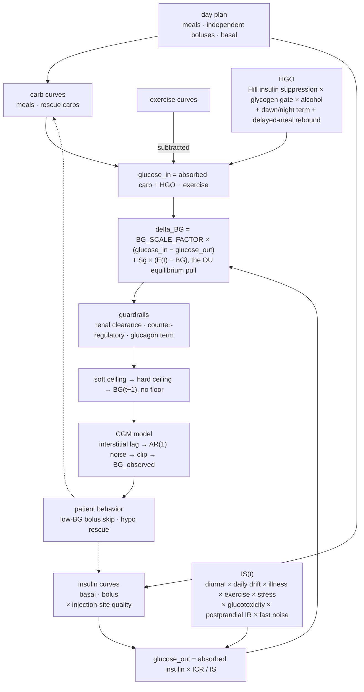

# Mathematical Formulation

Reference for the T1DM simulator's model: curve generation, the BG delta pipeline, and the behavioral layers that perturb it.

## Per-Step Pipeline

```mermaid
flowchart TD
    CARB["carb curves<br/>meals · rescue carbs"] --> GIN["glucose_in = absorbed carb + HGO − exercise"]
    EX["exercise curves"] -->|subtracted| GIN
    HGO["HGO<br/>Hill insulin suppression × glycogen gate × alcohol<br/>+ dawn/night term + delayed-meal rebound"] --> GIN
    INS["insulin curves<br/>basal · bolus<br/>× injection-site quality"] --> GOUT["glucose_out = absorbed insulin × ICR / IS"]
    IS["IS(t)<br/>diurnal × daily drift × illness × exercise × stress<br/>× glucotoxicity × postprandial IR × fast noise"] --> GOUT
    GIN --> DELTA["delta_BG = BG_SCALE_FACTOR × (glucose_in − glucose_out)<br/>+ Sg × (E(t) − BG), the OU equilibrium pull"]
    GOUT --> DELTA
    DELTA --> GUARD["guardrails<br/>renal clearance · counter-regulatory · glucagon term"]
    GUARD --> BOUND["soft ceiling → hard ceiling → BG(t+1), no floor"]
    BOUND --> CGM["CGM model<br/>interstitial lag → AR(1) noise → clip → BG_observed"]
    CGM --> BEH["patient behavior<br/>low-BG bolus skip · hypo rescue"]
    PLAN["day plan<br/>meals · independent boluses · basal"] --> CARB
    PLAN --> INS
    BEH -.-> CARB
    BEH -.-> INS
```

## Patient Skill Profile

Sample from a 4D multivariate normal — `Sigma` has `SKILL_VARIANCE` on the diagonal and `SKILL_CORRELATION * SKILL_VARIANCE` off-diagonal — then squash and clamp:

    s_raw = (s1, s2, s3, s4) ~ N(0, Sigma)
    s_i   = sigmoid(s_raw_i) = 1 / (1 + exp(-s_raw_i))
    s_i   = clip(s_i, SKILL_MIN, SKILL_MAX)

## Carbohydrate Absorption Curves

Each meal becomes 2-5 overlapping gamma-distributed absorption curves. Entry `n` of a curve is the amount appearing *during* step `n`, so `gamma_curve` integrates the gamma across the step — the mean of `GAMMA_CURVE_SUBSTEPS = 16` sub-step midpoints, starting from `t = 0`:

    C_i[n] = A_i * mean{ t^(k_i - 1) * exp(-t / theta_i) : t in [n*dt, (n+1)*dt) }
             A_i s.t. sum_n C_i[n] = component_carb_grams

Averaging the density across the step is what sizes the leading edge: the first step of a `k = 2, theta = 15` rescue curve carries 37% of the peak and a `k = 3, theta = 25` bolus 2%, so a curve rises through its onset. The same integration applies to every gamma curve — meal components, rescue carbs, exercise, and every bolus.

Component sampling and per-component noise:

    n_components  = min(MIXED_MEAL_MIN_COMPONENTS + Poisson(MIXED_MEAL_EXTRA_COMPONENTS_LAMBDA),
                        MIXED_MEAL_MAX_COMPONENTS)
    carb_fraction ~ Dirichlet(MIXED_MEAL_DIRICHLET_ALPHA)
    type_i        ~ {fast, medium, slow}, weighted by slow_carb_preference
    k_i, theta_i  ~ U(category range)                  e.g. MIXED_MEAL_FAST_K_RANGE
    k_actual      = k * (1 + N(0, CARB_CURVE_K_NOISE))
    theta_actual  = theta * (1 + N(0, CARB_CURVE_THETA_NOISE))

The components sum to the meal's logged grams, `carb_amount`. Rescue carbs use a separate fast pair (`HYPO_CARB_K`, `HYPO_CARB_THETA`) peaking faster than meal carbs (glucose tablets / juice).

## Insulin Action Curves

Bolus (rapid-acting): gamma curve whose duration and theta scale with dose about a 5U reference, so larger doses act longer and peak later, matching subcutaneous insulin PK. Helper: `bolus_pk_for_dose(dose) -> (k, theta, duration_minutes)`; the legacy `BOLUS_DURATION_HOURS` constant is kept for tests but not used by new code.

    sqrt_excess = sqrt(dose) - sqrt(5)
    duration_h  = clip(BOLUS_DIA_BASE_HOURS + BOLUS_DIA_DOSE_SCALE * sqrt_excess,
                       BOLUS_DIA_MIN_HOURS, BOLUS_DIA_MAX_HOURS)
    theta       = BOLUS_GAMMA_THETA * (1 + BOLUS_THETA_DOSE_SLOPE * sqrt_excess)
    k           = BOLUS_GAMMA_K

Basal (long-acting): Bateman one-compartment PK from `basal_curve()` — subcutaneous depot absorption (rate `ka`) followed by first-order elimination (rate `ke`):

    f(t)   = exp(-BASAL_KE_PER_HOUR · t) − exp(-BASAL_KA_PER_HOUR · t)
    tmax   = ln(ka / ke) / (ka − ke) ≈ 6.3 h      with ka = 0.30/h, ke = 0.07/h
    t_half ≈ 9.9 h                                (elimination)

A broad-peaked long-acting profile sitting between the glargine and degludec time-action curves, with no flat plateau and no slope discontinuity. A smootherstep window over the last `BASAL_TAIL_CLIP_HOURS` tapers the late residual to zero so consecutive daily doses join without a tail-step. Normalized so the area equals the dose.

### Injection site quality (lipohypertrophy)

Every dose (basal and bolus) is multiplied by a per-dose factor. Low `lifestyle_consistency` (s4) means poor site rotation and higher dose-to-dose variance; the PK shape (k, theta, duration) is set by the *intended* dose, only the absorbed amount varies:

    site_quality   ~ N(1.0, SITE_QUALITY_SIGMA_BASE * (1.5 - s4) ** 1.8)
    site_quality   = clip(site_quality, SITE_QUALITY_MIN, SITE_QUALITY_MAX)
    delivered_dose = intended_dose * site_quality

## Insulin Sensitivity

Diurnal pattern (`phase_shift` and `daily_drift` smooth-step-blend across midnight from yesterday to today over `IS_DRIFT_TRANSITION_HOURS`):

    morning = IS_MORNING_AMPLITUDE * exp(-0.5 * ((hour - IS_MORNING_PEAK_HOUR - phase_shift) / 2.0)^2)
    night   = -IS_NIGHT_DIP_AMPLITUDE * exp(-0.5 * ((night_hour - IS_NIGHT_DIP_HOUR) / 2.0)^2)
    diurnal = 1.0 + morning + night

    IS(t)   = IS_base * diurnal * (1 + daily_drift) * illness_factor
              * exercise_envelope * stress_envelope
              * glucotox_factor * postprandial_ir
              * (1 + fast_noise)

| Term | Sampling | Cadence |
| --- | --- | --- |
| `daily_drift` | `N(0, IS_DAILY_DRIFT_SIGMA * (1.5 - s4))` — consistent-lifestyle patients swing less day-to-day | once per day, blended across midnight |
| `phase_shift` | `N(0, IS_DAWN_PHASE_DAILY_SIGMA)` | once per day, blended across midnight |
| `fast_noise` | `N(0, IS_FAST_NOISE_SIGMA)` | every step |
| `illness_factor` | ramps toward `illness_is_target` at `ILLNESS_IS_RAMP_RATE` per day; rests at 1.0 when healthy | always applied |
| `exercise_envelope`, `stress_envelope` | trapezoidal `envelope_intensity()` blending the raw factor against 1.0 | per event |

### Glucotoxicity

A slow EMA of true BG (3h half-life) drives transient insulin resistance when chronically elevated, closing a positive feedback loop (high BG → more IR → harder to bring down):

    glucotox_bg_ema += α * (BG - glucotox_bg_ema)   where α = 1 - 0.5^(dt / half_life)
    if glucotox_bg_ema > GLUCOTOX_BG_THRESHOLD:
        intensity = min(1, (ema - threshold) / (max_bg - threshold))
        glucotox_factor = 1 + GLUCOTOX_MAX_IS_INCREASE * intensity
    else:
        glucotox_factor = 1.0

### Postprandial insulin resistance

In T1DM the incretin / GLP-1 axis is blunted and there is no endogenous insulin response, so the meal-time sensitivity boost non-diabetics get is absent; the absorbing-carb state is if anything mildly insulin-*resistant*. IR is therefore raised while carbs absorb, saturating in active carb load:

    penalty = POSTPRANDIAL_IR_PENALTY_FACTOR * active_carb / (POSTPRANDIAL_IR_PENALTY_HALF + active_carb)
    postprandial_ir = 1 + penalty

## BG Delta Computation

    absorbed_carb    = max(0, total_carb * (1 + ar_carb))
    absorbed_insulin = max(0, total_insulin * (1 + ar_insulin))
    glucose_in       = absorbed_carb + HGO - exercise
    glucose_out      = absorbed_insulin * ICR / IS(t)
    delta_BG         = BG_SCALE_FACTOR * (glucose_in - glucose_out)
    delta_BG        += Sg * (E(t) - BG)     # glucose-effectiveness restoring pull (see below)

`ar_carb` and `ar_insulin` are AR(1) absorption noise with stationary sd `CARB_ABSORPTION_NOISE_SIGMA` and `INSULIN_ABSORPTION_NOISE_SIGMA`. They perturb what reaches the blood; the recorded `total_carb`, `rescue_carb`, `basal_insulin` and `bolus_insulin` channels are the declared curves. All physiology and sensor noise draws from `noise_rng`, separate from the behavior generator `rng`.

`IS(t)` divides the insulin side only: insulin-resistant patients (IS > 1) clear less glucose per unit insulin. HGO suppression by insulin is handled separately by the Hill function (see Hepatic Glucose Output). Physiological guardrails, then the bounds:

    if BG > RENAL_THRESHOLD:
        delta_BG -= (BG - RENAL_THRESHOLD) * RENAL_CLEARANCE_RATE

    if BG < COUNTER_REGULATORY_THRESHOLD:
        delta_BG += COUNTER_REGULATORY_RATE * (COUNTER_REGULATORY_THRESHOLD - BG) / COUNTER_REGULATORY_THRESHOLD

    if BG < SEVERE_HYPO_THRESHOLD:
        severity = (SEVERE_HYPO_THRESHOLD - BG) / SEVERE_HYPO_THRESHOLD
        delta_BG += SEVERE_HYPO_GLUCAGON_RATE * severity

    ceiling_ref = max(BG(t), BG_SOFT_CEILING)
    highest     = ceiling_ref + SOFT_APPROACH_FRACTION * (BG_CLAMP_MAX - ceiling_ref)
    BG(t+1)     = min(BG(t) + min(delta_BG, highest - BG(t)), BG_CLAMP_MAX)

True BG has no floor. The counter-regulatory and glucagon terms are weak, so a unit of insulin lowers BG by about the same amount from any starting level, and a deep enough dose drives true BG below zero. Measuring headroom from `max(BG, BG_SOFT_CEILING)` keeps the ceiling monotone: a larger carb load never ends lower. Only the CGM reading is clipped to `[BG_CLAMP_MIN, BG_CLAMP_MAX]`, which keeps the Kovatchev log transform defined.

### Glucose effectiveness (Bergman Sg) equilibrium

`Sg = glucose_effectiveness` is the per-patient Bergman minimal-model glucose effectiveness (a per-step reversion fraction), sampled lognormally around `GE_RATE` and clipped to `[GE_RATE_MIN, GE_RATE_MAX]`; the floor prevents a pure integrator. `GE_RATE` is the median of that lognormal. The pull supplies the within-band mean reversion the renal / counter-regulatory guardrails do not. `GE_RATE` is zero, so the pull and the equilibrium below move nothing. Below `RENAL_THRESHOLD` only insulin lowers BG; any nonzero pull teaches that BG falls without insulin.

`E(t)` is an Ornstein–Uhlenbeck process. With `rho = exp(-DT_MINUTES / (GE_EQ_TAU_HOURS * 60))`:

    mu = ge_anchor + ge_dawn_amplitude * ge_diurnal_profile(hour)
    E  = mu + rho * (E_prev - mu) + sqrt(1 - rho^2) * GE_EQ_SIGMA * ge_sigma_mult * N(0, 1)
    E  = max(E, GE_EQ_FLOOR)

The `sqrt(1 - rho^2)` factor makes the stationary std equal `GE_EQ_SIGMA * ge_sigma_mult`. `GE_EQ_FLOOR` sits above `SEVERE_HYPO_THRESHOLD`, so the pull is upward in a severe low. `ge_diurnal_profile(hour)` is a mean-zero wrapped-Gaussian dawn-phenomenon rhythm peaking at `GE_DAWN_PEAK_HOUR` with width `GE_DAWN_WIDTH_HOURS`, mean-subtracted over the 24h day so it adds rhythm without shifting the pooled mean; its per-patient amplitude `ge_dawn_amplitude` scales with the same dawn trait as the HGO surge.

Per-patient heterogeneity, sampled once in `generate_patient`:

    ir            = clip(exp(N(0, IR_LOGNORMAL_SIGMA)), IR_FACTOR_MIN, IR_FACTOR_MAX)
    ge_anchor     = clip(N(GE_EQ_ANCHOR_MEAN + GE_ANCHOR_IR_COUPLING * (ir - 1), GE_EQ_ANCHOR_SIGMA), 110, 210)
    ge_sigma_mult = clip(exp(N(0, GE_SIGMA_REL_SIGMA)), GE_SIGMA_MULT_CLIP)

| Constant | Value | Role |
| --- | --- | --- |
| `IR_LOGNORMAL_SIGMA` | 0.26 | lognormal sigma of `ir` |
| `IR_FACTOR_MIN` / `IR_FACTOR_MAX` | 0.4 / 2.0 | clip on `ir` |
| `GE_EQ_ANCHOR_MEAN` | 138 | population-mean anchor (mg/dL) |
| `GE_ANCHOR_IR_COUPLING` | 30 | mg/dL per unit `ir - 1` |
| `GE_EQ_ANCHOR_SIGMA` | 15 | between-patient anchor spread |
| `GE_SIGMA_REL_SIGMA` | 0.16 | lognormal sigma of `ge_sigma_mult` |
| `GE_SIGMA_MULT_CLIP` | (0.68, 1.38) | clip on `ge_sigma_mult` |

`ge_anchor` and `ge_sigma_mult` set where and how widely each patient's equilibrium wanders; at `GE_RATE = 0` they have no effect. The same `ir` also seeds `is_base` and `icr`.

Each patient's `correction_factor` is derived, not sampled: `delivered_gain_per_unit` sums one unit of aspart's action times `icr / is_base`, plus the Hill HGO suppression that unit causes on top of the patient's basal level, each step decayed by `(1 - Sg)` up to `CORRECTION_HORIZON_STEPS`, times `BG_SCALE_FACTOR`. `CORRECTION_FACTOR_MEAN` is the same sum for a reference patient.

## CGM Observation Model

The sensor reports a delayed-and-smoothed interstitial value with time-correlated multiplicative noise — never the instantaneous true BG. A first-order interstitial lag (Rebrin/Steil) is applied first, then AR(1) sensor noise multiplicatively. The timescale is **per patient**, `cgm_lag_minutes ~ clip(N(CGM_LAG_MEAN_MINUTES, CGM_LAG_SIGMA_MINUTES), *CGM_LAG_CLIP)` — 8 ± 4 min clipped to [0, 20]. The mean sits below the raw physiological 5–15 min because CGM firmware compensates much of the apparent lag, and the spread covers sensor generations from fully compensated to not at all, so a model trained here is lag-robust rather than tuned to one device:

    if cgm_lag_minutes > 0:                                  # 0 is inside the clip
        alpha_lag = 1 - exp(-DT_MINUTES / cgm_lag_minutes)
        IG       += alpha_lag * (BG_true - IG)
    else:
        IG        = BG_true                                  # fully compensated sensor
    ar_cgm      = NOISE_AR1_RHO_SENSOR * ar_cgm + NOISE_AR1_INNOV_SENSOR * N(0, CGM_NOISE_FRACTION)
    BG_observed = clip(IG * (1 + ar_cgm), BG_CLAMP_MIN, BG_CLAMP_MAX)

Multiplying the reading makes the noise std scale with BG, matching real CGM MARD characteristics. `NOISE_AR1_INNOV_SENSOR = sqrt(1 - NOISE_AR1_RHO_SENSOR^2)` keeps the stationary sd at `CGM_NOISE_FRACTION`; the correlation sets the short-timescale texture seen in 15-minute sample entropy. Every consumer of `BG_observed` — the rescue trigger, the bolus skip, the exported CGM channel — sees this value, not the current step's true BG.

## Hepatic Glucose Output

Insulin-suppressed via a Hill function on EMA-smoothed insulin (proxies plasma insulin lag behind subcutaneous absorption, ~12 min half-life at `HGO_INSULIN_SMOOTHING_ALPHA = 0.25`):

    smoothed_ins  = α * insulin_per_step + (1-α) * smoothed_ins_prev
    suppression   = 1 / (1 + smoothed_ins / HGO_INSULIN_HALF_MAX)
    HGO_rate      = HGO_SUPPRESSED_FLOOR + (HGO_UNSUPPRESSED - HGO_SUPPRESSED_FLOOR) * suppression
    HGO_baseline  = max(0, HGO_rate * (1 + N(0, HGO_NOISE_SIGMA)) * (body_weight_kg / BODY_WEIGHT_MEAN_KG) * (DT_MINUTES / 60)
                            + (dawn_g_per_hr - night_dip_g_per_hr) * (DT_MINUTES / 60)) * glycogen_gate * alcohol_factor
    meal_rebound  = sum over active meal_hgo_effects of (magnitude * envelope_intensity) * (DT_MINUTES / 60)
    HGO(t)        = HGO_baseline + meal_rebound

- Basal is sized by `ideal_basal = HGO_BASE_GRAMS_PER_HOUR * 24 * (body_weight_kg / BODY_WEIGHT_MEAN_KG) * is_base / ICR`. `HGO_BASE_GRAMS_PER_HOUR` sits below the Hill output at that basal level, so basal alone leaves BG rising and boluses carry most of the total daily dose. The weight factor mirrors the per-step HGO scaling.
- At zero insulin, HGO climbs toward `HGO_UNSUPPRESSED_GRAMS_PER_HOUR` (DKA-like).
- `(dawn_g_per_hr - night_dip_g_per_hr)` is a cortisol-driven dawn surge (Gaussian peaking at `DAWN_HGO_PEAK_HOUR`) minus a deep-sleep trough (Gaussian at `NIGHT_HGO_DIP_HOUR`), added in g/hr rather than as a multiplier so the Hill suppression does not cancel it — this produces the dawn phenomenon.
- `alcohol_factor` (trapezoidal envelope around 1.0) suppresses HGO on top of insulin's suppression; `glycogen_gate` ramps HGO down when the reservoir is depleted.
- `meal_rebound` is additive, not multiplicative. Helper: `compute_hgo_rate(insulin_per_step) -> g/hr`.

### Delayed-meal HGO rebound

Each meal above `DELAYED_HGO_MEAL_THRESHOLD_GRAMS` schedules a positive HGO bump 3.5-5.5h later lasting 2.7-7.0h, shaped by the trapezoidal `envelope_intensity()` with `DELAYED_HGO_RAMP_HOURS` ramps. Models the delayed gluconeogenesis from amino acids and cortisol response that drive nocturnal hyperglycemia after a large dinner:

    excess     = carb_amount - DELAYED_HGO_MEAL_THRESHOLD_GRAMS
    magnitude  = min(DELAYED_HGO_MAX_BUMP, DELAYED_HGO_PER_GRAM * excess)   (g/hr)
    delay      ~ U(DELAYED_HGO_DELAY_HOURS_MIN, DELAYED_HGO_DELAY_HOURS_MAX)
    duration   ~ U(DELAYED_HGO_DURATION_HOURS_MIN, DELAYED_HGO_DURATION_HOURS_MAX)

### Glycogen reservoir

Hepatic glycogen is a finite store gating the glycogenolysis-sourced fraction of HGO, drained and refilled each step. The refill is a "background" channel — not subtracted from BG-bound carbs, since ICR is empirically tuned to net BG response; the only coupling back to BG dynamics is `glycogen_gate` reducing future HGO:

    if glycogen < GLYCOGEN_CAPACITY * GLYCOGEN_LOW_THRESHOLD_FRACTION:
        availability  = glycogen / (GLYCOGEN_CAPACITY * GLYCOGEN_LOW_THRESHOLD_FRACTION)
        glycogen_gate = (1 - GLYCOGEN_DRAIN_FRACTION) + GLYCOGEN_DRAIN_FRACTION * availability
    else:
        glycogen_gate = 1.0

    glycogen -= HGO(t) * GLYCOGEN_DRAIN_FRACTION        (drain from glycogenolysis)
    glycogen += absorbed_carb * GLYCOGEN_REFILL_FRACTION   (refill from absorbed carbs)
    glycogen  = clip(glycogen, 0, GLYCOGEN_CAPACITY)

## Bolus Policy

Count, clock time and dose are drawn independent of meals, carbs and BG. Per patient, at generation:

    day_glucose   = planned meal grams + delayed HGO rebound grams                   (that day)
    surplus(u)    = compute_hgo_rate((basal_dose + u) / 288) * 24 * weight_factor
                    + sqrt(2 pi) * (dawn_amp * DAWN_HGO_SIGMA_HOURS - dip_amp * NIGHT_HGO_DIP_SIGMA_HOURS)
                    - basal_dose * icr / is_base
    units         = BOLUS_BALANCE_GAIN * u*,  u* = (day_glucose + surplus(u*)) * is_base / icr  (iterated)
    night_median  = BOLUS_NIGHT_UNIT_SHARE * units / BOLUS_NIGHT_EVENTS_PER_DAY * exp(-sigma^2 / 2)
    day_median    = (1 - BOLUS_NIGHT_UNIT_SHARE) * units / BOLUS_DAY_EVENTS_PER_DAY * exp(-sigma^2 / 2)

with `sigma = BOLUS_DOSE_LOG_SIGMA`. The day's total tracks the day's planned glucose; no dose reads a meal's time or BG. Each day:

    n_night ~ Poisson(BOLUS_NIGHT_EVENTS_PER_DAY)    hour ~ U(start, start + BOLUS_NIGHT_HOURS)
    n_day   ~ Poisson(BOLUS_DAY_EVENTS_PER_DAY)      hour ~ U over the remaining 24 - BOLUS_NIGHT_HOURS
    dose    = median * exp(N(0, sigma))              then PK from bolus_pk_for_dose, × site_quality

`start = BOLUS_NIGHT_START_HOUR`. Small `MEAL_TIME_JITTER_BASE_MIN` and `WAKE_TIME_SIGMA_BASE` keep that window meal-free.

The one BG-reactive step is a glance at the CGM when a bolus falls due — probability `BOLUS_BG_CHECK_BASE_PROB + 0.05 * attentiveness`. On that glance the bolus is skipped below `hypo_threshold` and scaled by `BOLUS_REDUCE_FACTOR_BASE + 0.3 * dosing_competence` within `BOLUS_REDUCE_MARGIN` above it.

## Hypo Rescue

The per-patient threshold, sampled once in `generate_patient`:

    skill_avg      = (attentiveness + dosing_competence) / 2
    dev            = skill_avg - HYPO_THRESHOLD_SKILL_MID
    gain           = HYPO_THRESHOLD_SKILL_SPAN / (HYPO_THRESHOLD_SKILL_MID - SKILL_MIN)   if dev < 0
                     HYPO_THRESHOLD_SKILL_SPAN / (SKILL_MAX - HYPO_THRESHOLD_SKILL_MID)   otherwise
    hypo_threshold = HYPO_THRESHOLD_MEDIAN + gain * dev

The same value skips boluses and blocks exercise below `hypo_threshold + EXERCISE_HYPO_MARGIN`.

The patient reads the CGM every `cgm_check_interval_min` while awake; asleep, only `BG_observed < SEVERE_HYPO_THRESHOLD` acts, and a severe reading also bypasses the check interval. When `BG_observed < hypo_threshold`:

    rescue_cob        = rescue carbs still to absorb from t onward (g)
    awareness         = COB_AWARENESS_BASE + COB_AWARENESS_SKILL * dosing_competence
    projected_bg      = BG_observed + rescue_cob * BG_SCALE_FACTOR * awareness   (0 COB term on a rage-eat roll)
    if projected_bg >= hypo_threshold: wait
    deficit           = hypo_threshold + HYPO_RESCUE_TARGET_MARGIN - projected_bg
    correction_grams  = max(HYPO_RESCUE_MIN_GRAMS,
                            deficit / BG_SCALE_FACTOR * (HYPO_RESCUE_DEFICIT_GAIN
                                                         + panic_factor * HYPO_RESCUE_PANIC_GAIN))

The rage-eat roll has probability `RAGE_EAT_PROBABILITY_BASE * (1 - dosing_competence)`. Repeat doses wait `HYPO_CORRECTION_REFRACTORY_MIN`, or `SEVERE_HYPO_REFRACTORY_MIN` below the severe threshold. Each rescue opens a `POST_HYPO_BASAL_SUSPEND_DURATION_HOURS` window scaling basal down to `POST_HYPO_BASAL_SUSPEND_FACTOR` at its sin² peak.

## Behavioral & Stochastic Features

Mechanisms that perturb the deterministic core above, closing the gap between an idealized model and a free-living patient.

### Exercise post-effect IS envelope

A session is planned hours ahead but starts only if `BG_observed >= hypo_threshold + EXERCISE_HYPO_MARGIN` at its scheduled time (see Hypo Rescue); a session that does not start schedules no envelope. After an exercise event ends, IS is reduced (more sensitive) for `EXERCISE_IS_DURATION_HOURS` (6h), shaped by `envelope_intensity()` with `EXERCISE_IS_RAMP_HOURS` ramps:

    reduction            = min(0.30, EXERCISE_IS_REDUCTION * (exercise_duration / EXERCISE_DURATION_MEAN_MIN))
    exercise_envelope(t) = 1 - reduction * envelope_intensity(t; start, start+6h, ramp=1h)

### Stress IS envelope

Stress events transiently raise IS (more resistant), with per-day probability `STRESS_PROBABILITY_BASE - STRESS_LIFESTYLE_WEIGHT * s4`:

    is_factor          ~ U(STRESS_IS_FACTOR_MIN, STRESS_IS_FACTOR_MAX)
    duration           ~ U(STRESS_DURATION_HOURS_MIN, STRESS_DURATION_HOURS_MAX)
    stress_envelope(t) = 1 + (is_factor - 1) * envelope_intensity(t; start, end, STRESS_IS_RAMP_HOURS)

### Alcohol HGO suppression envelope

Drinking suppresses HGO multiplicatively, with an onset delay, plateau, and ramp-down. This multiplies the Hill-derived HGO baseline, separately from insulin suppression, and accounts for the nocturnal-hypo pattern after evening drinking:

    hgo_reduction ~ U(ALCOHOL_HGO_REDUCTION_MIN, ALCOHOL_HGO_REDUCTION_MAX)
    duration      ~ U(ALCOHOL_DURATION_HOURS_MIN, ALCOHOL_DURATION_HOURS_MAX)
    onset_delay   ~ U(ALCOHOL_ONSET_DELAY_HOURS_MIN, ALCOHOL_ONSET_DELAY_HOURS_MAX)
    alcohol_factor(t) = 1 - hgo_reduction * envelope_intensity(t; start+onset, start+onset+duration,
                                                                ALCOHOL_HGO_RAMP_HOURS)

### Trend-based preemptive carbs

From the last `TREND_CORRECTION_WINDOW_STEPS` CGM readings, a patient not yet below threshold eats fast carbs, with probability `attentiveness`, when BG falls faster than `TREND_LOW_RATE_THRESHOLD` below `TREND_LOW_BG_MAX`. The projected fall over the next `2 * TREND_CORRECTION_WINDOW_STEPS` steps sizes the carbs, clipped to 5-20 g, and the rescue refractory timer applies.

    trend = (window[-1] - window[0]) / (TREND_CORRECTION_WINDOW_STEPS - 1)   (mg/dL/step)

### Anomalous absorption events

With per-day probability `ANOMALOUS_EVENT_PROBABILITY`, one absorption curve on that day has its shape modified — unusual gastric emptying, food composition outliers, or other absorption surprises:

    k     *= U(ANOMALOUS_K_MULT_MIN,     ANOMALOUS_K_MULT_MAX)
    theta *= U(ANOMALOUS_THETA_MULT_MIN, ANOMALOUS_THETA_MULT_MAX)

### Rare event days

With per-day probability `RARE_EVENT_PROBABILITY`, three of the four skills — dietary discipline (s1), dosing competence (s3), lifestyle consistency (s4) — are degraded for that day; attentiveness (s2) is unchanged. Models the chaotic days (illness onset, travel, emotional events) even well-controlled patients have:

    skill_penalty ~ RARE_EVENT_SKILL_REDUCTION + U(0, 0.3)
    s_i(today)    = max(s_i - skill_penalty, 0.05)   for i in {1, 3, 4}

## Unit Conventions

All curve values are in "amount per step" units:

| Channel | Unit | Normalization |
| --- | --- | --- |
| Carb curves | grams per step | sum of curve = total grams |
| Insulin curves | units per step | sum of curve = total units |
| HGO | grams per step | rate g/hr converted via `DT_MINUTES / 60` |
| Exercise | grams-equivalent per step | — |

Both `gamma_curve` and `basal_curve` normalize so that `sum(values) = total_amount`; `gamma_curve` reaches that per-step meaning by integrating the gamma across each step (see Carbohydrate Absorption Curves). There is no `flat_curve` — `basal_curve` (Bateman PK, smooth onset/peak/decline) replaced it. Never pass a rate where `total_amount` is expected.
