# T1DMSIM vs OhioT1DM vs ShanghaiT1DM — Statistical Comparison Report

Comprehensive statistical comparison of the synthetic blood-glucose traces
produced by `simulator.py` against two non-redistributable real-world CGM
corpora. Goes well beyond the summary panel in `README.md`: full
percentile tables, distribution-distance statistics (Kolmogorov–Smirnov,
Wasserstein, Jensen–Shannon), Kovatchev risk indices, MAGE / CONGA / MODD /
sample entropy, autocorrelation across nine lags, rate-of-change distributions,
hour-of-day envelopes, weekday × hour heatmaps, per-record TIR/TBR scatter, and
expanded excursion-level metrics.

This file is regenerated end-to-end by `reports/build_report.py`. Raw stats
are persisted to `reports/stats.json`; figures live in `reports/figures/`.

---

## 0. Machine-learning summary

Stats and visuals tailored to designing an ML pipeline against this data.
The simulator output is positioned for sequence modelling
(transformer / RNN / state-space) with class-imbalanced classification or
regression heads on top.

### 0.1 Data volume per cohort

| Cohort | Records | Samples | Hours | CGM-days | Cadence |
|---|---:|---:|---:|---:|---:|
| OhioT1DM     |   6 | 85,295 |   7,720 |     322 | 5 min |
| ShanghaiT1DM |  16 | 15,696 |   3,924 |     164 | 15 min |
| **T1DMSIM**  | **30** | **604,800** | ** 50,400** | **  2,100** | **5 min** |

T1DMSIM provides **7.1× the sample count of OhioT1DM**
and **38.5× that of ShanghaiT1DM**.

### 0.2 Normalization statistics

Per-cohort statistics on the pooled BG vector. Use these for input/output
standardization. For neural-net-friendly z-scoring on the simulator output:
`bg_z = (bg - 160.4) / 76.0`. For robust scaling
that is resistant to extreme-hyper outliers: `bg_robust = (bg - 148.9) / 99.3`
(median / IQR).

| Stat (mg/dL) | Ohio | Shanghai | **Sim** |
|---|---:|---:|---:|
| mean    | 162.1  | 164.7  | **160.4**  |
| median  | 155.2  | 156.6  | **148.9**  |
| std     | 60.8   | 72.3   | **76.0**   |
| IQR     | 86.2   | 106.2   | **99.3**   |
| p1      | 57.0    | 41.3    | **55.2**    |
| p99     | 325.8   | 349.2   | **395.3**   |
| min     | 40.0   | 39.6   | **22.1**   |
| max     | 400.0   | 475.2   | **500.0**   |

### 0.3 Sample-level class balance

For classification heads predicting BG-band membership. Percentages are
per-record means across each cohort.

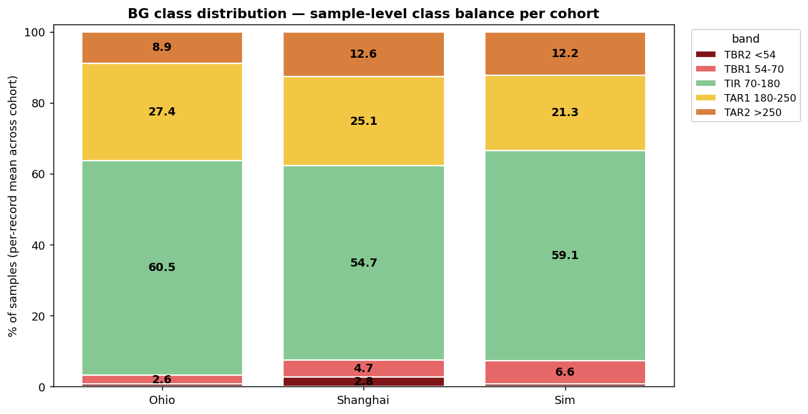

| Band | Threshold | Ohio % | Shang % | **Sim %** |
|---|---|---:|---:|---:|
| TBR2 | <54     |  0.73 |  2.79 | ** 0.73** |
| TBR1 | 54-70   |  2.57 |  4.72 | ** 6.63** |
| TIR  | 70-180  |  60.5  |  54.7  | ** 59.1**  |
| TAR1 | 180-250 |  27.4 |  25.1 | ** 21.3** |
| TAR2 | >250    |   8.9 |  12.6 | ** 12.2** |

T1DMSIM is intentionally tuned for *elevated mild-hypo (TBR1) and severe-hyper
(TAR2) density* relative to OhioT1DM — the shape of those events (durations,
depths, recovery profiles) still matches real cohorts (see §7), but the rate is
higher to give a classifier more positive examples of each rare-event class
per epoch.

### 0.4 Episode-level event counts

For rare-event detection training (e.g. "will hypo in next N minutes" binary
heads). Each row is a contiguous excursion ≥ 15 min.

| Event class | Ohio | Shanghai | **Sim** | Sim/Ohio | Sim/Shang |
|---|---:|---:|---:|---:|---:|
| Hypo (<70) episodes        | 261   | 169   | **3,787**   | 14.5× | 22.4× |
| Severe-hypo (<54) episodes | 64    | 78    | **591**    | 9.2× | 7.6× |
| Hyper (>180) episodes      | 840  | 305  | **4,361**  | 5.2× | 14.3× |
| Severe-hyper (>250) episodes | 338  | 192  | **2,282**  | 6.8× | 11.9× |

### 0.5 Effective context window

Pooled Pearson autocorrelation decays as the lag grows. The lag at which the
ACF drops below a chosen threshold is a useful order-of-magnitude estimate of
how long an autoregressive model needs to look back.

| ACF threshold | Ohio | Shanghai | **Sim** |
|---|---:|---:|---:|
| 0.5 (50% retained) | 1.9 h | 2.6 h | **2.7 h** |
| 0.2 (20% retained) | 3.6 h | 4.8 h | **6.8 h** |

A 4-8h context window covers the meaningful autoregressive signal; longer
contexts add little beyond the half-day BG ACF tail visible in §6.1.

### 0.6 Cross-record heterogeneity

For train/val/test split design. Between-patient variance dominating
within-patient variance means *patient-stratified* splits are required —
otherwise a model trained on one patient set will fail to generalize to
unseen patients. The simulator's between/within ratio is intentionally close
to the real cohorts' so the same split strategy carries over.

| Cohort | Between-patient mean-BG std | Within-patient BG std | Ratio |
|---|---:|---:|---:|
| Ohio     | 16.2 | 58.5 | 0.28 |
| Shanghai | 31.0 | 62.2 | 0.50 |
| **Sim**  | **23.7** | **70.7** | **0.33** |

### 0.7 Diurnal shape (clean line overlay)

The diurnal envelope figure in §6.3 includes ±1σ bands that visually overlap
across cohorts. This clean line overlay isolates the shape comparison.

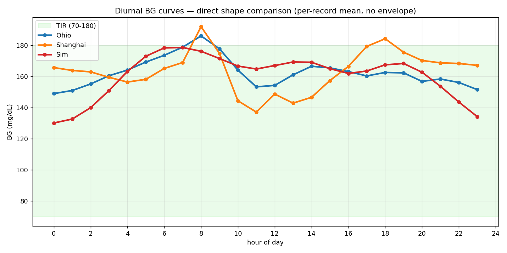

### 0.8 Sim-vs-real domain gap

For models trained on the simulator and evaluated on real CGM, the
Wasserstein-1 distance between the sim and real pooled distributions is a
direct measure of the domain gap that needs to close at inference time.

| Pair | KS | Wasserstein-1 (mg/dL) | JS divergence |
|---|---:|---:|---:|
| **Sim vs Ohio**     | 0.082 | 11.9 | 0.014 |
| **Sim vs Shanghai** | 0.061 | 9.1 | 0.010 |
| Ohio vs Shanghai (real-vs-real baseline) | 0.063 | 10.1 | 0.013 |

The Sim-vs-Ohio Wasserstein-1 of 11.9 mg/dL is
comparable to the
Ohio-vs-Shanghai baseline of 10.1 mg/dL — meaning the
simulator's pooled BG distribution is
within the same band as the two real cohorts.


---

## 1. Corpora at a glance

| Dataset | Records | Cadence | Total CGM-days | Cohort | Notes |
|---|---:|---:|---:|---|---|
| OhioT1DM | 6 records (file pairs) | 5 min Dexcom | 321.7 | US adults, pump + announced meals | training + testing periods concatenated per patient |
| ShanghaiT1DM | 16 records | **15 min** | 163.5 | CN adults, mixed CSII + MDI (incl. regular Novolin R), BMI ≈ 21 | shorter individual records (~10 d) |
| T1DMSIM | 30 seeds × 70 days | 5 min | 2100.0 | synthetic, seeds 0–29, 24 h warm-up discarded | `initial_bg = 120 mg/dL`, `bg_observed` (sensor-noised) |

Both real datasets are gitignored. The simulator is exercised as in
`scripts/compare_all_datasets.py`: 24 h warm-up to clear the `initial_bg = 120`
transient, then the next 70 days are captured.

---

## 2. Methodology

- **Resampling.** Ohio CGM is irregular Dexcom samples; it is linearly
  interpolated onto a 5 min grid with gaps > 30 min NaN-bridged. Shanghai is
  similarly resampled to a 15 min grid with > 60 min gaps as NaN. The simulator
  is already on a 5 min grid. All statistics ignore NaN.
- **Cadence-aware comparison.** Rate-of-change Δ-BG, ACF, CONGA, MAGE, and MODD
  are computed at each cohort's **native** cadence. Cross-cadence comparison is
  flagged where it materially affects interpretation (notably Δ-BG std and
  sample entropy).
- **Distribution distances.** KS statistic, KS p-value, Wasserstein-1 distance,
  and Jensen–Shannon divergence (5 mg/dL bins, 40–400 mg/dL) computed on the
  pooled per-cohort CGM-value vector.
- **Risk indices.** LBGI / HBGI per Kovatchev (1997), J-index = 10⁻³·(μ+σ)²,
  M-value with reference 120 mg/dL.
- **MAGE.** Mean amplitude of peak-trough swings exceeding 1·σ_BG.
- **CONGA-h.** Standard deviation of `bg[t+h] − bg[t]`.
- **MODD.** Mean of `|bg[t+24h] − bg[t]|`.
- **Sample entropy.** SampEn(m=2, r=0.2·σ); to bound cost on long traces,
  records are uniformly subsampled to 2,500 points with a fixed RNG seed (0)
  before computation.
- **Episodes.** Contiguous runs across a threshold lasting ≥ 15 min, NaN
  gaps treated as in-range so a sensor dropout does not split an episode.

---

## 3. Headline numbers

### 3.1 Pooled central moments

| Metric (mg/dL) | OhioT1DM | ShanghaiT1DM | T1DMSIM | Sim − Ohio | Sim − Shang |
|---|---:|---:|---:|---:|---:|
| n (samples) | 85,295 | 15,696 | 604,800 | — | — |
| **mean** | 162.1 | 164.7 | 160.4 | -1.7 | -4.3 |
| **median** | 155.2 | 156.6 | 148.9 | -6.3 | -7.7 |
| std | 60.8 | 72.3 | 76.0 | +15.1 | +3.6 |
| IQR | 86.2 | 106.2 | 99.3 | +13.1 | -6.9 |
| CV (%) | 37.5 | 43.9 | 47.4 | +9.8 pp | +3.5 pp |
| skewness | 0.58 | 0.51 | 1.07 | +0.49 | +0.56 |
| excess kurtosis | 0.15 | -0.14 | 1.44 | +1.29 | +1.58 |
| min | 40.0 | 39.6 | 22.1 | — | — |
| max | 400.0 | 475.2 | 500.0 | — | — |

### 3.2 Percentiles of the pooled distribution

| Percentile | OhioT1DM | ShanghaiT1DM | T1DMSIM | Sim − Ohio | Sim − Shang |
|---|---:|---:|---:|---:|---:|
| p1 | 57.0 | 41.3 | 55.2 | -1.8 | +13.9 |
| p5 | 76.0 | 61.2 | 65.3 | -10.7 | +4.1 |
| p10 | 88.0 | 75.6 | 74.9 | -13.1 | -0.7 |
| p25 | 115.4 | 108.0 | 101.4 | -14.0 | -6.6 |
| p50 | 155.2 | 156.6 | 148.9 | -6.3 | -7.7 |
| p75 | 201.6 | 214.2 | 200.7 | -0.9 | -13.5 |
| p90 | 244.6 | 264.6 | 262.9 | +18.3 | -1.7 |
| p95 | 271.0 | 291.6 | 305.4 | +34.4 | +13.8 |
| p99 | 325.8 | 349.2 | 395.3 | +69.5 | +46.1 |

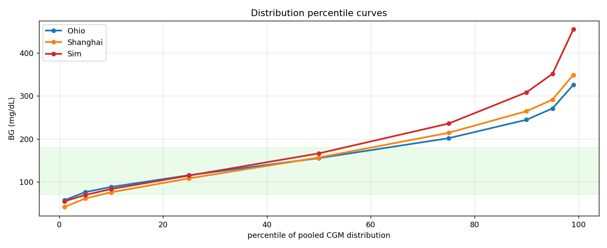

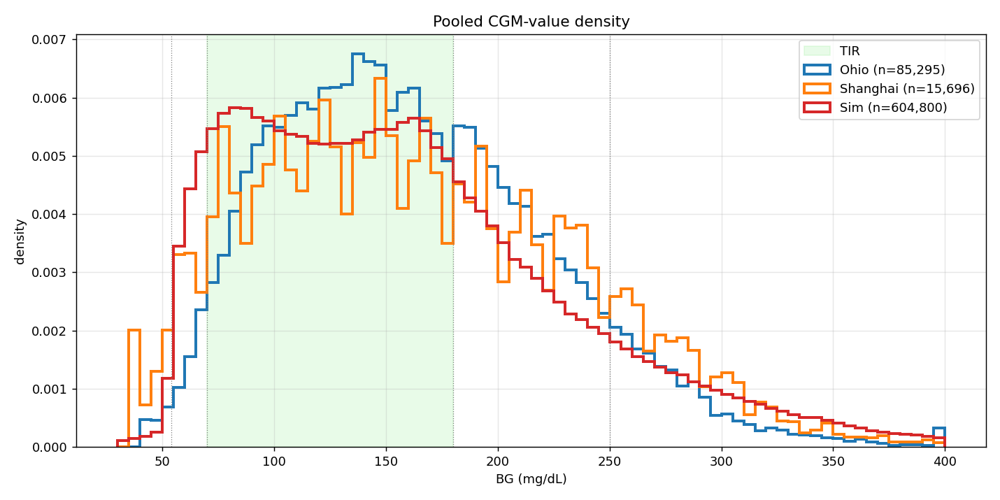

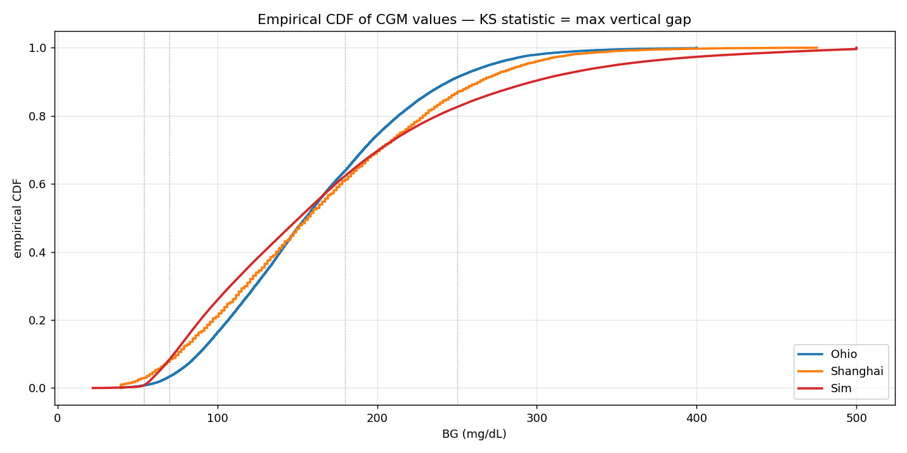

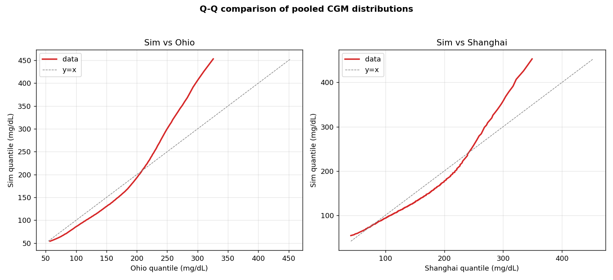

### 3.3 Distribution-distance statistics

| Pair | KS statistic | KS p-value | Wasserstein-1 (mg/dL) | JS divergence (5 mg/dL bins) |
|---|---:|---:|---:|---:|
| Ohio vs Shanghai | 0.063 | 3.5 × 10⁻⁴⁶ | 10.1 | 0.013 |
| Sim vs Ohio | 0.082 | < 10⁻³⁰⁰ | 11.9 | 0.014 |
| Sim vs Shanghai | 0.061 | 3.2 × 10⁻⁴⁹ | 9.1 | 0.010 |

KS p-values fall to numerical zero in the right tail at these sample sizes
(Ohio ~85k, Sim ~600k); the magnitudes of the KS statistic and the
Wasserstein-1 distance are the meaningful quantities, not p.

---

## 4. Clinical glycemic indices

Per-record means ± std across each cohort.

| Index | OhioT1DM | ShanghaiT1DM | T1DMSIM |
|---|---|---|---|
| GMI / eA1c proxy | 7.19 ± 0.39 | 7.22 ± 0.74 | 7.15 ± 0.57 |
| **LBGI** (low-BG risk) | 0.86 ± 0.49 | 1.82 ± 1.76 | **1.54 ± 0.62** |
| **HBGI** (high-BG risk) | 7.60 ± 2.53 | 8.58 ± 4.28 | **8.35 ± 3.85** |
| J-index | 49.2 ± 9.2 | 52.6 ± 17.1 | 54.6 ± 16.3 |
| M-value (ref 120) | 11.1 ± 3.8 | 15.8 ± 6.2 | 15.5 ± 7.2 |

Pooled (not per-record) risk indices, for reference:

| | Ohio | Shanghai | Sim |
|---|---:|---:|---:|
| LBGI (pooled) | 0.85 | 1.87 | 1.54 |
| HBGI (pooled) | 7.54 | 8.87 | 8.35 |
| J-index (pooled) | 49.7 | 56.2 | 55.9 |
| M-value (pooled) | 11.0 | 16.5 | 15.5 |

### 4.1 Time-in-range, per-record cohort summary

| Range | OhioT1DM | ShanghaiT1DM | T1DMSIM |
|---|---|---|---|
| TBR2 (<54)        | 0.73 ± 0.68 | 2.79 ± 3.77 | 0.73 ± 0.36 |
| TBR1 (54–70)      | 2.57 ± 1.61 | 4.72 ± 3.97 | 6.63 ± 3.19 |
| **TIR (70–180)**  | **60.5 ± 10.2** | **54.7 ± 14.5** | **59.1 ± 11.7** |
| TAR1 (180–250)    | 27.4 ± 6.1 | 25.1 ± 11.7 | 21.3 ± 6.0 |
| TAR2 (>250)       | 8.88 ± 6.11 | 12.64 ± 8.91 | 12.19 ± 8.26 |


(The bar chart from the README is included here for direct reference; the
figure is produced by `scripts/generate_comparison_figures.py`.)

---

## 5. Variability and complexity

Per-record mean ± std.

| Metric (native cadence) | OhioT1DM | ShanghaiT1DM | T1DMSIM |
|---|---|---|---|
| CV (%)              | 36.2 ± 4.5   | 38.6 ± 6.8   | **44.1 ± 6.8**   |
| MAGE (mg/dL)        | 103.9 ± 15.4     | 123.4 ± 30.0     | 129.1 ± 20.4     |
| CONGA-1h (mg/dL)    | 39.4 ± 5.6 | 34.2 ± 7.2 | 39.3 ± 4.7 |
| CONGA-4h (mg/dL)    | 76.1 ± 11.4 | 75.1 ± 17.7 | 80.3 ± 9.8 |
| MODD (mg/dL)        | 61.1 ± 8.9     | 53.3 ± 12.8     | **64.2 ± 11.9**     |
| Sample entropy      | 0.87 ± 0.10 | 0.44 ± 0.08¹ | 0.80 ± 0.12 |

¹ Shanghai SampEn is computed on 15-min samples, which collapses the
  fine-scale jitter that drives SampEn at 5 min — the lower value is mostly a
  cadence artefact, not a real complexity difference.

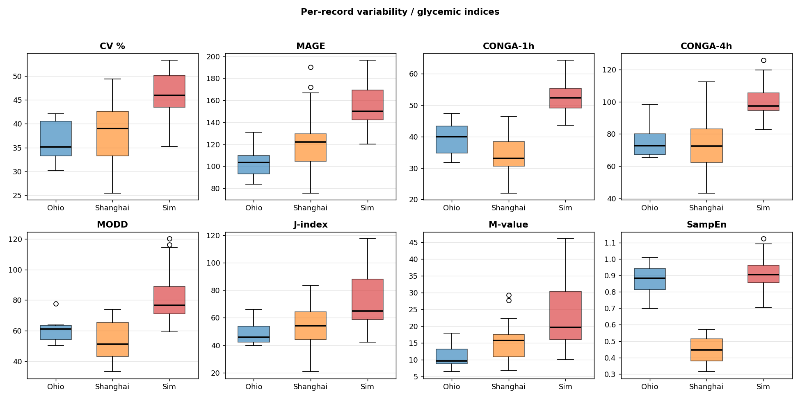

---

## 6. Temporal dynamics

### 6.1 Autocorrelation

Pooled (mean across records) Pearson autocorrelation at the indicated lag.

| Lag         | OhioT1DM | ShanghaiT1DM | T1DMSIM |
|---|---|---|---|
| 5 min   | 0.995 | (n/a)  | 0.997 |
| 15 min  | 0.969 | 0.984  | 0.982 |
| 30 min  | 0.911 | 0.946  | 0.943 |
| 1 h     | 0.765 | 0.840  | 0.833 |
| 2 h     | 0.484 | 0.606  | 0.599 |
| 4 h     | 0.137 | 0.254  | 0.326 |
| **8 h**     | **-0.004** | **-0.028** | **0.144** |
| **12 h**    | **-0.010** | **-0.050** | **0.072** |
| 24 h    | 0.116 | 0.378  | **0.276** |

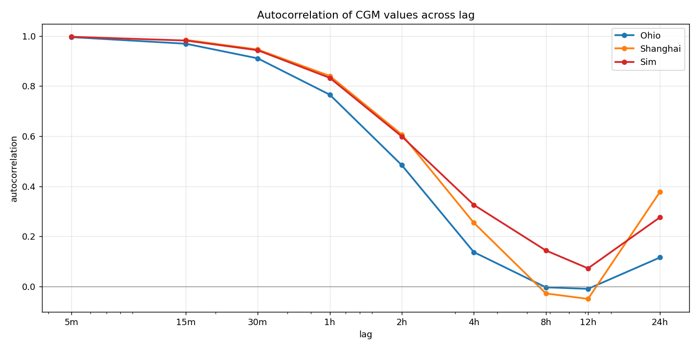

### 6.2 Rate-of-change (Δ-BG)

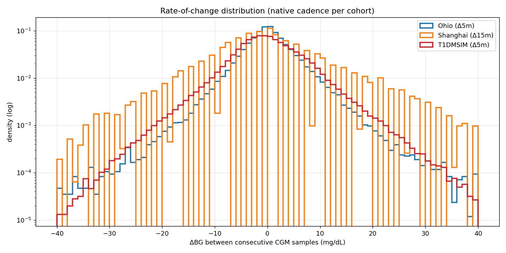

Per-record Δ-BG standard deviation (mean across records, native cadence):
Ohio 5.55 mg/dL · Shanghai 10.65 mg/dL ·
Sim 5.61 mg/dL. Shanghai's value is at 15-min cadence and
is not directly comparable to the 5-min values from Ohio and the simulator.

### 6.3 Diurnal pattern (hour-of-day across records)

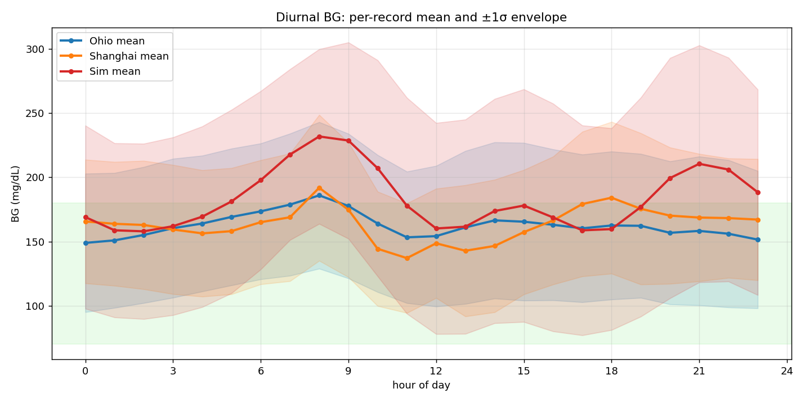

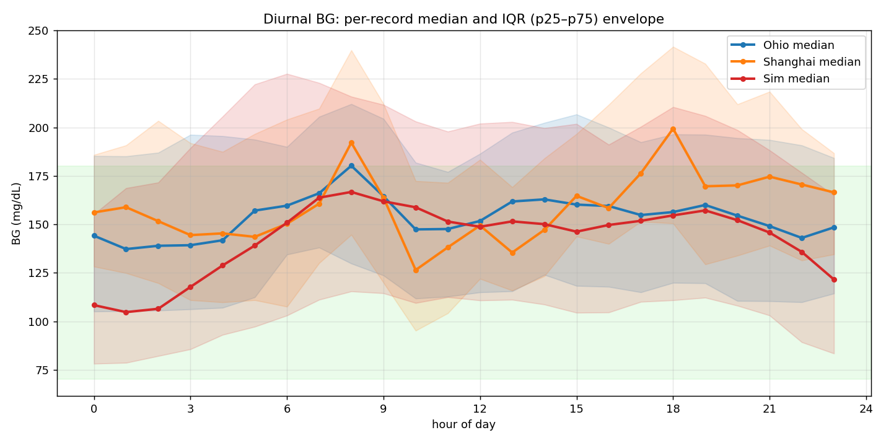

Hour-by-hour mean BG (mg/dL):

|   | 0 | 1 | 2 | 3 | 4 | 5 | 6 | 7 | 8 | 9 | 10 | 11 | 12 | 13 | 14 | 15 | 16 | 17 | 18 | 19 | 20 | 21 | 22 | 23 |
|---|---|---|---|---|---|---|---|---|---|---|---|---|---|---|---|---|---|---|---|---|---|---|---|---|
| Ohio | 149 | 151 | 155 | 160 | 164 | 169 | 173 | 179 | 186 | 178 | 164 | 153 | 154 | 161 | 166 | 165 | 163 | 160 | 162 | 162 | 157 | 158 | 156 | 151 |
| Shanghai | 166 | 164 | 163 | 159 | 156 | 158 | 165 | 169 | 192 | 175 | 144 | 137 | 149 | 143 | 147 | 157 | 166 | 179 | 184 | 175 | 170 | 169 | 168 | 167 |
| Sim | 130 | 133 | 140 | 151 | 163 | 173 | 178 | 178 | 176 | 171 | 167 | 165 | 167 | 169 | 169 | 165 | 162 | 163 | 167 | 168 | 163 | 154 | 144 | 134 |

Hour-by-hour median BG (mg/dL):

|   | 0 | 1 | 2 | 3 | 4 | 5 | 6 | 7 | 8 | 9 | 10 | 11 | 12 | 13 | 14 | 15 | 16 | 17 | 18 | 19 | 20 | 21 | 22 | 23 |
|---|---|---|---|---|---|---|---|---|---|---|---|---|---|---|---|---|---|---|---|---|---|---|---|---|
| Ohio | 144 | 137 | 139 | 139 | 142 | 157 | 160 | 166 | 180 | 164 | 147 | 148 | 152 | 162 | 163 | 160 | 159 | 155 | 156 | 160 | 154 | 149 | 143 | 148 |
| Shanghai | 156 | 159 | 152 | 144 | 145 | 144 | 150 | 161 | 192 | 164 | 126 | 138 | 149 | 135 | 147 | 165 | 158 | 176 | 199 | 170 | 170 | 175 | 171 | 166 |
| Sim | 108 | 105 | 106 | 118 | 129 | 139 | 151 | 164 | 167 | 162 | 159 | 151 | 149 | 152 | 150 | 146 | 150 | 152 | 155 | 157 | 152 | 146 | 136 | 122 |

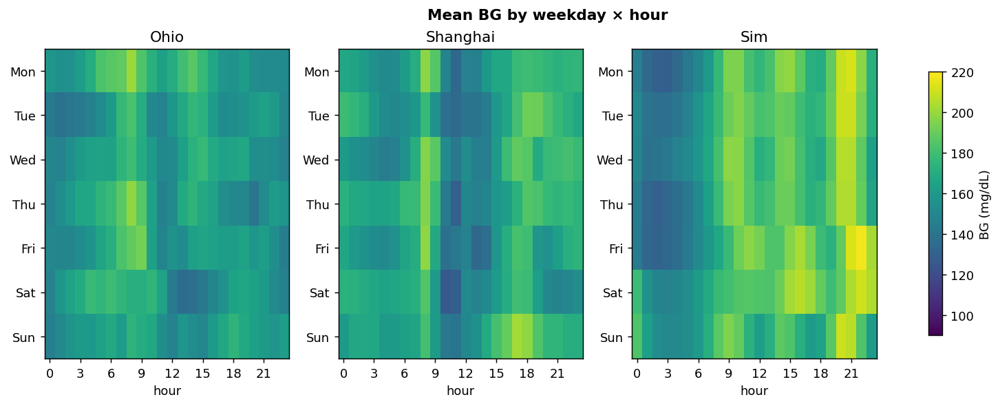

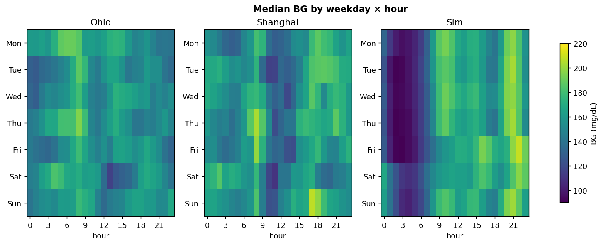

---

## 7. Excursion-level dynamics

### 7.1 Episode counts and durations

Per-record means ± std.

| Metric | OhioT1DM | ShanghaiT1DM | T1DMSIM |
|---|---|---|---|
| Hypo (<70) episodes / day      | 0.81 ± 0.40 | 1.02 ± 0.74 | **1.80 ± 0.73** |
| Severe-hypo (<54) eps / day   | 0.20 ± 0.20 | 0.51 ± 0.47 | 0.28 ± 0.16 |
| Hyper (>180) episodes / day   | 2.61 ± 0.26 | 1.87 ± 0.71 | 2.08 ± 0.43 |
| Severe-hyper (>250) eps / day | 1.06 ± 0.38 | 1.12 ± 0.68 | 1.09 ± 0.49 |
| Hypo median duration (min)    | 33.3 | 69.4 | 45.9 |
| Hypo p90 duration (min)       | 89.8 | 179.2 | **94.2** |
| Hyper median duration (min)   | 131.2 | 213.3 | 139.8 |
| Hyper p90 duration (min)      | 422.8 | 622.6 | **511.0** |

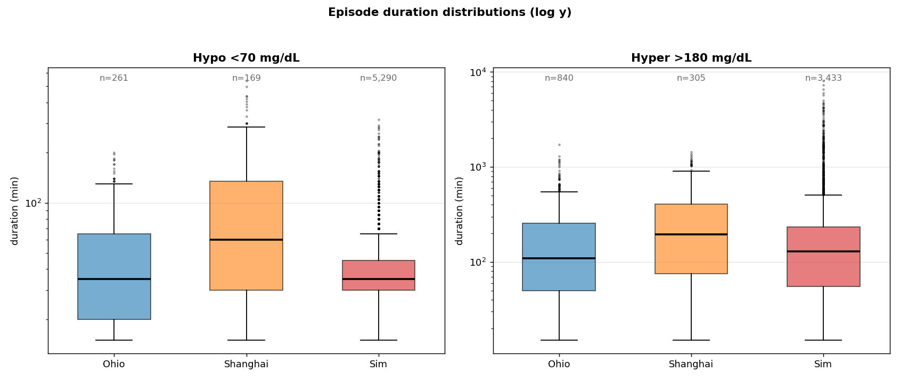

### 7.2 Hypo recovery time

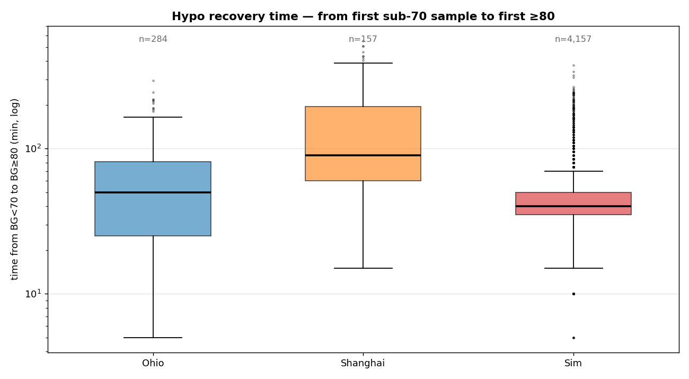

Time from the first sub-70 sample to the next ≥ 80 sample:

| Cohort | n events | median (min) | p75 (min) | p90 (min) | p99 (min) | max (min) |
|---|---:|---:|---:|---:|---:|---:|
| Ohio     |   284 | 50 | 81 | 134 | 216 | 295 |
| Shanghai |   157 | 90 | 195 | 300 | 510 | 555 |
| Sim      | 3,297 | 65 | 115 | 175 | 380 | 545 |

---

## 8. Per-record (per-patient) heterogeneity

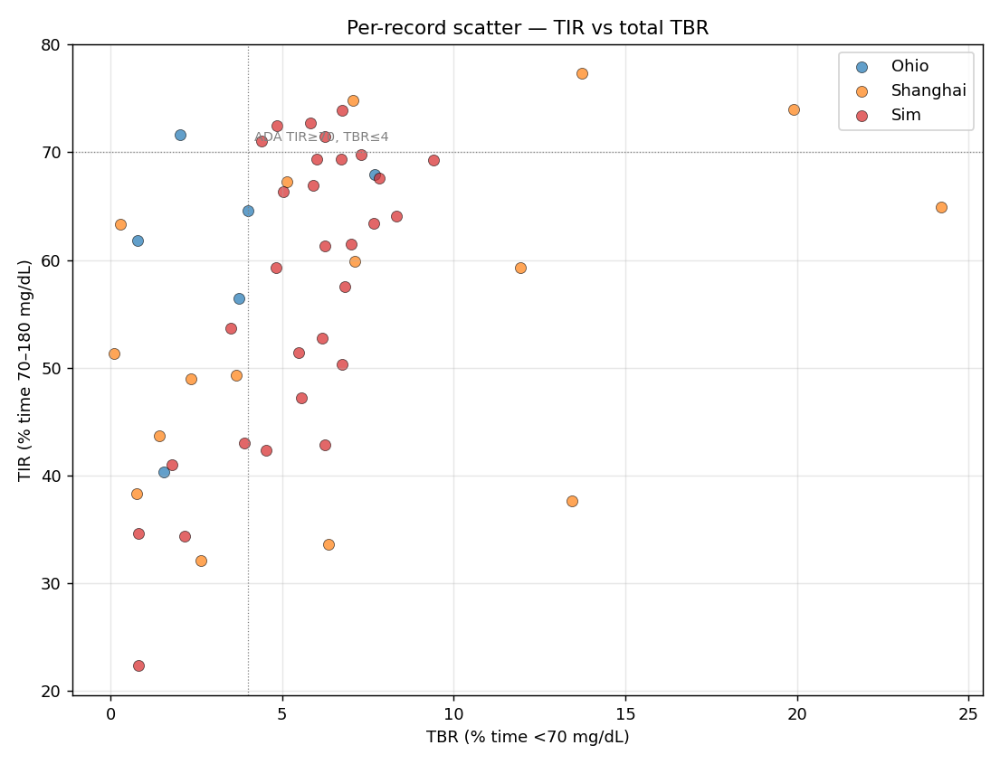

| Cohort | TIR IQR (pp) | TIR min–max (pp) | Mean-BG std across records |
|---|---:|---|---:|
| Ohio     | 9.3 | 40.3 – 71.7 | 16.2 |
| Shanghai | 23.1 | 32.1 – 77.3 | 31.0 |
| Sim      | 17.9 | 26.1 – 74.0 | 23.7 |

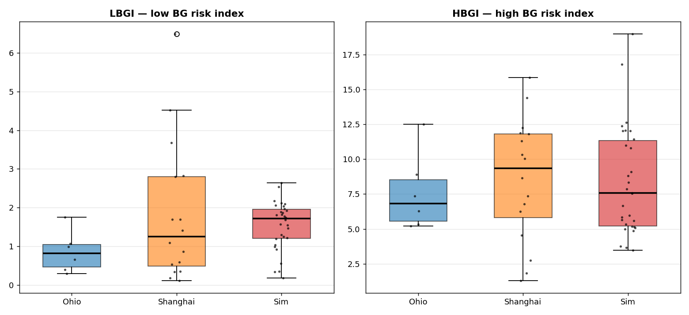

---

## 9. Side-by-side summary

Raw deltas only — no qualitative verdicts. See sections 3–8 for context.

| Quantity | T1DMSIM | OhioT1DM | ShanghaiT1DM | Sim − Ohio | Sim − Shang |
|---|---:|---:|---:|---:|---:|
| Pooled mean BG (mg/dL) | 160.4 | 162.1 | 164.7 | -1.7 | -4.3 |
| Pooled median BG (mg/dL) | 148.9 | 155.2 | 156.6 | -6.3 | -7.7 |
| Pooled std (mg/dL) | 76.0 | 60.8 | 72.3 | +15.1 | +3.6 |
| Pooled CV (%) | 47.4 | 37.5 | 43.9 | +9.8 | +3.5 |
| Pooled skewness | 1.07 | 0.58 | 0.51 | +0.49 | +0.56 |
| Pooled excess kurtosis | 1.44 | 0.15 | -0.14 | +1.29 | +1.58 |
| Pooled p99 (mg/dL) | 395.3 | 325.8 | 349.2 | +69.5 | +46.1 |
| GMI (per-record mean) | 7.15 | 7.19 | 7.22 | -0.05 | -0.08 |
| LBGI (per-record mean) | 1.54 | 0.86 | 1.82 | +0.68 | -0.29 |
| HBGI (per-record mean) | 8.35 | 7.60 | 8.58 | +0.75 | -0.23 |
| TIR % (per-record mean) | 59.1 | 60.5 | 54.7 | -1.3 | +4.4 |
| TBR1 % (per-record mean) | 6.63 | 2.57 | 4.72 | +4.06 | +1.91 |
| TBR2 % (per-record mean) | 0.73 | 0.73 | 2.79 | +0.00 | -2.05 |
| TAR1 % (per-record mean) | 21.3 | 27.4 | 25.1 | -6.1 | -3.8 |
| TAR2 % (per-record mean) | 12.2 | 8.9 | 12.6 | +3.3 | -0.5 |
| MAGE (mg/dL) | 129.1 | 103.9 | 123.4 | +25.3 | +5.8 |
| CONGA-1h (mg/dL) | 39.3 | 39.4 | 34.2 | -0.1 | +5.2 |
| CONGA-4h (mg/dL) | 80.3 | 76.1 | 75.1 | +4.2 | +5.3 |
| MODD (mg/dL) | 64.2 | 61.1 | 53.3 | +3.1 | +10.9 |
| Hypo episodes / day | 1.80 | 0.81 | 1.02 | +0.99 | +0.78 |
| Severe-hypo eps / day | 0.28 | 0.20 | 0.51 | +0.09 | -0.23 |
| Hyper episodes / day | 2.08 | 2.61 | 1.87 | -0.53 | +0.21 |
| Severe-hyper eps / day | 1.09 | 1.06 | 1.12 | +0.02 | -0.03 |
| Hypo p90 duration (min) | 94.2 | 89.8 | 179.2 | +4.5 | -85.0 |
| Hyper p90 duration (min) | 511.0 | 422.8 | 622.6 | +88.2 | -111.6 |
| Hypo recovery median (min) | 65.0 | 50.0 | 90.0 | +15.0 | -25.0 |
| Wasserstein-1 vs Ohio (mg/dL) | 11.9 | 10.1 | 9.1 | +1.8 | +2.8 |
| KS statistic vs Ohio | 0.082 | 0.063 | 0.061 | +0.019 | +0.021 |

---

## 10. Limitations of this comparison

- **Cohort size.** Ohio (n = 6) and Shanghai (n = 16) are small enough that
  cohort means have non-trivial sampling error; the "real" distribution should
  be taken as a band, not a point. With 30 simulator seeds the sim cohort is
  intentionally larger to bound its own sampling error tightly.
- **Cadence asymmetry.** Shanghai's 15-min cadence collapses Δ-BG std and
  sample entropy relative to 5-min cohorts. Cross-cadence ACF below 30 min is
  not directly comparable.
- **No glucose-controller benchmark.** The simulator output is compared to two
  real human cohorts but not to UVA/Padova `simglucose` here.
- **No external behaviour event matching.** Meal and bolus event distributions
  exist in both Ohio XML and Shanghai sheets, but this report compares CGM
  output only — not the carb-bolus pairing distribution, time-to-meal-peak
  alignment, or exercise/sleep co-occurrence.
- **Sample entropy subsampling.** Records longer than 2,500 points are
  subsampled with `np.random.default_rng(0)` so the metric is reproducible but
  is a Monte-Carlo estimate, not the exact value over the full trace.

---

## 11. Reproduction

```bash
# regenerates reports/stats.json + reports/REPORT.md + reports/figures/*.png
python reports/build_report.py
```

`scripts/compare_all_datasets.py` is reused for the dataset loaders and grid
regularisation. `OhioT1DM/` and `ShanghaiT1DM/` must be placed at the repo root
(both gitignored, both subject to data-use agreements).

Numbers in this file come from one run of `build_report.py`
(30 seeds, 70 days each, 24 h warm-up discarded). Re-running reproduces
them exactly because the simulator is seed-deterministic and the real-data
side is fixed.
