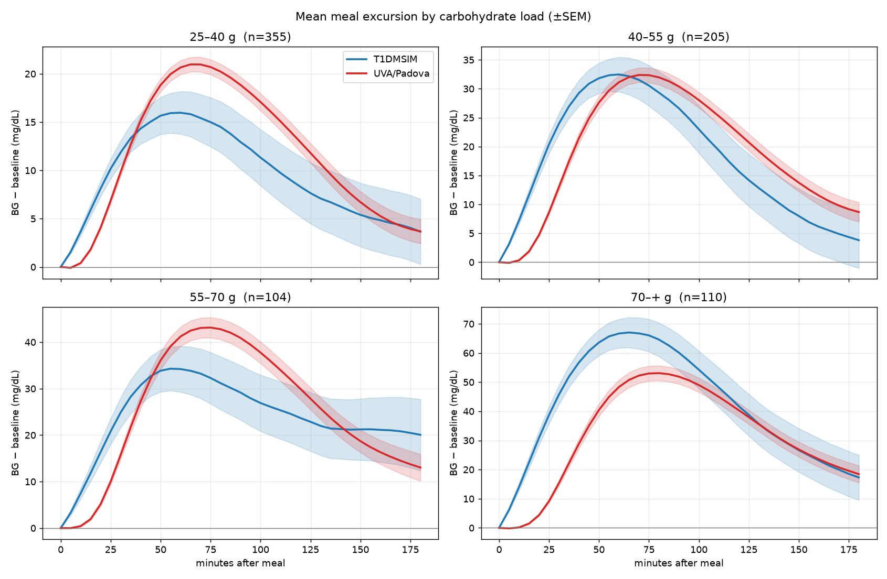
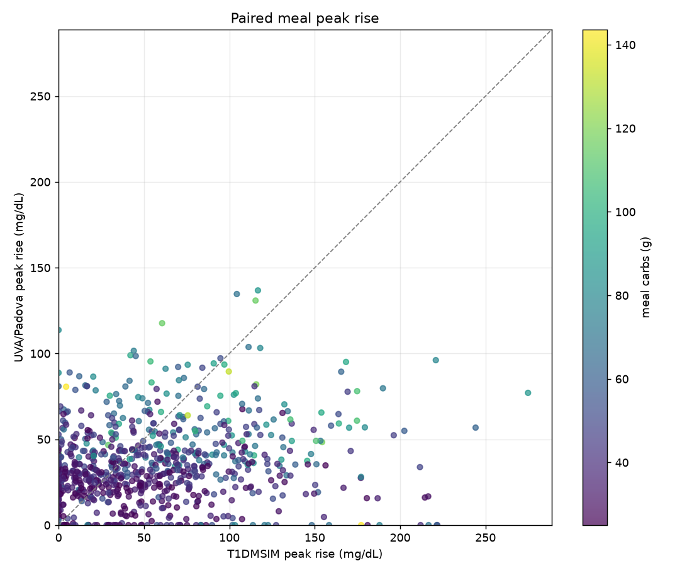
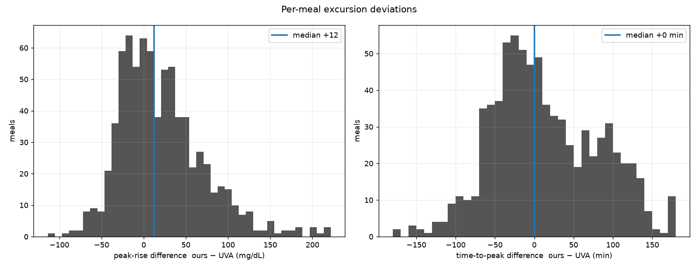
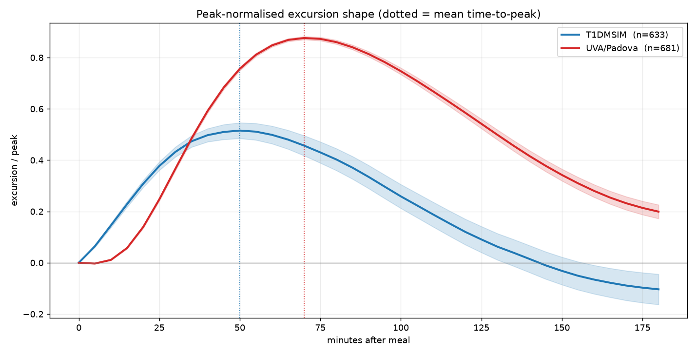
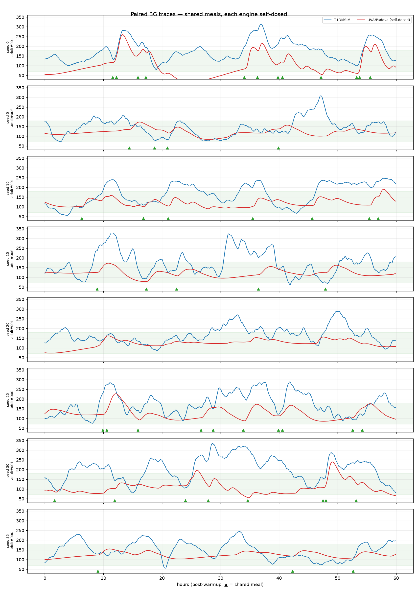

# Meal excursions: T1DMSIM vs. a self-dosed UVA/Padova patient

Companion to [`README.md`](README.md), which replays T1DMSIM's insulin into
UVA/Padova verbatim: those boluses, sized by T1DMSIM's insulin-to-carb ratio,
over-cover the UVA virtual patients into sustained hypoglycaemia, so that
comparison is dominated by a gross level mismatch. Here the engines **share only
the meal schedule** and each doses insulin for its own physiology.

*Generated by `uva_padova/compare_excursions.py`. Do not edit by hand.*

## Method

For each of 40 seeds, T1DMSIM generates a virtual patient and a
14-day schedule. The food-meal times and grams are shared with a
paired UVA/Padova `adult` patient; insulin is **not** shared.
T1DMSIM doses as it normally would (behavioural under-counting, missed boluses,
corrections, timing jitter and all); the UVA/Padova patient is dosed for its own
physiology — own basal (u2ss) + grams/CR meal bolus + bounded CF correction.
Isolated post-meal excursions (≥25 g, no other ≥20 g
meal within ±120 min so the rise and peak are clean, a
180-min window) are extracted relative to each engine's **own**
pre-meal baseline, so what is compared is the *response*, not the level.
774 excursions met the criteria.

## Excursion amplitude and timing (median, IQR)

| Quantity | T1DMSIM | UVA/Padova |
|---|---|---|
| Peak rise (mg/dL) | 48 (18–83) | 32 (22–47) |
| Time-to-peak (min) | 75 (40–145) | 75 (60–90) |
| 3-h excursion area (mg/dL·min) | 3866 (770–8429) | 3291 (1834–5036) |
| Recovery to baseline (min) | 155 (75–180) | 145 (95–180) |

Per-meal paired differences (T1DMSIM − UVA/Padova): peak rise
**+12** mg/dL
(IQR -15–+48),
time-to-peak **+0** min
(IQR -35–+60).

### By carbohydrate load

| Meal size | n | T1DMSIM peak (mg/dL) | UVA/Padova peak (mg/dL) | T1DMSIM t-peak (min) | UVA/Padova t-peak (min) |
|---|---|---|---|---|---|
| 25-40 g | 355 | 36 (11–65) | 24 (16–34) | 85 (40–165) | 70 (55–92) |
| 40-55 g | 205 | 49 (21–81) | 35 (26–45) | 65 (40–130) | 75 (60–90) |
| 55-70 g | 104 | 58 (21–102) | 44 (32–65) | 78 (45–158) | 80 (65–90) |
| 70-200 g | 110 | 89 (54–121) | 53 (41–76) | 65 (45–109) | 80 (65–90) |





## Excursion shape (amplitude removed)

Each excursion is normalised by its own peak, leaving only the *shape* — how
fast glucose rises and how it returns.



## Sample paired traces

Shared meals (▲), each engine self-dosed.



## Reproducing

```bash
pip install --no-deps simglucose>=0.2.11
venv/bin/python uva_padova/compare_excursions.py            # full run
venv/bin/python uva_padova/compare_excursions.py --quick    # fast smoke run
```
