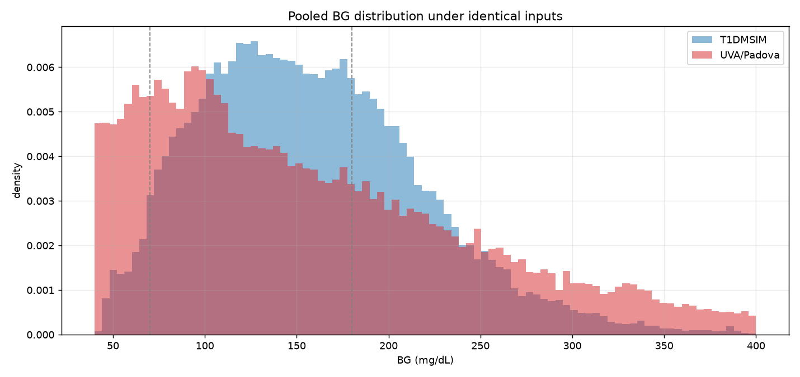
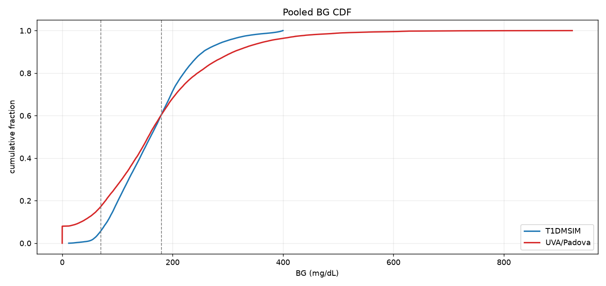
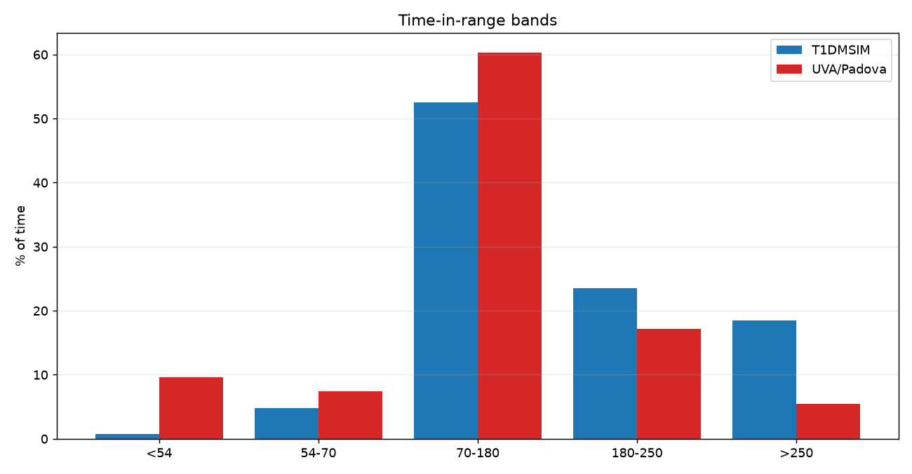
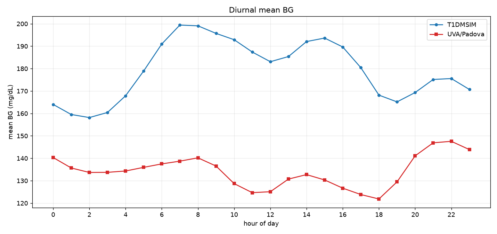
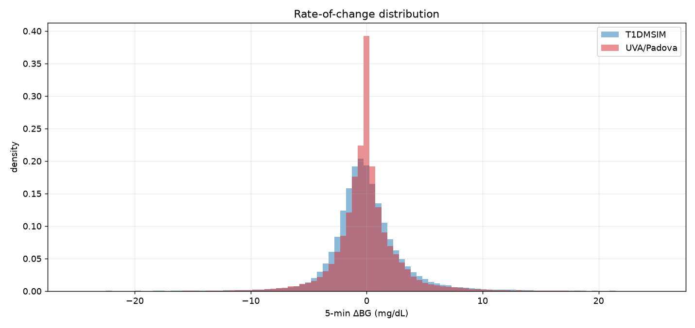
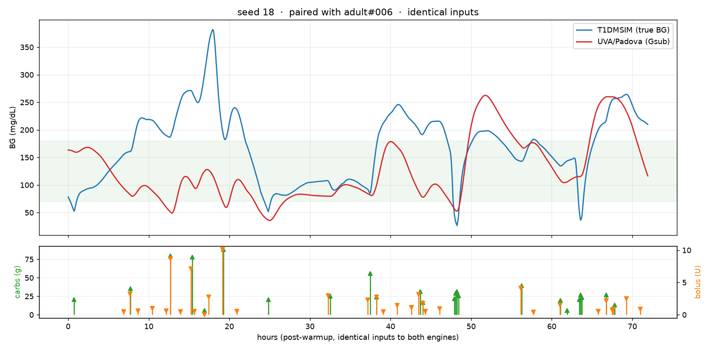
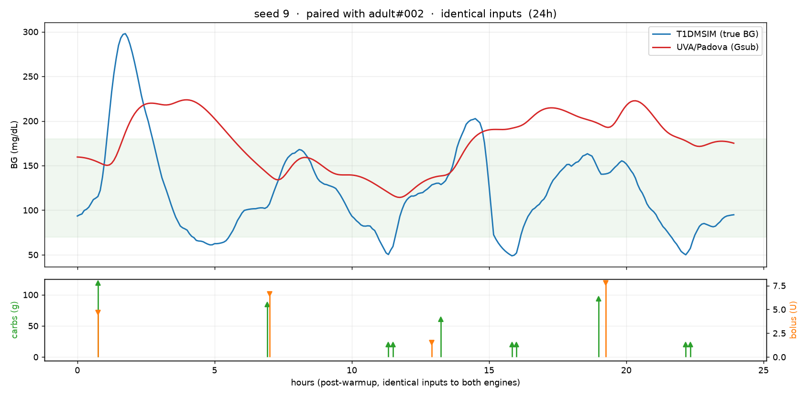
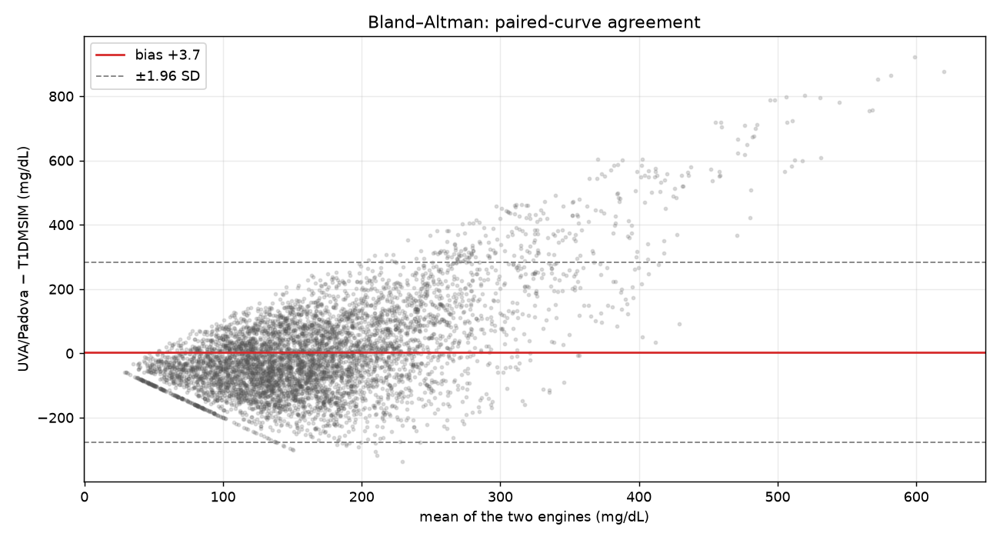
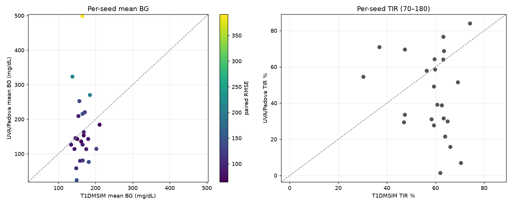
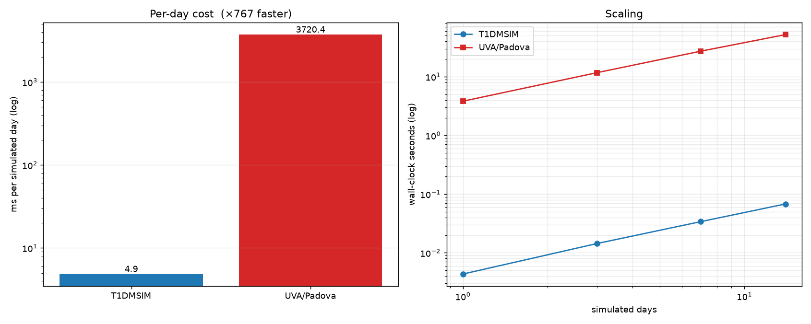

# T1DMSIM vs. UVA/Padova 2008 (in-silico reference)

## Distributional comparison (pooled across seeds)

| Metric | T1DMSIM | UVA/Padova | Δ (UVA − ours) |
|---|---|---|---|
| Mean BG (mg/dL) | 164.2 | 165.4 | 1.2 |
| Median BG (mg/dL) | 158.7 | 152.8 | -5.8 |
| SD (mg/dL) | 59.5 | 75.2 | 15.8 |
| CV (%) | 36.4 | 55.4 | 18.9 |
| GMI (%) | 7.24 | 7.27 | 0.03 |
| p10 (mg/dL) | 90.7 | 80.9 | -9.8 |
| p90 (mg/dL) | 245.5 | 267.2 | 21.8 |
| Time <54 % (TBR2) | 0.93 | 14.13 | 13.20 |
| Time 54–70 % (TBR1) | 2.88 | 6.86 | 3.99 |
| Time 70–180 % (TIR) | 58.7 | 44.9 | -13.8 |
| Time 180–250 % (TAR1) | 28.1 | 15.9 | -12.2 |
| Time >250 % (TAR2) | 9.40 | 18.20 | 8.80 |
| LBGI | 0.91 | 29.00 | 28.09 |
| HBGI | 7.95 | 12.24 | 4.29 |
| Hypo episodes/day | 0.96 | 0.90 | -0.06 |
| Hyper episodes/day | 2.52 | 0.97 | -1.56 |
| 5-min ΔBG SD (mg/dL) | 4.25 | 2.82 | -1.44 |

## Paired-curve agreement

| Quantity | Median | IQR |
|---|---|---|
| RMSE (mg/dL) | 101.1 | 87.5–136.8 |
| Mean abs. diff (mg/dL) | 83.5 | 71.4–110.7 |
| Pearson r | 0.12 | -0.06–0.22 |
| Pearson r (best lag) | 0.13 | -0.04–0.25 |
| Mean-BG drift (mg/dL) | -20.3 | -65.7–+49.5 |
| KS distance | 0.331 | 0.230–0.610 |
| Wasserstein-1 (mg/dL) | 58.8 | 28.1–91.6 |

## Generation speed

| Simulated days | T1DMSIM (s) | UVA/Padova (s) | T1DMSIM ms/day | UVA/Padova ms/day | Speedup |
|---|---|---|---|---|---|
| 1 | 0.004 | 3.82 | 4.34 | 3819 | ×879 |
| 3 | 0.014 | 11.73 | 4.80 | 3909 | ×814 |
| 7 | 0.034 | 27.19 | 4.85 | 3884 | ×801 |
| 14 | 0.068 | 52.09 | 4.85 | 3720 | ×767 |

| Throughput | Value |
|---|---|
| T1DMSIM | 59364 steps/s |
| UVA/Padova | 387 ODE-minutes/s |
| End-to-end speedup at the longest horizon | ×767 |

