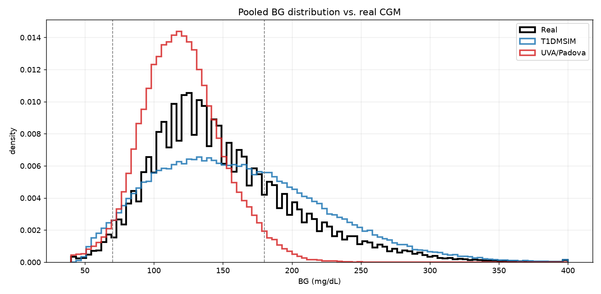
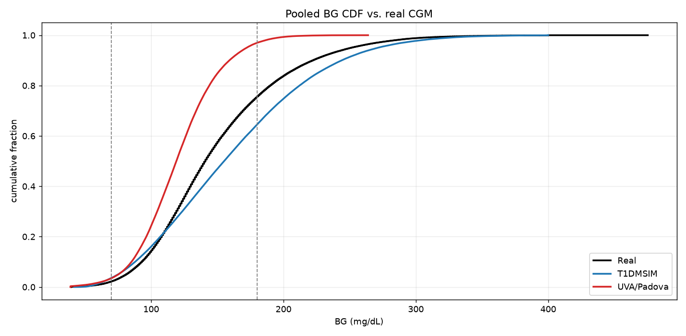
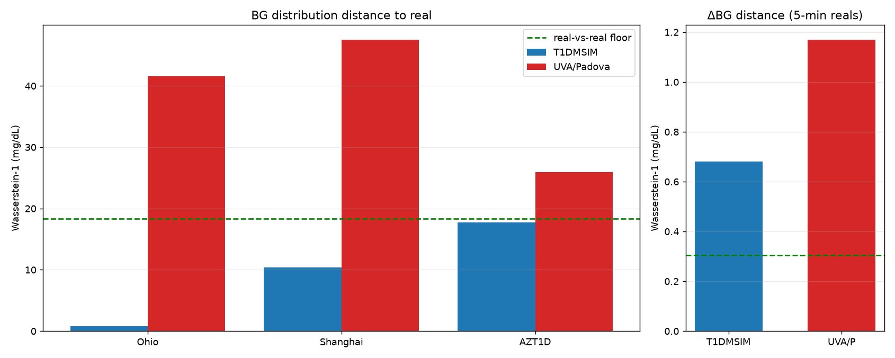
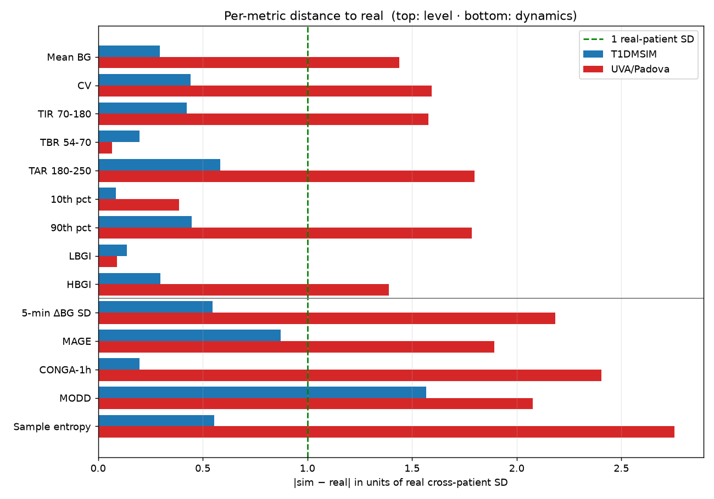
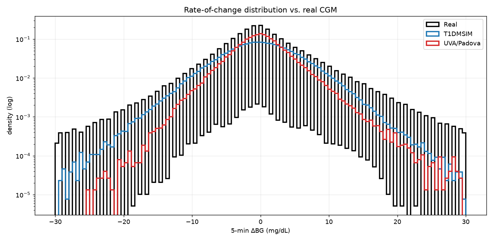
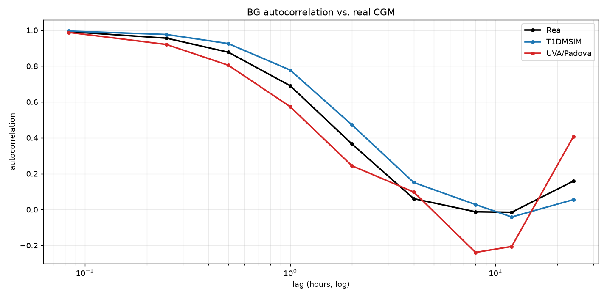

# Which simulator better resembles real-world CGM?

A model trained on synthetic data and run on real data pays for the gap between
the two distributions. Without training anything, this report measures that gap
for both simulators against real CGM (OhioT1DM + ShanghaiT1DM + AZT1D),
using the metric battery in `diff/build_report.py`. The yardstick is the
distance *between the real cohorts themselves* — a simulator inside that
envelope is, distributionally, as real as one real cohort is to another.

*Generated by `uva_padova/compare_realism.py`. Do not edit by hand.*

> **Read this first.** T1DMSIM was calibrated against the Ohio/Shanghai cohorts;
> UVA/Padova was not — it is a physiology + controller benchmark for closed-loop
> testing, here driven by its own native data-generation stack
> (RandomScenario meals + BBController + Dexcom CGM). T1DMSIM's calibration targeted not only the **level** but
> also distributional *shape* — the ΔBG distribution and autocorrelation — so even
> the **dynamic** metrics are not a fitting-free contest; they are merely less
> dominated by the level fit. Read every gap below as distance from a target
> T1DMSIM was trained toward and UVA/Padova never saw.

## Population summary

| Cohort | Mean BG | GMI | TIR 70–180 | 5-min ΔBG SD |
|---|---|---|---|---|
| **Real (pooled)** | 155 | 7.01 | 68% | 6.00 |
| · Ohio | 162 | 7.19 | 61% | 5.89 |
| · Shanghai (15-min) | 164 | 7.22 | 55% | — |
| · AZT1D | 147 | 6.83 | 78% | 6.02 |
| **T1DMSIM** | 162 | 7.18 | 61% | 5.50 |
| **UVA/Padova** | 120 | 6.19 | 93% | 4.01 |

## Distance to real (lower is closer)

Wasserstein-1 between each simulator's pooled distribution and real, with the
real-vs-real floor for reference:

| | T1DMSIM | UVA/Padova | real-vs-real floor |
|---|---|---|---|
| BG distribution | 12.8 | 30.0 | 18.4 |
| ΔBG distribution | 0.7 | 1.2 | 0.3 |

On the marginal BG distribution, **T1DMSIM** is closer to real — by ≈2.3×
on Wasserstein.





## Per-metric distance (units of one real-patient SD)

A gap under 1.0 means the simulator's population mean lands within the spread of
real patients on that metric — i.e. indistinguishable from a real cohort. The
battery is split by **sampling cadence**: pointwise marginal & risk metrics are
cadence-invariant and referenced to all three real cohorts; rate-of-change
metrics are cadence-dependent and referenced only to the 5-min cohorts (Ohio,
AZT1D), since Shanghai is 15-min.

### Marginal & risk metrics (sampling-invariant; all three real cohorts)

| Metric | Real | T1DMSIM | UVA/Padova | ours (SD) | UVA (SD) | closer |
|---|---|---|---|---|---|---|
| Mean BG | 154.6 | 161.6 | 120.5 | 0.29 | 1.44 | T1DMSIM |
| CV | 33.6 | 36.5 | 22.9 | 0.44 | 1.59 | T1DMSIM |
| TIR 70-180 | 67.8 | 60.9 | 93.5 | 0.42 | 1.58 | T1DMSIM |
| TBR 54-70 | 2.6 | 3.2 | 2.4 | 0.20 | 0.07 | UVA/Padova |
| TAR 180-250 | 21.0 | 26.9 | 3.0 | 0.58 | 1.80 | T1DMSIM |
| 10th pct | 92.2 | 90.8 | 85.9 | 0.09 | 0.39 | T1DMSIM |
| 90th pct | 224.6 | 241.3 | 157.8 | 0.45 | 1.79 | T1DMSIM |
| LBGI | 1.0 | 0.8 | 1.1 | 0.14 | 0.09 | UVA/Padova |
| HBGI | 6.4 | 7.5 | 1.3 | 0.30 | 1.39 | T1DMSIM |

Mean normalised error — T1DMSIM **0.32**,
UVA/Padova **1.13**.

### Rate-of-change metrics (cadence-dependent; 5-min cohorts only — the fairer test)

| Metric | Real | T1DMSIM | UVA/Padova | ours (SD) | UVA (SD) | closer |
|---|---|---|---|---|---|---|
| 5-min ΔBG SD | 6.0 | 5.5 | 4.0 | 0.55 | 2.18 | T1DMSIM |
| MAGE | 82.9 | 99.2 | 47.7 | 0.87 | 1.89 | T1DMSIM |
| CONGA-1h | 37.9 | 39.0 | 24.5 | 0.20 | 2.41 | T1DMSIM |
| MODD | 45.8 | 63.7 | 22.1 | 1.57 | 2.08 | T1DMSIM |
| Sample entropy | 0.7 | 0.6 | 1.1 | 0.56 | 2.75 | T1DMSIM |

Mean normalised error — T1DMSIM **0.75**,
UVA/Padova **2.26**.





## Reading the result

A model trained on the source whose distribution is closer to real incurs less
covariate/label shift at deployment, so distance to real bounds — but does not
prove — transfer quality. T1DMSIM is closer on every aggregate here: decisively
on level (mean normalised error 0.32 vs
1.13 real-patient SDs) and more narrowly on
dynamics (0.75 vs 2.26).
That ordering is expected — T1DMSIM was fit to these cohorts, UVA/Padova never
saw them — so the result confirms the calibration rather than crowning a winner.

Two findings survive the caveat. First, both simulators sit **outside** the
real-vs-real envelope on the pooled distribution (13 and
30 mg/dL vs a 18 floor), so neither is a
drop-in replacement for real CGM. Second, on excursion-amplitude (MAGE, MODD)
UVA/Padova — despite no fitting — lands closer to real than T1DMSIM, which
*overshoots* them: a model trained on T1DMSIM should transfer better overall,
but would inherit its exaggerated swings.

## Reproducing

```bash
venv/bin/python uva_padova/compare_realism.py            # full
venv/bin/python uva_padova/compare_realism.py --quick    # fast smoke run
```
